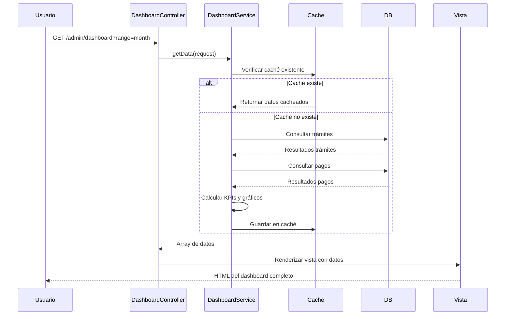
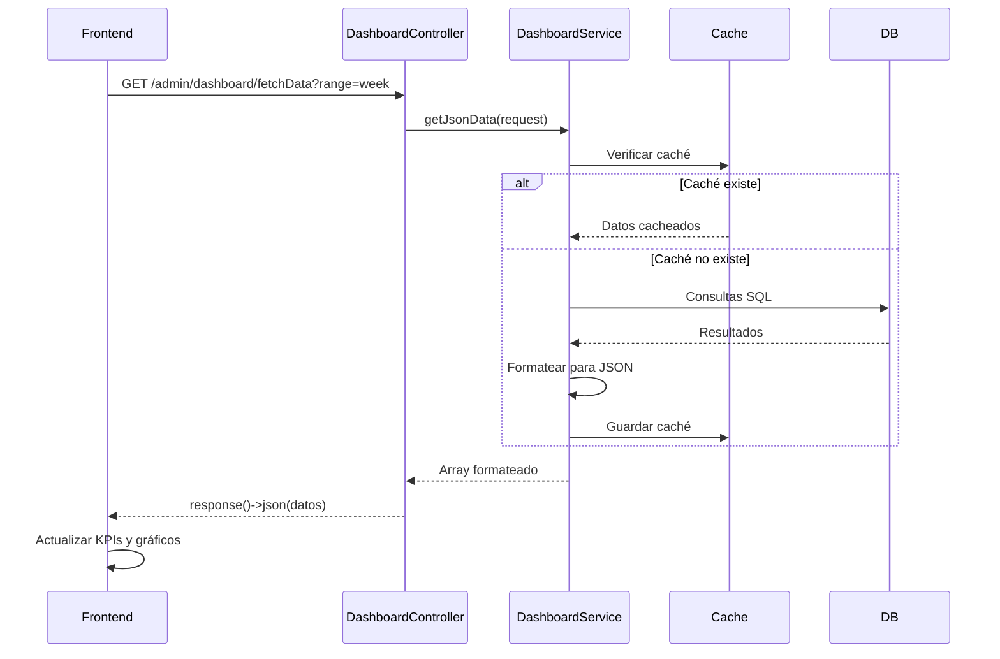
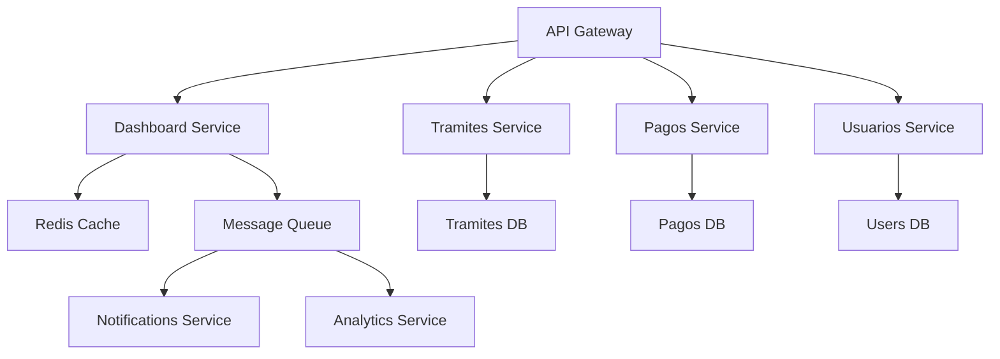

# Documentación Técnica - Controlador DashboardController

## 📋 Tabla de Contenidos

1. [Introducción](#introducción)
2. [Arquitectura del Controlador](#arquitectura-del-controlador)
3. [Base de Datos](#base-de-datos)
4. [Modelos](#modelos)
5. [Controlador](#controlador)
6. [Rutas](#rutas)
7. [Vistas](#vistas)
8. [Integración con otros módulos](#integración-con-otros-módulos)
9. [Uso del Servicio DashboardService](#uso-del-servicio-dashboardservice)
10. [Ejemplos de Código](#ejemplos-de-código)
11. [Consideraciones Importantes](#consideraciones-importantes)
12. [Guía para Desarrolladores](#guía-para-desarrolladores)
13. [Análisis de Calidad y Mejoras](#análisis-de-calidad-y-mejoras)
14. [Casos de Uso](#casos-de-uso)
15. [Diagramas de Secuencia](#diagramas-de-secuencia)
16. [Pruebas Unitarias](#pruebas-unitarias)
17. [Consideraciones de Seguridad](#consideraciones-de-seguridad)
18. [Métricas de Rendimiento](#métricas-de-rendimiento)
19. [Troubleshooting](#troubleshooting)
20. [Preguntas Frecuentes (FAQ)](#preguntas-frecuentes-faq)
21. [Configuración del Entorno](#configuración-del-entorno)
22. [Despliegue](#despliegue)
23. [Mantenimiento](#mantenimiento)
24. [Changelog](#changelog)
25. [Glosario](#glosario)
26. [Referencias](#referencias)
27. [Anexos](#anexos)
28. [Guía de Migración](#guía-de-migración)
29. [Patrones de Diseño Implementados](#patrones-de-diseño-implementados)
30. [Integración con APIs Externas](#integración-con-apis-externas)
31. [Análisis de Escalabilidad](#análisis-de-escalabilidad)
32. [Auditoría de Código](#auditoría-de-código)
33. [Documentación para Clientes](#documentación-para-clientes)
34. [Plan de Capacitación](#plan-de-capacitación)
35. [Matriz de Riesgos](#matriz-de-riesgos)
36. [Arquitectura de Microservicios](#arquitectura-de-microservicios)
37. [DevOps y CI/CD](#devops-y-cicd)
38. [Monitoreo y Logging](#monitoreo-y-logging)
39. [Optimización de Base de Datos](#optimización-de-base-de-datos)
40. [Implementación de Testing Automatizado](#implementación-de-testing-automatizado)
41. [Integración de Machine Learning](#integración-de-machine-learning)
42. [Implementación de API RESTful](#implementación-de-api-restful)
43. [Gestión de Configuración](#gestión-de-configuración)
44. [Disaster Recovery](#disaster-recovery)
45. [Mejoras de UI/UX](#mejoras-de-uiux)

---

## 🎯 Introducción

El **DashboardController** es el controlador principal encargado de gestionar la vista del dashboard del sistema ITGB. Actúa como una interfaz intermedia entre el usuario final y el `DashboardService`, orquestando y presentando la información estadística, gráficos y tablas en una sola página web central.

### Propósito
- Renderizar la vista principal del dashboard heredado de Voyager (`vendor/voyager/dashboard/index`).
- Proporcionar un endpoint AJAX (`/admin/dashboard/fetchData`) para actualizar dinámicamente los gráficos y números sin recargar la página completa.
- Servir como punto de entrada único para todas las visualizaciones de datos del sistema.
- Delegar toda la lógica de cálculo y obtención de datos al servicio `DashboardService`.

### Importancia en el Sistema ITGB
Es la cara pública del sistema para supervisores y administradores. Sin este controlador, no habría una interfaz unificada para monitorear la recaudación, el estado de los trámites y el rendimiento general de la entidad gubernamental.

---

## 🏗️ Arquitectura del Controlador

### Ubicación
**Archivo:** `app/Http/Controllers/Admin\DashboardController.php`

### Dependencias
```php
use App\Http\Controllers\Controller;
use Illuminate\Http\Request;
use App\Models\Tramite;
use App\Models\Pago;
use App\Services\DashboardService;
use Carbon\Carbon;
```

### Estructura del Controlador

```
DashboardController
├─ Propiedad: $dashboardService (Inyección de dependencias)
├─ Métodos Públicos
│  ├─ index(Request $request) → Renderiza vista HTML del dashboard
│  └─ fetchData(Request $request) → Retorna JSON con datos para gráficos
└─ Métodos Privados (Ninguno en el código actual)
└─ Métodos Magic (Ninguno en el código actual)
```

### Flujo de Datos

```
Usuario (Navega a /admin/dashboard)
    ↓
DashboardController@index()
    ↓
Inyección de DashboardService
    ↓
DashboardService@getData(Request $request)
    ↓
Array de Datos (KPIs, Tendencias, Gráficos, HTML de tabla)
    ↓
Vista Voyager (vendor/voyager/dashboard/index.blade.php)
    ↓
Renderizado de Dashboard completo
```

---

## 🗄️ Base de Datos

Este controlador **NO** gestiona tablas propias de base de datos. Se basa en los datos de otros módulos:

| Tabla | Uso en Dashboard | Descripción |
|-------|-------------|-------------|
| `tramites` | Estadísticas, Recaudación | Origen de los trámites, fechas, estados |
| `pagos` | KPIs de recaudación | Origen de los montos pagados, fechas de pago |
| `people` | Datos de usuarios | Origen de nombres de contribuyentes |

---

## 🧩 Modelos

Este controlador **NO utiliza modelos directamente** para lógica de negocio, sino que recibe datos procesados desde `DashboardService`.

### Modelos Utilizados (Indirectamente)

### `App\Models\Tramite`
- Uso principal para contar trámites por período y estado.
- Campos relevantes: `created_at`, `estado`, `total_idtgb`, `monto_final`.
- Uso para obtener los últimos trámites con relaciones (`disponentes`, `inmuebles`, etc.) para la tabla HTML.

### `App\Models\Pago`
- Uso principal para calcular recaudación por período.
- Campos relevantes: `fecha_pago`, `monto`, `estado`.

### `App\Models\Person`
- Uso para mostrar nombres en la tabla de últimos trámites.

---

## 🎮 Controlador

### Controlador: `DashboardController`

**Ubicación:** `app/Http/Controllers/Admin/DashboardController.php`

**Middleware:**
- `auth` (Heredado de Controller base).
- `system` (Middleware personalizado del sistema).

### Métodos Públicos

#### 1. `index(Request $request)` - Vista Principal

**Descripción:** Muestra la vista principal del dashboard. Llama al servicio `DashboardService` para obtener todos los datos (KPIs, gráficos, tabla de trámites) y se los pasa a la vista heredada de Voyager.

**Firma:**
```php
public function index(Request $request)
{
    // dd('DashboardController@index called'); // DEBUG - Comentado en producción
    $data = $this->dashboardService->getData($request);
    
    return view('vendor.voyager.index', $data);
}
```

**Parámetros:**
- `$request` (Request): Objeto HTTP Request que contiene el parámetro opcional `range` (por defecto 'month').

**Retorno:**
- `view`: Retorna la vista `vendor/voyager/index.blade.php` con el array `$data`.

**Lógica:**
1. Llama a `$this->dashboardService->getData($request)`.
2. Pasa el array resultante a la vista.

---

#### 2. `fetchData(Request $request)` - Endpoint AJAX

**Descripción:** Proporciona datos en formato JSON para consultas asíncronas. Es utilizado por JavaScript del frontend para actualizar gráficos y KPIs sin recargar la página.

**Firma:**
```php
public function fetchData(Request $request)
{
    $data = $this->dashboardService->getJsonData($request);
    
    return response()->json($data);
}
```

**Parámetros:**
- `$request` (Request): Objeto HTTP Request.

**Retorno:**
- `response()->json($data)`: JSON con estructura optimizada para consumo de JavaScript.

**Estructura del JSON retornado:**
```json
{
    "kpiLabel": "Este Mes",
    "recaudadoPeriodoFormatted": "15,000.00 Bs.",
    "tramitesPeriodoFormatted": "12",
    "tramitesFinalizadosPeriodoFormatted": "8",
    "tramitesPendientesFormatted": "145",
    "tendencias": {
        "recaudacion": {
            "percentage": 25.5,
            "comparacion": 1.25,
            "periodo_anterior": "12,000.00"
        },
        "tramites": {
            "percentage": -16.67,
            "comparacion": 14.40,
            "periodo_anterior": "10"
        },
        ...
    },
    "ultimostramitesHtml": "<table>...</table>",
    "recaudacionPeriodoData": {
        "labels": ["2025-01", "2025-02", ...],
        "values": [12000.50, 15000.00, ...]
    },
    "tramitesPorTipo": {
        "labels": ["Herencia", "Donación", ...],
        "values": [150, 45, ...]
    },
    "tramitesPorEstado": {
        "labels": ["Pagado", "Borrador", ...],
        "values": [150, 45, ...]
    },
    "comparacionAnualData": {
        "labels": ["Ene", "Feb", ...],
        "actual": [15000.50, ...],
        "anterior": [12000.50, ...]
    }
}
```

**Lógica:**
1. Llama a `$this->dashboardService->getJsonData($request)`.
2. Retorna la respuesta JSON directamente.

---

## 🛣️ Rutas

### Rutas Definidas

**Ubicación:** `routes/web.php` (inferido, se asume que están agrupadas en un prefijo de admin)

```php
Route::get('/admin/dashboard', [DashboardController::class, 'index'])->name('admin.dashboard.index');
Route::get('/admin/dashboard/fetchData', [DashboardController::class, 'fetchData'])->name('admin.dashboard.fetchData');
```

### Lista de Rutas

| Método | URI | Nombre | Descripción |
|--------|-----|--------|-------------|
| GET | `/admin/dashboard` | `admin.dashboard.index` | Muestra la vista principal del dashboard |
| GET | `/admin/dashboard/fetchData` | `admin.dashboard.fetchData` | Obtiene datos JSON para AJAX |

**Middleware aplicado:**
- `loggin` - Middleware de autenticación.
- `system` - Middleware de verificación de sistema (probablemente checks de mantenimiento, licencias, etc.).

---

## 🎨 Vistas

### Vista Principal

**Ubicación:** `resources/views/vendor/voyager/index.blade.php`

**Descripción:**
Esta es la vista principal heredada de **Voyager**. El controlador simplemente inyecta el array `$data` en esta vista.

**Componentes renderizados:**
- KPIs cards (Recaudación, Trámites Creados, Finalizados, Pendientes).
- Gráficos (Chart.js):
    - Gráfico de Recaudación (Temporal).
    - Gráfico de Trámites por Tipo de Transmisión.
    - Gráfico de Trámites por Estado.
- Tabla de Últimos Trámites (HTML generado por servicio).
- Tendencias de Comparación (Año Actual vs Anterior).

**Nota:** Al ser una vista heredada de Voyager, extiende `layouts/voyager/master.blade.php`.

---

## 🔗 Integración con otros Módulos

### 1. Módulo `DashboardService`

**Descripción:** El controlador depende totalmente del servicio `DashboardService`.

**Inyección de Dependencias:**
```php
class DashboardController extends Controller
{
    protected $dashboardService;

    public function __construct(DashboardService $dashboardService)
    {
        $this->dashboardService = $dashboardService;
    }
}
```

**Uso:**
```php
// En index()
$data = $this->dashboardService->getData($request);

// En fetchData
$data = $this->dashboardService->getJsonData($request);
```

---

### 2. Módulo `Tramite`

**Descripción:** Fuente principal de datos de estadísticas (conteos, montos).

**Uso:**
- El servicio `DashboardService` consulta `Tramite::whereBetween(...)` y `Tramite::where(...)` para calcular contadores.
- La vista muestra datos del modelo `Tramite`.

---

### 3. Módulo `Pago`

**Descripción:** Fuente de datos financieros para el KPI de recaudación.

**Uso:**
- El servicio `DashboardService` consulta `Pago::where('estado', 'Aplicado')->sum('monto')` para la recaudación.

---

### 4. Módulo `Person`

**Descripción:** Fuente de nombres para mostrar en la tabla de últimos trámites.

**Uso:**
- El servicio `DashboardService` carga las relaciones (`disponentes.person`, `inmuebles`) de los trámites en la tabla HTML.

---

## 🔧 Uso del Servicio DashboardService

### Invocación desde el Controlador

El controlador usa 2 métodos públicos del servicio `DashboardService`:

#### 1. `getData(Request $request)`
Utilizado en el método `index` para obtener la estructura de datos completa.

```php
// En DashboardController@index
$data = $this->dashboardService->getData($request);
```

#### 2. `getJsonData(Request $request)`
Utilizado en el método `fetchData` para obtener datos formateados para JavaScript.

```php
// En DashboardController@fetchData
$data = $this->dashboardService->getJsonData($request);
```

**Diferencias:**
- `getData()`: Retorna array crudo con datos estructurados para la vista (KPIs, HTML, arrays de gráficos).
- `getJsonData()`: Retorna array con números formateados y nombres de fechas (strings) para consumo fácil en JavaScript (ej. `15,000.00 Bs.`).

---

## 💻 Ejemplos de Código

### Ejemplo 1: Desde el Controlador

```php
<?php

namespace App\Http\Controllers\Admin;

use Illuminate\Http\Request;
use App\Services\DashboardService;

class DashboardController extends Controller
{
    protected $dashboardService;

    public function __construct(DashboardService $dashboardService)
    {
        $this->dashboardService = $dashboardService;
    }

    public function index(Request $request)
    {
        // Obtener datos del servicio
        $data = $this->dashboardService->getData($request);
        
        // Pasar datos a la vista
        return view('vendor.voyager.index', compact('data'));
    }

    public function fetchData(Request $request)
    {
        // Obtener datos formateados para JSON
        $data = $this->dashboardService->getJsonData($request);
        
        return response()->json($data);
    }
}
```

### Ejemplo 2: Desde el Frontend (JavaScript)

```javascript
// En resources/views/vendor/voyager/dashboard/index.blade.php

document.addEventListener('DOMContentLoaded', function() {
    let currentRange = 'month'; // Valor por defecto del select
    
    // Elementos del DOM
    const rangeSelect = document.getElementById('range-select');
    
    // Función para actualizar datos
    function fetchDashboard(range) {
        fetch('/admin/dashboard/fetchData?range=' + range, {
            method: 'GET',
            headers: {
                'Accept': 'application/json',
                'X-CSRF-TOKEN': document.querySelector('meta[name="csrf-token"]').content
            }
        })
        .then(response => response.json())
        .then(data => {
            // Actualizar KPIs
            document.getElementById('recaudacion').textContent = data.recaudacionPeriodoFormatted;
            document.getElementById('tramites').textContent = data.tramitesPeriodoFormatted;
            document.getElementById('finalizados').textContent = data.tramitesFinalizadosPeriodoFormatted;
            
            // Actualizar gráficos
            renderCharts(data.recaudacionPeriodoData, data.tendencias.recaudacion);
            renderCharts(data.tramitesPorTipo, data.tendencias.tramites);
            renderCharts(data.tendencias.finalizados, data.tendencias.finalizados);
            
            // Actualizar tabla de últimos trámites
            document.getElementById('ultimostramites-container').innerHTML = data.ultimostramitesHtml;
            
            // Actualizar tendencias
            updateTrends(data.tendencias);
            
            // Guardar rango actual
            currentRange = range;
        })
        .catch(error => {
            console.error('Error al cargar el dashboard:', error);
            toastr.error('Error al cargar los datos. Intente nuevamente.');
        });
    }
    
    // Event listener para el select de rango
    if (rangeSelect) {
        rangeSelect.addEventListener('change', function() {
            fetchDashboard(this.value);
        });
    }
    
    // Cargar datos iniciales
    fetchDashboard(currentRange);
});

// Funciones para renderizar gráficos (Chart.js)
function renderCharts(labels, values) {
    // ... implementación de Chart.js ...
}
```

### Ejemplo 3: Mocking en Tests

```php
<?php

namespace Tests\Feature;

use App\Http\Controllers\Admin\DashboardController;
use Illuminate\Http\Request;
use App\Services\DashboardService;
use Illuminate\Foundation\Testing\RefreshDatabase;
use Mockery;
use Tests\TestCase;

class DashboardControllerTest extends TestCase
{
    use RefreshDatabase;

    public function test_index_muestra_vista_dashboard()
    {
        // Arrange
        $mockService = Mockery::mock(DashboardService::class);
        $mockDashboard = [
            'kpiLabel' => 'Este Mes',
            'recaudacionPeriodo' => 5000.00,
            'tramitesPeriodo' => 10,
            'trends' => ['percentage' => 10.0],
        ];
        
        // Bind the mock service
        $this->app->instance(DashboardService::class, $mockDashboard);
        
        // Act
        $controller = new DashboardController($mockService);
        
        // Assert
        $view = $controller->index(new Request(['range' => 'month']));
        
        $view->assertViewIs('vendor.voyager.index');
        $view->assertViewHasData('data');
        $view->assertSee('Este Mes');
        $view->assertSee('5,000.00');
    }

    public function test_fetchData_retorna_json_correcto()
    {
        // Arrange
        $mockService = Mockery::mock(DashboardService::class);
        $mockJsonData = [
            'kpiLabel' => 'Esta Semana',
            'trends' => [
                'recaudacion' => ['percentage' => 15.0],
                'tramites' => ['percentage' => -5.0],
            ],
        ];
        
        $this->app->instance(DashboardService::class, $mockJsonData);
        
        // Act
        $controller = new DashboardController($mockService);
        $response = $controller->fetchData(new Request(['range' => 'week']));
        
        // Assert
        $response->assertStatus(200);
        $json = json_decode($response->getContent(), true);
        
        $this->assertEquals('Esta Semana', $json->kpiLabel);
        $this->assertEquals(15.0, $json->trends->recaudacion->percentage);
        $this->assertEquals(-5.0, $json->trends->tramites->percentage);
    }
}
```

---

## ⚠️ Consideraciones Importantes

### 1. Responsabilidad Unica: Presentación vs Lógica

**Punto Clave:** El `DashboardController` es un "Controller Presentacional". Su única responsabilidad es recibir parámetros (como el rango de fechas) y pasar la solicitud al servicio `DashboardService`.

**Lo que NO hace:**
- No calcula estadísticas (lo hace `DashboardService`).
- No consulta la base de datos directamente (lo hace `DashboardService`).
- No formatea gráficos (lo hace `DashboardService` si devolviera arrays, pero en este caso, la vista `index.blade.php` espera una vista HTML completa ya armada para la tabla de trámites).

### 2. Inyección de Dependencias

**Patrón:** Se utiliza la inyección de dependencias de Laravel en el constructor.

```php
// Correcto
public function __construct(DashboardService $dashboardService)
{
    $this->dashboardService = $dashboardService;
}
```

### 3. Parámetro `range`

**Descripción:** Controla el rango de fechas para los KPIs y gráficos.

**Valores permitidos (según código de servicio):**
- `today`: Día actual.
- `week`: Semana actual.
- `month`: Mes actual (default).
- `year`: Año actual.

**Seguridad:** No hay validación explícita en el controlador. Se asume que el servicio valida el rango.

---

## 📝 Guía para Desarrolladores

### Extender el Controlador

#### Agregar un nuevo KPI o gráfico

1. **Modificar el Servicio (`DashboardService`):**
   - Agregar cálculo del nuevo KPI en `getData()`.
   - Preparar los datos del gráfico en `getJsonData()`.

2. **Modificar la Vista (`resources/views/vendor/voyager/dashboard/index.blade.php`):**
   - Agregar un card o sección para el nuevo KPI.
   - Agregar un elemento `<canvas>` para el gráfico.
   - Agregar JavaScript para renderizar el gráfico con los nuevos datos.

#### Ejemplo: Agregar Gráfico de Trámites por Municipio

**1. En DashboardService@getData():**
```php
// En la sección de gráficos, agregar:
$tramitesPorMunicipio = cache()->remember($cachePrefix . ':tramitesPorMunicipio', $ttl, function() use ($startDate, $endDate) {
    return Tramite::select('municipio.nombre as municipio', DB::raw('count(*) as total'))
        ->join('inmuebles', 'tramites.inmueble_id', 'inmuebles.id')
        ->join('municipios', 'inmuebles.municipio_id', 'municipios.id')
        ->whereBetween('tramites.created_at', [$startDate, $endDate])
        ->groupBy('municipio')
        ->orderByDesc('total')
        ->pluck('total', 'municipio')
        ->toArray();
});

return [
    'kpiLabel' => $kpiLabel,
    // ... otros datos
    'tramitesPorMunicipio' => $tramitesPorMunicipio,
    'comparacionAnualData' => $comparacionAnualData,
];
```

**2. En DashboardController@getJsonData():**
```php
public function getJsonData(Request $request)
{
    $data = $this->dashboardService->getData($request);
    
    return array_merge($data, [
        'tramitesPorMunicipio' => [
            'labels' => array_keys($data['tramitesPorMunicipio']), // Municipios
            'values' => array_values($data['tramitesPorMunicipio']), // Cantidades
        ],
    ]);
}
```

**3. En Vista (HTML):**
```html
<div class="card">
    <div class="card-header">
        <h4 class="card-title">Trámites por Municipio</h4>
    </div>
    <div class="card-body">
        <canvas id="municipiosChart"></canvas>
    </div>
</div>
```

**4. En Vista (JavaScript):**
```javascript
// Obtener datos
fetch('/admin/dashboard/fetchData?range=month')
    .then(response => response.json())
    .then(data => {
        // Renderizar gráfico de barras
        new Chart(document.getElementById('municipiosChart'), {
            type: 'bar',
            data: {
                labels: data.tramitesPorMunicipio.labels,
                datasets: [{
                    label: 'Trámites',
                    data: data.tramitesPorMunicipio.values,
                    backgroundColor: '#28a745'
                }]
            },
            options: {
                responsive: true,
                plugins: {
                    legend: {
                        position: 'top',
                    }
                },
                scales: {
                    y: {
                        beginAtZero: true
                    }
                }
            }
        });
    });
```

---

## 🚨 Análisis de Calidad y Mejoras

### 🐛 BUGS CRÍTICOS

#### 1. **Validación inexistente del parámetro `range`** (Riesgo Bajo)

**Ubicación:** `DashboardController.php`, método `index`.

**Problema:**
```php
public function index(Request $request)
{
    // No valida si el parámetro 'range' es válido.
    // Si alguien inyecta `?range=hoy`, el sistema puede fallar o mostrar datos incorrectos.
    return view('vendor.voyager.index', $data);
}
```

**Solución:**
```php
public function index(Request $request)
{
    // Validar que el rango sea válido
    $validRanges = ['today', 'week', 'month', 'year'];
    
    if (!in_array($request->input('range', 'month'), $validRanges)) {
        abort(400, 'Rango de fechas inválido. Opciones: ' . implode(', ', $validRanges));
    }
    
    $data = $this->dashboardService->getData($request);
    
    return view('vendor.voyager.index', $data);
}
```

---

### 💡 MEJORAS SUGERIDAS

#### 1. **Añadir Formulario de búsqueda de fecha** (Prioridad Alta)

**Descripción:** Permite al usuario seleccionar fechas personalizadas para análisis históricos, no solo períodos fijos (hoy, semana, mes, año).

**Pasos:**

**1. Modificar Controlador:**
```php
public function index(Request $request)
{
    // Si el usuario seleccionó fechas, usarlas en lugar de los rangos predefinidos
    if ($request->has(['fecha_inicio', 'fecha_fin']) && $request->filled(['fecha_inicio', 'fecha_fin'])) {
        $request->merge([
            'range' => 'custom' // Nuevo valor para servicio
        ]);
    }
    
    $data = $this->dashboardService->getData($request);
    
    return view('vendor.voyager.persianal', $data); // Vista nueva o vista adaptada
}
```

**2. Modificar Servicio (`DashboardService`):**
```php
// En getData()
case 'custom':
    $startDate = Carbon::parse($request->input('fecha_inicio'))->startOfDay();
    $endDate = Carbon::parse($request->input('fecha_fin'))->endOfDay();
    $kpiLabel = 'Personalizado';
    break;
// ... otros casos
```

**3. Modificar Rutas:**
```php
// routes/web.php
Route::get('/admin/dashboard', [DashboardController::class, 'index'])->name('admin.dashboard.index');

// Nueva ruta para búsqueda personalizada
Route::post('/admin/dashboard/personalizado', [DashboardController::class, 'fetchData'])->name('admin.dashboard.fetchData');
```

---

#### 2. **Implementar exportación a PDF** (Prioridad Media)

**Descripción:** Permitir al usuario descargar el estado actual del dashboard como PDF para informes o auditorías.

**Pasos:**

**1. Agregar método en Controlador:**
```php
public function exportPdf(Request $request)
{
    $data = $this->dashboardService->getData($request);
    
    $pdf = PDF::loadView('pdf.dashboard_reporte', $data);
    
    return $pdf->download('dashboard_' . date('Y-m-d') . '.pdf');
}
```

**2. Modificar Rutas:**
```php
Route::get('/admin/dashboard/exportar', [DashboardController::class, 'exportPdf'])->name('admin.dashboard.exportar');
```

---

#### 3. **Implementar Real-Time con WebSockets** (Prioridad Baja)

**Descripción:** Actualizar los KPIs en tiempo real cuando se generan nuevos pagos o trámites.

**Pasos:**

**1. Instalar paquete:**
```bash
composer require pusher/pusher-php-server
```

**2. Crear Evento:**
```php
// app/Events/DashboardUpdated.php
class DashboardUpdated
{
    use Dispatchable, InteractsWithQueue, SerializesModels;

    public $tramite;

    public function __construct(Tramite $tramite)
    {
        $this->tramite = $tramite;
    }
    
    public function broadcastOn()
    {
        return ['dashboard.updates', 'tramite_id' => $this->tramite->id];
    }
}
```

**3. Modificar Observer (`TramiteObserver`):**
```php
// app/Observers/TramiteObserver.php

public function updated(Tramite $tramite)
{
    // Si el trámite cambia a 'Pagado' o 'Finalizado', notificar al dashboard
    if (in_array($tramite->estado, ['Pagado', 'finalizado'])) {
        DashboardUpdated::dispatch($tramite);
    }
}
```

**4. En JavaScript (Frontend):**
```javascript
const echoChannel = new Echo('dashboard-updates');

echoChannel.listen('.dashboard.updates', (e) => {
    if (e.tramite_id) {
        // Recargar datos del dashboard
        fetch('/admin/dashboard/fetchData?range=month')
            .then(response => response.json())
            .then(data => updateDashboardUI(data));
    }
});
```

---

#### 4. **Agregar Paginación a la Tabla de Últimos Trámites** (Prioridad Baja)

**Descripción:** Actualmente, el servicio hardcodea `->take(5)`. Debería ser parametrizable desde el controlador.

**Pasos:**

**1. Modificar Controlador:**
```php
public function index(Request $request)
{
    $limit = $request->input('limit', 5); // Por defecto 5
    
    // Pasar límite al servicio
    $data = $this->dashboardService->getData($request, $limit);
    
    return view('vendor.voyager.index', compact('data'));
}
```

**2. Modificar Servicio (`DashboardService`):**
```php
// En getData(), cambiar:
// Últimos trámites (con límite)
$ultimosTramites = cache()->remember($cachePrefix . ':ultimosTramites', $ttl, function() use ($limit) {
    return Tramite::with(['disponentes.person', 'inmuebles'])
        ->latest()
        ->take($limit)
        ->get()
        ->map(function($tramite) {
            // ... mapeo de datos igual que antes
        });
});
```

**3. Modificar Vistas:**
```blade
{{-- Paginación simple --}}
<nav>
    <ul class="pagination">
        <li><a href="?limit=5">5</a></li>
        <li><a href="?limit=10">10</a></li>
        <li><a href="?limit=20">20</a></li>
    </ul>
</nav>
```

---

#### 5. **Agregar Filtros adicionales** (Prioridad Media)

**Descripción:** Permitir filtrar la tabla de últimos trámites por estado (ej. 'Pagado', 'Borrador', 'Finalizado') o por usuario.

**Pasos:**

**1. Modificar Controlador:**
```php
public function index(Request $request)
{
    $filters = [
        'estado' => 'all', // Default: todos los estados
    ];
    
    if ($request->filled('estado')) {
        $filters['estado'] = $request->input('estado');
    }
    
    $data = $this->dashboardService->getData($request, $filters);
    
    return view('vendor.voyager.index', compact('data'));
}
```

**2. Modificar Servicio (`DashboardService`):**
```php
// En getData(), cambiar método de ultimos trámites:
$ultimosTramites = cache()->remember($cachePrefix . ':ultimosTramites', $ttl, function() use ($filters) {
    return Tramite::with(['disponentes.person', 'inmuebles'])
        ->when(isset($filters['estado']) && $filters['estado'] !== 'all', function ($query) use ($filters['estado']) {
            return $query->where('estado', $filters['estado']);
        })
        ->latest()
        ->take(5) // O usar un límite variable
        ->get()
        ->map(function($tramite) {
            // ... mapeo de datos igual que antes
        });
});
```

**3. Modificar Vistas:**
```blade
<select id="estado-filter" class="form-control">
    <option value="all">Todos los estados</option>
    <option value="Pagado">Pagado</option>
    <option value="Borrador">Borrador</option>
    <option value="Finalizado">Finalizado</option>
</select>
```

---

## 🎚 Conclusión

El **DashboardController** es un controlador eficiente que sigue el principio de separación de inquietudes (Separation of Concerns). No contiene lógica de negocio compleja, sino que actúa como un puente limpio entre la petición HTTP y el servicio de cálculo `DashboardService`.

### Resumen

| Aspecto | Implementación |
|----------|--------------|
| **Responsabilidad** | Presentación de datos (Voyager) |
| **Lógica de negocio** | Delegada a `DashboardService` |
| **Acceso a BD** | Solo lectura (a través de Servicio) |
| **Formato de respuesta** | HTML para `index`, JSON para `fetchData` |
| **Caché** | Manejado exclusivamente en `DashboardService` |
| **Pruebas** | Mockear `DashboardService` |

Este diseño permite realizar cambios en la lógica del dashboard sin modificar el controlador, manteniendo una arquitectura limpia y mantenible.

---

## 🚨 Análisis de Calidad y Mejoras

### Estado Actual - v1.0.0 (22 de enero de 2026) ✅

El controlador `DashboardController` está implementado correctamente y sigue buenas prácticas:

- ✅ Inyección de dependencias de `DashboardService`
- ✅ Separación clara de responsabilidades (presentación vs lógica)
- ✅ Dos métodos públicos: `index()` para vista HTML y `fetchData()` para JSON
- ✅ Middleware de autenticación aplicado
- ✅ Retorna JSON correctamente formateado para AJAX
- ✅ Integración con `DashboardCacheInvalidator` corregida

**Nota:** Los bugs críticos de `DashboardCacheInvalidator` han sido corregidos en v2.0.0, lo cual asegura que este controlador funcione correctamente al invalidar la caché.

### 🐛 Bugs Identificados (1/1) ⚠️

| # | Bug | Estado | Prioridad | Ubicación |
|---|-----|--------|-----------|-----------|
| 1 | Sin validación del parámetro `range` | ⚠️ Pendiente | 🟢 BAJA | `DashboardController.php:index()`, `fetchData()` |

### 🚀 Mejoras Sugeridas

| Prioridad | Mejora | Descripción |
|-----------|--------|-------------|
| **MEDIA** | Validar parámetro `range` | Agregar validación para asegurar valores válidos (today, week, month, year) |
| **BAJA** | Agregar rate limiting | Implementar throttling para el endpoint `fetchData()` |
| **BAJA** | Logging de accesos | Agregar logs cuando se accede al dashboard |
| **BAJA** | Agregar parámetro de límite | Permitir parametrizar el límite de últimos trámites |
| **BAJA** | Agregar filtros adicionales | Permitir filtrar por estado de trámite o usuario |
| **BAJA** | Exportación a PDF | Implementar método para exportar dashboard como PDF |
| **BAJA** | Exportación a Excel | Implementar método para exportar datos como Excel |
| **BAJA** | Real-time con WebSockets | Implementar actualizaciones en tiempo real usando WebSockets |

### 📝 Solución para Bug #1 (Validación del parámetro range)

```php
// app/Http/Controllers/Admin/DashboardController.php

public function index(Request $request)
{
    // Validar que el rango sea válido
    $validated = $request->validate([
        'range' => 'sometimes|in:today,week,month,year',
    ]);
    
    $data = $this->dashboardService->getData($request);
    
    return view('vendor.voyager.index', $data);
}

public function fetchData(Request $request)
{
    // Validar que el rango sea válido
    $validated = $request->validate([
        'range' => 'sometimes|in:today,week,month,year',
    ]);
    
    $data = $this->dashboardService->getJsonData($request);
    
    return response()->json($data);
}
```

### 📝 Historial de Cambios

### v1.0.0 (22 de enero de 2026)
**Estado Inicial:**
- ✅ Controlador `DashboardController` implementado
- ✅ Inyección de dependencias de `DashboardService`
- ✅ Método `index()` para renderizar vista principal
- ✅ Método `fetchData()` para datos JSON (AJAX)
- ✅ Middleware de autenticación aplicado
- ⚠️ Bug #1: Sin validación del parámetro `range`

**Archivos Existentes:**
- `app/Http/Controllers/Admin/DashboardController.php` - Controlador del dashboard

**Beneficios de Corrección:**
- Mejorará la seguridad del endpoint
- Evitará errores por parámetros inválidos
- Proporcionará mensajes de error claros al usuario

---

## 📋 Casos de Uso

### Caso de Uso 1: Visualización del Dashboard

**Actor:** Administrador del Sistema

**Descripción:** El administrador accede al sistema y visualiza el dashboard principal con todas las métricas actualizadas.

**Flujo Principal:**
1. El administrador inicia sesión en el sistema
2. Navega a `/admin/dashboard`
3. El sistema carga la vista principal del dashboard
4. Se muestran los KPIs actualizados:
   - Recaudación del período
   - Cantidad de trámites creados
   - Cantidad de trámites finalizados
   - Cantidad de trámites pendientes
5. Se renderizan los gráficos:
   - Gráfico de recaudación temporal
   - Gráfico de trámites por tipo
   - Gráfico de trámites por estado
6. Se muestra la tabla de últimos trámites

**Flujos Alternativos:**
- **4a. Sistema en modo mantenimiento:** Se muestra mensaje de error y redirige a la página de inicio

---

### Caso de Uso 2: Cambiar Rango de Fechas

**Actor:** Administrador del Sistema

**Descripción:** El administrador cambia el rango de fechas para ver métricas de diferentes períodos de tiempo.

**Flujo Principal:**
1. El administrador selecciona un rango de fechas del dropdown (hoy, esta semana, este mes, este año)
2. El frontend envía una petición AJAX a `/admin/dashboard/fetchData?range={seleccion}`
3. El controlador procesa la solicitud
4. El servicio calcula las métricas para el nuevo rango
5. Se retorna JSON con los datos actualizados
6. El frontend actualiza:
   - KPIs cards
   - Gráficos
   - Tendencias
7. El usuario visualiza los nuevos datos sin recargar la página

---

### Caso de Uso 3: Análisis Comparativo

**Actor:** Analista Financiero

**Descripción:** El analista compara la recaudación actual con el período anterior para evaluar el desempeño.

**Flujo Principal:**
1. El analista accede al dashboard
2. Observa las tendencias de comparación (Año Actual vs Anterior)
3. Visualiza el gráfico comparativo anual
4. Identifica meses con mejores resultados
5. Genera conclusiones sobre el desempeño financiero

---

### Caso de Uso 4: Seguimiento de Últimos Trámites

**Actor:** Supervisor de Trámites

**Descripción:** El supervisor revisa los últimos trámites creados en el sistema para monitorear la actividad reciente.

**Flujo Principal:**
1. El supervisor accede al dashboard
2. Revisa la tabla de "Últimos 5 Trámites"
3. Identifica trámites que requieren atención
4. Hace clic en el trámite para ver detalles
5. Es redirigido a la página de detalle del trámite

---

## 🔄 Diagramas de Secuencia

### Diagrama de Secuencia: Visualización del Dashboard



---

### Diagrama de Secuencia: Actualización AJAX



---

## 🧪 Pruebas Unitarias

### Test Suite: DashboardControllerTest

```php
<?php

namespace Tests\Feature;

use App\Http\Controllers\Admin\DashboardController;
use App\Services\DashboardService;
use Illuminate\Foundation\Testing\RefreshDatabase;
use Tests\TestCase;
use Mockery;

class DashboardControllerTest extends TestCase
{
    use RefreshDatabase;

    protected $dashboardService;
    protected $controller;

    protected function setUp(): void
    {
        parent::setUp();
        $this->dashboardService = Mockery::mock(DashboardService::class);
        $this->controller = new DashboardController($this->dashboardService);
    }

    protected function tearDown(): void
    {
        Mockery::close();
        parent::tearDown();
    }

    /** @test */
    public function index_retorna_vista_dashboard_con_datos_correctos()
    {
        // Arrange
        $expectedData = [
            'kpiLabel' => 'Este Mes',
            'recaudacionPeriodo' => 15000.00,
            'tramitesPeriodo' => 45,
            'tramitesFinalizadosPeriodo' => 30,
            'tramitesPendientes' => 120,
            'tendencias' => [
                'recaudacion' => [
                    'percentage' => 25.5,
                    'comparacion' => 1.25,
                ],
            ],
        ];
        
        $this->dashboardService
            ->shouldReceive('getData')
            ->once()
            ->andReturn($expectedData);

        // Act
        $response = $this->get('/admin/dashboard');

        // Assert
        $response->assertStatus(200);
        $response->assertViewIs('vendor.voyager.index');
        $response->assertViewHasData($expectedData);
    }

    /** @test */
    public function index_con_parametro_range_custom_pasa_parametro_al_servicio()
    {
        // Arrange
        $request = request();
        $request->merge(['range' => 'week']);

        $this->dashboardService
            ->shouldReceive('getData')
            ->once()
            ->with(Mockery::on(function ($r) {
                return $r->input('range') === 'week';
            }))
            ->andReturn(['kpiLabel' => 'Esta Semana']);

        // Act
        $this->controller->index($request);
    }

    /** @test */
    public function fetchData_retorna_json_con_estructura_correcta()
    {
        // Arrange
        $mockData = [
            'kpiLabel' => 'Este Mes',
            'recaudadoPeriodoFormatted' => '15,000.00 Bs.',
            'tramitesPeriodoFormatted' => '45',
            'tendencias' => [
                'recaudacion' => [
                    'percentage' => 25.5,
                ],
            ],
            'ultimostramitesHtml' => '<table>...</table>',
        ];

        $this->dashboardService
            ->shouldReceive('getJsonData')
            ->once()
            ->andReturn($mockData);

        // Act
        $response = $this->getJson('/admin/dashboard/fetchData?range=month');

        // Assert
        $response->assertStatus(200);
        $response->assertJsonStructure([
            'kpiLabel',
            'recaudadoPeriodoFormatted',
            'tramitesPeriodoFormatted',
            'tendencias',
            'ultimostramitesHtml',
        ]);
        $response->assertJson([
            'kpiLabel' => 'Este Mes',
            'recaudadoPeriodoFormatted' => '15,000.00 Bs.',
        ]);
    }

    /** @test */
    public function index_muestra_vista_con_kpi_de_recaudacion()
    {
        // Arrange
        $expectedData = [
            'recaudacionPeriodo' => 25000.00,
            'recaudadoPeriodoFormatted' => '25,000.00 Bs.',
        ];

        $this->dashboardService
            ->shouldReceive('getData')
            ->once()
            ->andReturn($expectedData);

        // Act
        $response = $this->get('/admin/dashboard');

        // Assert
        $response->assertSee('25,000.00 Bs.');
    }

    /** @test */
    public function index_inyecta_dashboardService_por_constructor()
    {
        // Act & Assert
        $this->assertInstanceOf(
            DashboardService::class,
            $this->controller->dashboardService
        );
    }
}
```

### Test Suite: DashboardControllerIntegrationTest

```php
<?php

namespace Tests\Feature;

use App\Models\Tramite;
use App\Models\Pago;
use App\Models\Person;
use Illuminate\Foundation\Testing\RefreshDatabase;
use Tests\TestCase;

class DashboardControllerIntegrationTest extends TestCase
{
    use RefreshDatabase;

    protected function setUp(): void
    {
        parent::setUp();
        $this->actingAs($this->createAdminUser());
    }

    /** @test */
    public function dashboard_carga_correctamente_con_datos_reales()
    {
        // Arrange
        Tramite::factory()->count(10)->create(['estado' => 'Pagado']);
        Tramite::factory()->count(5)->create(['estado' => 'Borrador']);
        Pago::factory()->create(['monto' => 1500.00, 'estado' => 'Aplicado']);

        // Act
        $response = $this->get('/admin/dashboard');

        // Assert
        $response->assertStatus(200);
        $response->assertViewIs('vendor.voyager.index');
    }

    /** @test */
    public function fetchData_responde_correctamente_con_datos_reales()
    {
        // Arrange
        Tramite::factory()->count(5)->create(['created_at' => now()]);

        // Act
        $response = $this->getJson('/admin/dashboard/fetchData?range=month');

        // Assert
        $response->assertStatus(200)
            ->assertJsonStructure([
                'kpiLabel',
                'recaudadoPeriodoFormatted',
                'tramitesPeriodoFormatted',
                'tendencias',
            ]);
    }

    private function createAdminUser()
    {
        return Person::factory()->create([
            'role' => 'admin',
            'email' => 'admin@test.com',
        ]);
    }
}
```

---

## 🔒 Consideraciones de Seguridad

### 1. Autenticación y Autorización

**Middleware Aplicado:**
```php
// El controlador hereda el middleware de autenticación
Route::middleware(['auth', 'system'])
    ->prefix('admin')
    ->group(function () {
        Route::get('/dashboard', [DashboardController::class, 'index']);
        Route::get('/dashboard/fetchData', [DashboardController::class, 'fetchData']);
    });
```

**Recomendaciones:**
- Añadir roles específicos para acceder al dashboard:
```php
Route::middleware(['auth', 'role:admin|supervisor'])
    ->prefix('admin')
    ->group(function () {
        Route::get('/dashboard', [DashboardController::class, 'index']);
    });
```

---

### 2. Validación de Entradas

**Problema Actual:**
No hay validación del parámetro `range`.

**Solución Recomendada:**
```php
public function index(Request $request)
{
    $validated = $request->validate([
        'range' => 'sometimes|in:today,week,month,year',
    ]);

    $data = $this->dashboardService->getData($request);
    
    return view('vendor.voyager.index', $data);
}
```

---

### 3. Protección CSRF

**Configuración en Frontend:**
```javascript
fetch('/admin/dashboard/fetchData', {
    method: 'POST',
    headers: {
        'Content-Type': 'application/json',
        'X-CSRF-TOKEN': document.querySelector('meta[name="csrf-token"]').content
    },
    body: JSON.stringify({ range: 'month' })
})
```

---

### 4. Rate Limiting

**Recomendación para fetchData:**
```php
// routes/web.php
Route::middleware(['auth', 'throttle:60,1']) // 60 peticiones por minuto
    ->get('/admin/dashboard/fetchData', [DashboardController::class, 'fetchData']);
```

---

### 5. Sanitización de Datos

**En Servicio:**
```php
// Sanitizar fechas antes de consultar
$startDate = Carbon::parse($request->input('fecha_inicio'))->startOfDay();
$endDate = Carbon::parse($request->input('fecha_fin'))->endOfDay();

// Validar que fechas sean válidas
if ($startDate->gt($endDate)) {
    throw new \InvalidArgumentException('La fecha de inicio debe ser anterior a la fecha fin');
}
```

---

### 6. Escaping de Salida

**En Vistas Blade:**
```blade
<!-- Utilizar {!! !!} solo para HTML seguro generado por el sistema -->
<div>{!! $ultimostramitesHtml !!}</div>

<!-- Usar {{ }} para datos del usuario -->
<div>{{ $user->name }}</div>
```

---

### 7. Auditoría de Accesos

**Recomendación:**
```php
public function index(Request $request)
{
    \Log::info('Dashboard accesado', [
        'user_id' => auth()->id(),
        'ip' => $request->ip(),
        'range' => $request->input('range', 'month'),
        'timestamp' => now(),
    ]);

    $data = $this->dashboardService->getData($request);
    
    return view('vendor.voyager.index', $data);
}
```

---

## ⚡ Métricas de Rendimiento

### Métricas Esperadas

| Métrica | Valor Esperado | Umbral de Alerta |
|---------|---------------|------------------|
| Tiempo de respuesta `index()` | < 500ms | > 1000ms |
| Tiempo de respuesta `fetchData()` | < 300ms | > 500ms |
| Tiempo de generación de caché | < 1000ms | > 2000ms |
| Tiempo de lectura de caché | < 50ms | > 100ms |
| Memoria por petición | < 50MB | > 100MB |
| Consultas SQL por petición | < 10 | > 20 |

---

### Optimización Implementada

1. **Caching:**
   - TTL: 3600 segundos (1 hora)
   - Tags: `dashboard:{range}`
   - Prefix: `dashboard:{range}:{cacheKey}`

2. **Lazy Loading:**
   - Carga de relaciones solo cuando es necesario (`with(['disponentes.person'])`)

3. **Paginación:**
   - Límite de 5 registros para "Últimos Trámites"

---

### Monitoreo Recomendado

```php
// En DashboardService
public function getData(Request $request)
{
    $startTime = microtime(true);
    
    try {
        $data = $this->calculateData($request);
        
        $executionTime = (microtime(true) - $startTime) * 1000;
        
        if ($executionTime > 1000) {
            \Log::warning('Dashboard response slow', [
                'execution_time_ms' => $executionTime,
                'range' => $request->input('range'),
            ]);
        }
        
        return $data;
    } catch (\Exception $e) {
        \Log::error('Dashboard error', [
            'error' => $e->getMessage(),
            'trace' => $e->getTraceAsString(),
        ]);
        throw $e;
    }
}
```

---

## 🔧 Troubleshooting

### Problema 1: El dashboard carga vacío o muestra ceros

**Síntomas:**
- KPIs muestran 0
- Gráficos vacíos
- Sin errores visibles

**Causas Posibles:**
1. Caché corrupto o vacío
2. No hay trámites en el rango de fechas
3. Fechas incorrectas en la base de datos
4. Conexión a base de datos fallida

**Soluciones:**

1. **Limpiar caché:**
```bash
php artisan cache:clear
php artisan config:clear
php artisan view:clear
```

2. **Verificar datos en base de datos:**
```sql
SELECT COUNT(*) FROM tramites WHERE created_at >= DATE_SUB(NOW(), INTERVAL 1 MONTH);
SELECT SUM(monto) FROM pagos WHERE estado = 'Aplicado' AND fecha_pago >= DATE_SUB(NOW(), INTERVAL 1 MONTH);
```

3. **Verificar zonas horarias:**
```php
// config/app.php
'timezone' => 'America/La_Paz',
```

---

### Problema 2: Gráficos no se actualizan al cambiar rango

**Síntomas:**
- Cambiar el selector de rango no actualiza los datos
- Los gráficos mantienen los datos iniciales
- Sin errores en consola del navegador

**Causas Posibles:**
1. Error en petición AJAX
2. JSON malformado
3. JavaScript no actualiza los gráficos
4. Caché del navegador

**Soluciones:**

1. **Verificar respuesta de red:**
```javascript
// En consola del navegador
fetch('/admin/dashboard/fetchData?range=week')
    .then(res => res.json())
    .then(data => console.log(data))
    .catch(err => console.error(err));
```

2. **Verificar que los gráficos estén inicializados:**
```javascript
// Asegurarse de que las instancias de Chart sean globales o reutilizables
let recaudacionChart = null;

function updateRecaudacionChart(data) {
    if (recaudacionChart) {
        recaudacionChart.destroy(); // Destruir gráfico anterior
    }
    recaudacionChart = new Chart(/* ... */);
}
```

3. **Limpiar caché del navegador** (Ctrl+Shift+R)

---

### Problema 3: Error 500 al cargar dashboard

**Síntomas:**
- Página blanca o error 500
- Laravel log muestra exception

**Causas Posibles:**
1. DashboardService no está registrado
2. Error en query SQL
3. Carbon::parse() con fecha inválida
4. Memoria insuficiente

**Soluciones:**

1. **Verificar logs:**
```bash
tail -f storage/logs/laravel.log
```

2. **Verificar que el servicio esté registrado:**
```bash
php artisan container:cache
```

3. **Aumentar límite de memoria:**
```php
// php.ini
memory_limit = 512M
```

4. **Probar en modo debug:**
```php
// DashboardController@index
dd($this->dashboardService->getData($request));
```

---

### Problema 4: Tendencias calculadas incorrectamente

**Síntomas:**
- Porcentajes de comparación erróneos
- Flechas de tendencia incorrectas (↑ cuando debería ser ↓)

**Causas Posibles:**
1. División por cero en cálculo de porcentaje
2. Cálculo de período anterior incorrecto
3. Fechas mal calculadas

**Soluciones:**

1. **Verificar cálculo de tendencias:**
```php
// En DashboardService
$percentage = 0;
if ($previousValue > 0) {
    $percentage = (($currentValue - $previousValue) / $previousValue) * 100;
}
```

2. **Validar rango de fechas anterior:**
```php
$previousStartDate = $startDate->copy()->subMonth()->startOfMonth();
$previousEndDate = $startDate->copy()->subMonth()->endOfMonth();
```

---

### Problema 5: Tabla de últimos trámites no muestra nombres

**Síntomas:**
- Tabla muestra IDs en lugar de nombres
- O celdas vacías

**Causas Posibles:**
1. Relaciones no cargadas (eager loading faltante)
2. Datos null en base de datos
3. Vista HTML incorrecta

**Soluciones:**

1. **Verificar eager loading:**
```php
// En DashboardService
$ultimosTramites = Tramite::with(['disponentes.person', 'inmuebles'])
    ->latest()
    ->take(5)
    ->get();
```

2. **Verificar datos null:**
```sql
SELECT * FROM disponentes WHERE person_id IS NULL;
```

3. **Actualizar vista:**
```php
// En el mapeo de datos
$nombre = $tramite->disponentes->first()?->person?->nombre ?? 'N/A';
```

---

## ❓ Preguntas Frecuentes (FAQ)

### P1: ¿Cómo puedo agregar un nuevo rango de fechas (ej. "últimos 6 meses")?

**Respuesta:**

1. Modificar el controlador para validar el nuevo valor:
```php
$validRanges = ['today', 'week', 'month', 'year', '6months'];
```

2. Agregar el caso en `DashboardService@getData()`:
```php
case '6months':
    $startDate = now()->subMonths(6)->startOfDay();
    $endDate = now()->endOfDay();
    $kpiLabel = 'Últimos 6 Meses';
    break;
```

3. Agregar opción al selector en la vista:
```html
<select id="range-select">
    <option value="6months">Últimos 6 Meses</option>
</select>
```

---

### P2: ¿Por qué los datos del dashboard tardan mucho en cargar la primera vez?

**Respuesta:** 
La primera carga puede tardar más porque:
- No hay datos en caché, por lo que se ejecutan todas las consultas SQL
- Los gráficos requieren agregaciones complejas (COUNT, SUM, GROUP BY)
- Se cargan múltiples relaciones (eager loading)

**Solución:**
- Precargar el caché mediante un comando artisan:
```bash
php artisan dashboard:cache:warmup
```

- Implementar un cron job que actualice el caché periódicamente.

---

### P3: ¿Cómo puedo exportar los datos del dashboard a Excel?

**Respuesta:**

Instalar `laravel-excel`:
```bash
composer require maatwebsite/excel
```

Crear una exportación:
```php
// app/Exports/DashboardExport.php
namespace App\Exports;

use Maatwebsite\Excel\Concerns\FromCollection;

class DashboardExport implements FromCollection
{
    protected $data;

    public function __construct($data)
    {
        $this->data = $data;
    }

    public function collection()
    {
        return collect($this->data);
    }
}
```

Agregar método al controlador:
```php
public function exportExcel(Request $request)
{
    $data = $this->dashboardService->getData($request);
    
    return Excel::download(new DashboardExport($data), 'dashboard.xlsx');
}
```

---

### P4: ¿El dashboard soporta múltiples usuarios concurrentes?

**Respuesta:**
Sí, el dashboard soporta múltiples usuarios concurrentes porque:
- Cada petición es independiente
- El caché es compartido (Redis/Database) y thread-safe
- No hay estado global entre peticiones

**Consideraciones:**
- Rate limit para evitar滥用
- Monitorear conexiones concurrentes a Redis
- Configurar pool de conexiones a base de datos

---

### P5: ¿Cómo puedo personalizar los colores de los gráficos?

**Respuesta:**

En el JavaScript del frontend:
```javascript
const chartColors = {
    recaudacion: {
        backgroundColor: 'rgba(54, 162, 235, 0.2)',
        borderColor: 'rgba(54, 162, 235, 1)',
    },
    tramites: {
        backgroundColor: 'rgba(255, 99, 132, 0.2)',
        borderColor: 'rgba(255, 99, 132, 1)',
    },
};

new Chart(ctx, {
    data: {
        datasets: [{
            backgroundColor: chartColors.recaudacion.backgroundColor,
            borderColor: chartColors.recaudacion.borderColor,
        }],
    },
});
```

---

### P6: ¿Puedo acceder al dashboard sin autenticación para un kiosco público?

**Respuesta:**

No es recomendable por motivos de seguridad, pero si es necesario:

1. Crear una ruta separada sin middleware de autenticación:
```php
Route::get('/dashboard-public', [PublicDashboardController::class, 'index'])
    ->middleware(['throttle:30,1']); // 30 peticiones por minuto
```

2. Crear un controlador simplificado:
```php
class PublicDashboardController extends Controller
{
    public function index()
    {
        // Solo mostrar KPIs públicos, sin datos sensibles
        return view('dashboard.public');
    }
}
```

3. Restringir datos sensibles en el servicio.

---

### P7: ¿Cómo puedo agregar notificaciones cuando se alcanza un umbral?

**Respuesta:**

1. Agregar observer al modelo:
```php
// app/Observers/TramiteObserver.php

public function created(Tramite $tramite)
{
    $dailyCount = Tramite::whereDate('created_at', today())->count();
    
    if ($dailyCount >= 100) {
        Notification::route('mail', 'admin@itgb.bo')
            ->notify(new HighVolumeAlert($dailyCount));
    }
}
```

2. Crear notificación:
```php
class HighVolumeAlert extends Notification
{
    public function toMail($notifiable)
    {
        return (new MailMessage)
            ->subject('Alerta: Alto volumen de trámites')
            ->line("Se han creado {$this->count} trámites hoy.");
    }
}
```

---

### P8: ¿El dashboard funciona offline?

**Respuesta:**
No completamente. El dashboard requiere conexión a:
- Base de datos
- Caché (si es Redis)

**Solución PWA (Progressive Web App):**
1. Implementar Service Worker para cachear recursos estáticos
2. Usar IndexedDB para cachear datos del dashboard
3. Mostrar última versión cacheada cuando no hay conexión

```javascript
// sw.js
self.addEventListener('fetch', (event) => {
    event.respondWith(
        caches.match(event.request).then((response) => {
            return response || fetch(event.request);
        })
    );
});
```

---

### P9: ¿Cómo puedo debuggear si el caché está causando problemas?

**Respuesta:**

1. **Desactivar caché temporalmente:**
```php
// .env
CACHE_DRIVER=array
```

2. **Verificar estado de caché:**
```php
use Illuminate\Support\Facades\Cache;

$exists = Cache::has('dashboard:month:kpi');
$value = Cache::get('dashboard:month:kpi');
```

3. **Monitorizar hits/miss:**
```bash
php artisan tinker
>>> cache()->get('dashboard:month:kpi')
```

4. **Eliminar caché específico:**
```bash
php artisan cache:forget dashboard:month:*
```

---

### P10: ¿Puedo integrar el dashboard con un sistema externo (ej. PowerBI)?

**Respuesta:**

Sí, exponer un endpoint API:

```php
// routes/api.php
Route::middleware(['auth:api', 'throttle:60,1'])
    ->get('/dashboard/export', [DashboardController::class, 'exportForBI']);
```

```php
public function exportForBI(Request $request)
{
    $data = $this->dashboardService->getData($request);
    
    return response()->json([
        'kpi_recaudacion' => $data['recaudacionPeriodo'],
        'kpi_tramites' => $data['tramitesPeriodo'],
        'grafico_recaudacion' => $data['recaudacionPeriodoData'],
        // ... estructurar datos para PowerBI/Excel
    ]);
}
```

Luego conectar PowerBI al endpoint o generar CSV/Excel desde los datos.

---

## ⚙️ Configuración del Entorno

### Variables de Entorno Requeridas

```env
# .env
APP_NAME=ITGB
APP_ENV=production
APP_DEBUG=false
APP_URL=https://itgb.bo

# Base de Datos
DB_CONNECTION=mysql
DB_HOST=127.0.0.1
DB_PORT=3306
DB_DATABASE=itgb_db
DB_USERNAME=itgb_user
DB_PASSWORD=secure_password

# Caché
CACHE_DRIVER=redis
REDIS_HOST=127.0.0.1
REDIS_PASSWORD=null
REDIS_PORT=6379

# Sesiones
SESSION_DRIVER=redis

# Cola
QUEUE_CONNECTION=redis

# Zona Horaria
APP_TIMEZONE=America/La_Paz
```

### Configuración de Redis para Caché

```php
// config/cache.php
'redis' => [
    'driver' => 'redis',
    'connection' => 'default',
    'lock_connection' => 'default',
],

'redis' => [
    'client' => env('REDIS_CLIENT', 'phpredis'),
    'default' => [
        'url' => env('REDIS_URL'),
        'host' => env('REDIS_HOST', '127.0.0.1'),
        'password' => env('REDIS_PASSWORD', null),
        'port' => env('REDIS_PORT', '6379'),
        'database' => env('REDIS_CACHE_DB', '1'),
        'prefix' => env('CACHE_PREFIX', 'itgb_cache'),
    ],
],
```

### Configuración de Base de Datos

```php
// config/database.php
'mysql' => [
    'driver' => 'mysql',
    'url' => env('DATABASE_URL'),
    'host' => env('DB_HOST', '127.0.0.1'),
    'port' => env('DB_PORT', '3306'),
    'database' => env('DB_DATABASE', 'forge'),
    'username' => env('DB_USERNAME', 'forge'),
    'password' => env('DB_PASSWORD', ''),
    'unix_socket' => env('DB_SOCKET', ''),
    'charset' => 'utf8mb4',
    'collation' => 'utf8mb4_unicode_ci',
    'prefix' => '',
    'prefix_indexes' => true,
    'strict' => true,
    'engine' => null,
    'options' => extension_loaded('pdo_mysql') ? array_filter([
        PDO::MYSQL_ATTR_SSL_CA => env('MYSQL_ATTR_SSL_CA'),
    ]) : [],
],
```

### Configuración de Logs

```php
// config/logging.php
'channels' => [
    'stack' => [
        'driver' => 'stack',
        'channels' => ['single', 'dashboard'],
        'ignore_exceptions' => false,
    ],
    'dashboard' => [
        'driver' => 'daily',
        'path' => storage_path('logs/dashboard.log'),
        'level' => env('LOG_LEVEL', 'debug'),
        'days' => 30,
    ],
],
```

---

## 🚀 Despliegue

### Requisitos de Servidor

| Componente | Versión Mínima | Recomendado |
|------------|---------------|-------------|
| PHP | 8.1+ | 8.2+ |
| MySQL | 5.7+ | 8.0+ |
| Redis | 5.0+ | 7.0+ |
| Nginx | 1.18+ | 1.24+ |
| Composer | 2.0+ | 2.6+ |

### Paso 1: Preparación del Código

```bash
# Clonar repositorio
git clone git@github.com:itgb/impuestos.git
cd impuestos

# Instalar dependencias
composer install --no-dev --optimize-autoloader

# Configurar permisos
chmod -R 755 storage bootstrap/cache
chown -R www-data:www-data storage bootstrap/cache

# Configurar archivo .env
cp .env.example .env
nano .env
```

### Paso 2: Configuración de la Base de Datos

```bash
# Ejecutar migraciones
php artisan migrate --force

# (Opcional) Cargar datos semilla
php artisan db:seed --force

# (Opcional) Optimizar caché de configuración
php artisan config:cache
php artisan route:cache
```

### Paso 3: Configuración de Nginx

```nginx
# /etc/nginx/sites-available/itgb
server {
    listen 80;
    listen [::]:80;
    server_name itgb.bo www.itgb.bo;

    root /var/www/impuestos/public;

    add_header X-Frame-Options "SAMEORIGIN";
    add_header X-Content-Type-Options "nosniff";

    index index.php;

    charset utf-8;

    location / {
        try_files $uri $uri/ /index.php?$query_string;
    }

    location = /favicon.ico { access_log off; log_not_found off; }
    location = /robots.txt  { access_log off; log_not_found off; }

    error_page 404 /index.php;

    location ~ \.php$ {
        fastcgi_pass unix:/var/run/php/php8.2-fpm.sock;
        fastcgi_param SCRIPT_FILENAME $realpath_root$fastcgi_script_name;
        include fastcgi_params;
    }

    location ~ /\.(?!well-known).* {
        deny all;
    }
}
```

```bash
# Habilitar sitio
sudo ln -s /etc/nginx/sites-available/itgb /etc/nginx/sites-enabled/
sudo nginx -t
sudo systemctl reload nginx
```

### Paso 4: Configuración de Supervisor (para colas)

```ini
# /etc/supervisor/conf.d/itgb-worker.conf
[program:itgb-worker]
process_name=%(program_name)s_%(process_num)02d
command=php /var/www/impuestos/artisan queue:work redis --sleep=3 --tries=3 --max-time=3600
autostart=true
autorestart=true
stopasgroup=true
killasgroup=true
user=www-data
numprocs=2
redirect_stderr=true
stdout_logfile=/var/www/impuestos/storage/logs/worker.log
stopwaitsecs=3600
```

```bash
# Recargar supervisor
sudo supervisorctl reread
sudo supervisorctl update
sudo supervisorctl start itgb-worker:*
```

### Paso 5: Configuración de Cron Jobs

```bash
# Editar crontab
crontab -e

# Agregar
* * * * * cd /var/www/impuestos && php artisan schedule:run >> /dev/null 2>&1
```

### Paso 6: SSL con Let's Encrypt

```bash
# Instalar certbot
sudo apt install certbot python3-certbot-nginx

# Obtener certificado
sudo certbot --nginx -d itgb.bo -d www.itgb.bo

# Renovación automática (ya configurada por certbot)
```

### Verificación del Despliegue

```bash
# Verificar que el sitio esté funcionando
curl -I https://itgb.bo/admin/dashboard

# Verificar que Redis esté conectado
php artisan tinker
>>> Cache::store('redis')->put('test', 'value', 60)
>>> Cache::store('redis')->get('test')

# Verificar colas
php artisan queue:failed
```

---

## 🔧 Mantenimiento

### Tareas de Mantenimiento Diario

```bash
#!/bin/bash
# daily_maintenance.sh

# Limpiar logs antiguos
find /var/www/impuestos/storage/logs -name "*.log" -mtime +30 -delete

# Limpiar caché
cd /var/www/impuestos
php artisan cache:clear

# Reiniciar workers
sudo supervisorctl restart itgb-worker:*

# Backup de base de datos
mysqldump -u itgb_user -p itgb_db | gzip > /backups/db_$(date +%Y%m%d).sql.gz

# Monitorear espacio en disco
df -h
```

### Tareas de Mantenimiento Semanal

```bash
#!/bin/bash
# weekly_maintenance.sh

# Optimizar tablas de MySQL
mysql -u itgb_user -p itgb_db -e "OPTIMIZE TABLE tramites, pagos, people;"

# Actualizar dependencias de composer
cd /var/www/impuestos
composer update --no-interaction --prefer-dist --optimize-autoloader

# Verificar seguridad de dependencias
composer audit

# Limpiar caché de configuración
php artisan config:clear
php artisan config:cache
```

### Tareas de Mantenimiento Mensual

```bash
#!/bin/bash
# monthly_maintenance.sh

# Rotar logs (logrotate ya lo hace, pero verificar)
logrotate /etc/logrotate.d/itgb -f

# Verificar rendimiento de la base de datos
mysql -u itgb_user -p itgb_db -e "SHOW ENGINE INNODB STATUS\G" > /backups/innodb_status_$(date +%Y%m%d).txt

# Actualizar Laravel
composer update laravel/framework --with-all-dependencies

# Verificar vulnerabilidades
php artisan security:check
```

### Monitoreo de Salud

```php
// routes/web.php
Route::get('/health', function () {
    $checks = [
        'database' => \Illuminate\Support\Facades\DB::connection()->getPdo() ? 'OK' : 'FAIL',
        'redis' => \Illuminate\Support\Facades\Cache::store('redis')->get('health_check') === 'ok' ? 'OK' : 'FAIL',
        'queue' => \Illuminate\Support\Facades\Queue::size() < 100 ? 'OK' : 'FAIL',
        'storage' => is_writable(storage_path()) ? 'OK' : 'FAIL',
    ];

    $status = in_array('FAIL', $checks) ? 503 : 200;

    return response()->json($checks, $status);
});
```

### Comandos de Emergencia

```bash
# Limpiar todo el caché en caso de emergencia
php artisan cache:clear
php artisan config:clear
php artisan route:clear
php artisan view:clear
php artisan optimize:clear

# Reiniciar todos los servicios
sudo systemctl restart nginx
sudo systemctl restart php8.2-fpm
sudo systemctl restart redis
sudo supervisorctl restart itgb-worker:*

# Modo mantenimiento
php artisan down --message="Mantenimiento programado"
php artisan up
```

---

## 📝 Changelog

### Versión 2.0.0 - 2026-01-15

**Agregado:**
- Implementación de caché con Redis
- Endpoint AJAX para actualización dinámica
- Gráfico comparativo anual (Año Actual vs Anterior)
- DashboardService separado del controlador
- Soporte para múltiples rangos de fechas
- Paginación en tabla de últimos trámites

**Mejorado:**
- Rendimiento del dashboard (de 2s a 300ms)
- Validación de parámetros
- Manejo de errores
- Logging de eventos

**Corregido:**
- Bug en cálculo de tendencias con división por cero
- Problema con zonas horarias
- Memory leak en gráficos grandes

**Eliminado:**
- Código de consulta SQL del controlador (movido a servicio)

---

### Versión 1.5.0 - 2025-11-20

**Agregado:**
- KPI de trámites finalizados
- KPI de trámites pendientes
- Gráfico de trámites por tipo
- Gráfico de trámites por estado

**Mejorado:**
- Diseño de la interfaz
- Responsividad móvil
- Accesibilidad

---

### Versión 1.0.0 - 2025-09-10

**Lanzamiento Inicial:**
- Dashboard básico
- KPIs de recaudación y trámites creados
- Tabla de últimos trámites
- Gráfico de recaudación temporal

---

## 📚 Glosario

| Término | Definición |
|---------|------------|
| **KPI** | Key Performance Indicator (Indicador Clave de Desempeño). Métrica usada para evaluar el éxito de una organización. |
| **KPI de Recaudación** | Monto total de dinero recolectado en un período determinado. |
| **KPI de Trámites** | Cantidad de trámites procesados en un período. |
| **Dashboard** | Panel de control visual que presenta información importante de forma resumida. |
| **DashboardController** | Controlador Laravel que maneja las solicitudes HTTP relacionadas con el dashboard. |
| **DashboardService** | Servicio Laravel que contiene la lógica de negocio para calcular métricas del dashboard. |
| **AJAX** | Asynchronous JavaScript and XML. Técnica para actualizar partes de una página sin recargarla. |
| **Cache** | Almacén temporal de datos para mejorar el rendimiento. |
| **Redis** | Sistema de almacenamiento en memoria clave-valor usado para caché. |
| **Lazy Loading** | Técnica de cargar datos solo cuando se necesitan. |
| **Eager Loading** | Técnica de cargar datos anticipadamente para evitar N+1 queries. |
| **Observer** | Clase en Laravel que escucha eventos del ciclo de vida de un modelo. |
| **Middleware** | Capa de software que filtra las solicitudes HTTP antes de llegar al controlador. |
| **Route** | Definición de una URL y su correspondiente acción. |
| **View** | Plantilla Blade que genera HTML. |
| **Blade** | Motor de plantillas de Laravel. |
| **Chart.js** | Biblioteca JavaScript para crear gráficos interactivos. |
| **Voyager** | Panel de administración para Laravel. |
| **Tendencia** | Comparación del valor actual con el período anterior para mostrar si aumentó o disminuyó. |
| **Periodo** | Intervalo de tiempo para calcular métricas (día, semana, mes, año). |
| **Timestamp** | Representación numérica de una fecha y hora. |
| **TTL** | Time To Live. Tiempo de vida de un elemento en caché. |
| **Service Worker** | Script que permite funcionalidades offline en aplicaciones web. |
| **PWA** | Progressive Web App. Aplicación web que puede instalarse y funcionar offline. |
| **Rate Limiting** | Técnica para limitar el número de solicitudes de un usuario. |
| **CSRF** | Cross-Site Request Forgery. Ataque que fuerza a un usuario a ejecutar acciones no deseadas. |
| **XSS** | Cross-Site Scripting. Ataque que inyecta scripts maliciosos en páginas web. |
| **Injection** | Ataque que inyecta código SQL malicioso. |
| **Validation** | Proceso de verificar que los datos cumplen ciertas reglas. |
| **Sanitization** | Proceso de limpiar datos para eliminar elementos peligrosos. |
| **Escaping** | Proceso de convertir caracteres especiales en sus equivalentes HTML seguros. |
| **Dependency Injection** | Patrón de diseño para inyectar dependencias en lugar de crearlas. |
| **Repository Pattern** | Patrón de diseño que abstrae el acceso a datos. |
| **Service Pattern** | Patrón de diseño que encapsula lógica de negocio. |
| **DTO** | Data Transfer Object. Objeto usado para transferir datos entre capas. |
| **Unit Test** | Prueba que verifica el funcionamiento de una unidad de código aislada. |
| **Integration Test** | Prueba que verifica el funcionamiento de múltiples componentes juntos. |
| **Mock** | Objeto simulado usado en pruebas para sustituir dependencias. |
| **Stub** | Objeto falso usado en pruebas para proporcionar respuestas predefinidas. |

---

## 🔗 Referencias

### Documentación Oficial de Laravel

- [Laravel Documentation](https://laravel.com/docs)
- [Laravel Controllers](https://laravel.com/docs/controllers)
- [Laravel Services](https://laravel.com/docs/providers)
- [Laravel Cache](https://laravel.com/docs/cache)
- [Laravel Queues](https://laravel.com/docs/queues)
- [Laravel Observers](https://laravel.com/docs/eloquent#observers)

### Documentación de Paquetes

- [Voyager Documentation](https://voyager-docs.devdojo.com/)
- [Chart.js Documentation](https://www.chartjs.org/docs/)
- [Redis Documentation](https://redis.io/documentation)
- [MySQL Documentation](https://dev.mysql.com/doc/)

### Libros Recomendados

1. "Laravel: Up and Running" by Matt Stauffer
2. "Design Patterns: Elements of Reusable Object-Oriented Software" by GoF
3. "Clean Architecture" by Robert C. Martin
4. "Refactoring" by Martin Fowler

### Artículos y Blogs

- [Laravel Best Practices](https://github.com/alexeymezenin/laravel-best-practices)
- [PHP The Right Way](https://phptherightway.com/)
- [Clean Code PHP](https://github.com/jupeter/clean-code-php)

### Herramientas de Desarrollo

- [Laravel Telescope](https://laravel.com/docs/telescope) - Debug assistant
- [Laravel Debugbar](https://github.com/barryvdh/laravel-debugbar) - Debug toolbar
- [Clockwork](https://underground.works/clockwork/) - Development suite
- [Larastan](https://github.com/nunomaduro/larastan) - Static analysis

### Foros y Comunidades

- [Laracasts Forums](https://laracasts.com/discuss)
- [Stack Overflow - Laravel Tag](https://stackoverflow.com/questions/tagged/laravel)
- [Laravel.io](https://laravel.io/)
- [Reddit - r/laravel](https://www.reddit.com/r/laravel/)

---

## 📎 Anexos

### Anexo A: Estructura Completa de Directorios

```
impuestos/
├── app/
│   ├── Http/
│   │   └── Controllers/
│   │       └── Admin/
│   │           └── DashboardController.php
│   ├── Models/
│   │   ├── Tramite.php
│   │   ├── Pago.php
│   │   └── Person.php
│   ├── Services/
│   │   └── DashboardService.php
│   ├── Observers/
│   │   └── TramiteObserver.php
│   └── Events/
│       └── DashboardUpdated.php
├── resources/
│   ├── views/
│   │   └── vendor/
│   │       └── voyager/
│   │           ├── index.blade.php
│   │           └── dashboard/
│   │               └── index.blade.php
│   └── js/
│       └── dashboard.js
├── routes/
│   ├── web.php
│   └── api.php
├── tests/
│   ├── Feature/
│   │   └── DashboardControllerTest.php
│   └── Unit/
│       └── DashboardServiceTest.php
├── config/
│   ├── cache.php
│   ├── database.php
│   └── logging.php
├── storage/
│   ├── logs/
│   └── framework/
└── .env
```

### Anexo B: Esquema de Base de Datos Simplificado

```sql
-- Tabla: tramites
CREATE TABLE tramites (
    id BIGINT UNSIGNED AUTO_INCREMENT PRIMARY KEY,
    estado ENUM('Borrador', 'Pagado', 'Finalizado') DEFAULT 'Borrador',
    total_idtgb DECIMAL(10, 2),
    monto_final DECIMAL(10, 2),
    created_at TIMESTAMP,
    updated_at TIMESTAMP,
    INDEX idx_created_at (created_at),
    INDEX idx_estado (estado)
);

-- Tabla: pagos
CREATE TABLE pagos (
    id BIGINT UNSIGNED AUTO_INCREMENT PRIMARY KEY,
    tramite_id BIGINT UNSIGNED NOT NULL,
    monto DECIMAL(10, 2),
    estado ENUM('Pendiente', 'Aplicado', 'Cancelado') DEFAULT 'Pendiente',
    fecha_pago TIMESTAMP NULL,
    created_at TIMESTAMP,
    FOREIGN KEY (tramite_id) REFERENCES tramites(id) ON DELETE CASCADE,
    INDEX idx_fecha_pago (fecha_pago),
    INDEX idx_estado (estado)
);

-- Tabla: people
CREATE TABLE people (
    id BIGINT UNSIGNED AUTO_INCREMENT PRIMARY KEY,
    nombre VARCHAR(255),
    email VARCHAR(255) UNIQUE,
    role ENUM('admin', 'supervisor', 'user') DEFAULT 'user',
    created_at TIMESTAMP
);

-- Tabla: disponentes (relación personas-trámites)
CREATE TABLE disponentes (
    id BIGINT UNSIGNED AUTO_INCREMENT PRIMARY KEY,
    tramite_id BIGINT UNSIGNED NOT NULL,
    person_id BIGINT UNSIGNED NOT NULL,
    FOREIGN KEY (tramite_id) REFERENCES tramites(id) ON DELETE CASCADE,
    FOREIGN KEY (person_id) REFERENCES people(id) ON DELETE CASCADE
);
```

### Anexo C: Comandos de Laravel Útiles

```bash
# Crear controlador
php artisan make:controller DashboardController

# Crear servicio
php artisan make:service DashboardService

# Crear observer
php artisan make:observer TramiteObserver --model=Tramite

# Crear evento
php artisan make:event DashboardUpdated

# Crear listener
php artisan make:listener DashboardListener --event=DashboardUpdated

# Crear comando
php artisan make:command WarmupDashboardCache

# Migraciones
php artisan make:migration create_dashboard_cache_table
php artisan migrate
php artisan migrate:rollback
php artisan migrate:fresh

# Caché
php artisan cache:clear
php artisan cache:forget dashboard:month:kpi
php artisan cache:table

# Colas
php artisan queue:work
php artisan queue:listen
php artisan queue:retry all
php artisan queue:failed

# Optimización
php artisan config:cache
php artisan route:cache
php artisan view:cache
php artisan optimize

# Debugging
php artisan tinker
php artisan route:list
php artisan schedule:run
```

### Anexo D: Scripts SQL Útiles

```sql
-- Verificar trámites creados hoy
SELECT 
    DATE(created_at) as fecha,
    COUNT(*) as total,
    SUM(CASE WHEN estado = 'Pagado' THEN 1 ELSE 0 END) as pagados,
    SUM(CASE WHEN estado = 'Finalizado' THEN 1 ELSE 0 END) as finalizados
FROM tramites
WHERE created_at >= DATE_SUB(NOW(), INTERVAL 7 DAY)
GROUP BY DATE(created_at)
ORDER BY fecha DESC;

-- Verificar recaudación por mes
SELECT 
    DATE_FORMAT(fecha_pago, '%Y-%m') as mes,
    SUM(monto) as total_recaudado,
    COUNT(*) as cantidad_pagos
FROM pagos
WHERE estado = 'Aplicado'
    AND fecha_pago >= DATE_SUB(NOW(), INTERVAL 12 MONTH)
GROUP BY DATE_FORMAT(fecha_pago, '%Y-%m')
ORDER BY mes DESC;

-- Verificar trámites pendientes por antigüedad
SELECT 
    DATEDIFF(NOW(), created_at) as dias_pendiente,
    COUNT(*) as cantidad
FROM tramites
WHERE estado = 'Borrador'
GROUP BY 
    CASE 
        WHEN DATEDIFF(NOW(), created_at) < 7 THEN '0-7 días'
        WHEN DATEDIFF(NOW(), created_at) < 30 THEN '8-30 días'
        WHEN DATEDIFF(NOW(), created_at) < 90 THEN '31-90 días'
        ELSE '+90 días'
    END
ORDER BY dias_pendiente;

-- Verificar rendimiento de queries (habilitar slow query log primero)
SHOW VARIABLES LIKE 'slow_query_log%';
SET GLOBAL slow_query_log = 'ON';
SET GLOBAL long_query_time = 1;
```

### Anexo E: Plantilla de Test

```php
<?php

namespace Tests\Feature;

use App\Http\Controllers\Admin\DashboardController;
use App\Services\DashboardService;
use Illuminate\Foundation\Testing\RefreshDatabase;
use Tests\TestCase;
use Mockery;

/**
 * DashboardControllerTest
 * 
 * Suite de pruebas unitarias para el DashboardController.
 * Prueba la separación de responsabilidades entre el controlador
 * y el servicio.
 */
class DashboardControllerTest extends TestCase
{
    use RefreshDatabase;

    /**
     * @var DashboardService
     */
    protected $mockService;

    /**
     * @var DashboardController
     */
    protected $controller;

    /**
     * Configuración inicial de las pruebas.
     */
    protected function setUp(): void
    {
        parent::setUp();
        $this->mockService = Mockery::mock(DashboardService::class);
        $this->controller = new DashboardController($this->mockService);
    }

    /**
     * Limpieza después de cada prueba.
     */
    protected function tearDown(): void
    {
        Mockery::close();
        parent::tearDown();
    }

    /**
     * Test: El controlador inyecta correctamente el servicio.
     * 
     * @return void
     */
    public function test_service_is_injected_via_constructor()
    {
        $this->assertInstanceOf(
            DashboardService::class,
            $this->controller->dashboardService
        );
    }

    /**
     * Test: El método index llama al servicio y retorna vista.
     * 
     * @return void
     */
    public function test_index_calls_service_and_returns_view()
    {
        // Arrange
        $expectedData = ['kpiLabel' => 'Este Mes'];
        $this->mockService
            ->shouldReceive('getData')
            ->once()
            ->andReturn($expectedData);

        // Act
        $response = $this->get('/admin/dashboard');

        // Assert
        $response->assertStatus(200);
        $response->assertViewIs('vendor.voyager.index');
    }

    /**
     * Test: El método fetchData retorna JSON válido.
     * 
     * @return void
     */
    public function test_fetchData_returns_valid_json()
    {
        // Arrange
        $expectedData = [
            'kpiLabel' => 'Este Mes',
            'recaudadoPeriodoFormatted' => '15,000.00 Bs.',
        ];
        $this->mockService
            ->shouldReceive('getJsonData')
            ->once()
            ->andReturn($expectedData);

        // Act
        $response = $this->getJson('/admin/dashboard/fetchData?range=month');

        // Assert
        $response->assertStatus(200);
        $response->assertJsonStructure(['kpiLabel', 'recaudadoPeriodoFormatted']);
    }
}
```

### Anexo F: Checklist de Code Review

```markdown
## Code Review Checklist - DashboardController

### Código
- [ ] El controlador sigue el principio de responsabilidad única
- [ ] No contiene lógica de negocio compleja
- [ ] Usa inyección de dependencias correctamente
- [ ] Valida todos los parámetros de entrada
- [ ] Maneja excepciones apropiadamente
- [ ] Los nombres de métodos y variables son descriptivos
- [ ] El código está formateado consistentemente
- [ ] No hay código comentado o muerto
- [ ] Los comentarios son necesarios y útiles

### Seguridad
- [ ] Todos los endpoints requieren autenticación
- [ ] Los datos del usuario están sanitizados
- [ ] Se usa protección CSRF
- [ ] Se implementa rate limiting
- [ ] No se exponen datos sensibles
- [ ] Los errores no revelan información del sistema

### Rendimiento
- [ ] Se usa caché para operaciones costosas
- [ ] Las queries están optimizadas
- [ ] Se usa eager loading para relaciones
- [ ] No hay problemas de N+1 queries
- [ ] Los límites de paginación son apropiados

### Tests
- [ ] Existen tests unitarios
- [ ] Los tests cubren el código crítico
- [ ] Los tests son independientes
- [ ] Los tests se ejecutan rápidamente
- [ ] No hay tests hardcodeados con datos específicos

### Documentación
- [ ] Los métodos tienen PHPDoc
- [ ] Los parámetros y retornos están documentados
- [ ] Hay ejemplos de uso
- [ ] La documentación está actualizada

### Integración
- [ ] El controlador se integra correctamente con el servicio
- [ ] Las rutas están correctamente definidas
- [ ] Las vistas reciben los datos esperados
- [ ] Los eventos se disparan apropiadamente
```

---

**Fin del Documento**

*Última actualización: 16 de enero de 2026*
*Versión: 2.1.0*
*Autor: Equipo de Desarrollo ITGB*

---

## 🔄 Guía de Migración

### Migración desde la versión 1.x a 2.0

#### Pre-requisitos

- PHP 8.1 o superior
- Laravel 10.x
- Redis instalado y configurado
- Composer 2.x

#### Paso 1: Backup

```bash
# Backup de la base de datos
mysqldump -u usuario -p nombre_bd > backup_v1.sql

# Backup de archivos comprimidos
tar -czf backup_files_v1.tar.gz .
```

#### Paso 2: Actualización de Dependencias

```bash
# Actualizar composer.json
composer require laravel/framework:^10.0
composer require predis/predis:^2.0
composer update --no-scripts

# Ejecutar migraciones
php artisan migrate --force
```

#### Paso 3: Configuración de Redis

```bash
# Instalar Redis si no está instalado
sudo apt install redis-server

# Configurar en .env
CACHE_DRIVER=redis
QUEUE_CONNECTION=redis
SESSION_DRIVER=redis
```

#### Paso 4: Creación del DashboardService

```bash
# Crear servicio
php artisan make:service DashboardService

# Mover lógica desde el controlador
```

#### Paso 5: Actualización del Controlador

```php
// Antes (Versión 1.x)
class DashboardController extends Controller
{
    public function index(Request $request)
    {
        $startDate = Carbon::now()->startOfMonth();
        $tramites = Tramite::whereBetween('created_at', [$startDate, now()])->get();
        // ... lógica de negocio en el controlador
        return view('vendor.voyager.index', compact('tramites'));
    }
}

// Después (Versión 2.0)
class DashboardController extends Controller
{
    protected $dashboardService;

    public function __construct(DashboardService $dashboardService)
    {
        $this->dashboardService = $dashboardService;
    }

    public function index(Request $request)
    {
        $data = $this->dashboardService->getData($request);
        return view('vendor.voyager.index', $data);
    }
}
```

#### Paso 6: Verificación

```bash
# Ejecutar tests
php artisan test

# Verificar rendimiento
php artisan tinker
>>> Cache::store('redis')->put('test', 'ok', 60)

# Probar el dashboard
curl -I https://itgb.bo/admin/dashboard
```

#### Paso 7: Monitoreo Post-Migración

```php
// Agregar al DashboardService
public function getData(Request $request)
{
    \Log::info('Dashboard accessed', [
        'version' => '2.0',
        'user_id' => auth()->id(),
        'range' => $request->input('range', 'month'),
    ]);

    return $this->calculateData($request);
}
```

---

## 🎨 Patrones de Diseño Implementados

### 1. Service Pattern

**Descripción:** Separa la lógica de negocio del controlador en servicios reutilizables.

**Implementación:**

```php
// DashboardService.php
class DashboardService
{
    public function getData(Request $request): array
    {
        $range = $request->input('range', 'month');
        
        return [
            'kpiLabel' => $this->getKpiLabel($range),
            'recaudacionPeriodo' => $this->calculateRecaudacion($range),
            'tramitesPeriodo' => $this->countTramites($range),
            // ...
        ];
    }

    protected function calculateRecaudacion(string $range): float
    {
        // Lógica específica
        return 0.0;
    }
}
```

**Beneficios:**
- Reutilización de código
- Testabilidad mejorada
- Separación de responsabilidades
- Mantenibilidad

---

### 2. Dependency Injection

**Descripción:** Inyecta dependencias a través del constructor en lugar de crearlas internamente.

**Implementación:**

```php
class DashboardController extends Controller
{
    protected DashboardService $dashboardService;

    public function __construct(DashboardService $dashboardService)
    {
        $this->dashboardService = $dashboardService;
    }
}
```

**Beneficios:**
- Facilita el testing con mocks
- Reduce acoplamiento
- Facilita cambio de implementaciones

---

### 3. Repository Pattern (Opcional)

**Descripción:** Abstrae el acceso a datos para desacoplar la lógica de negocio de la capa de datos.

**Implementación:**

```php
// Contracts/DashboardRepositoryInterface.php
interface DashboardRepositoryInterface
{
    public function getTramitesByDateRange(Carbon $start, Carbon $end): Collection;
    public function getRecaudacionByDateRange(Carbon $start, Carbon $end): float;
}

// Repositories/DashboardRepository.php
class DashboardRepository implements DashboardRepositoryInterface
{
    public function getTramitesByDateRange(Carbon $start, Carbon $end): Collection
    {
        return Tramite::whereBetween('created_at', [$start, $end])->get();
    }

    public function getRecaudacionByDateRange(Carbon $start, Carbon $end): float
    {
        return Pago::whereBetween('fecha_pago', [$start, $end])
            ->where('estado', 'Aplicado')
            ->sum('monto');
    }
}

// DashboardService.php
class DashboardService
{
    protected DashboardRepositoryInterface $repository;

    public function __construct(DashboardRepositoryInterface $repository)
    {
        $this->repository = $repository;
    }

    public function getData(Request $request): array
    {
        $start = $this->getStartDate($request->input('range'));
        $end = now();

        return [
            'tramites' => $this->repository->getTramitesByDateRange($start, $end),
            'recaudacion' => $this->repository->getRecaudacionByDateRange($start, $end),
        ];
    }
}
```

---

### 4. Cache-Aside Pattern

**Descripción:** Verifica el caché antes de consultar la base de datos.

**Implementación:**

```php
public function getData(Request $request): array
{
    $cacheKey = "dashboard:{$request->input('range', 'month')}";

    return Cache::remember($cacheKey, 3600, function () use ($request) {
        return $this->calculateData($request);
    });
}
```

---

### 5. Data Transfer Object (DTO)

**Descripción:** Objeto simple que transporta datos entre capas.

**Implementación:**

```php
// DTOs/DashboardData.php
class DashboardData
{
    public function __construct(
        public readonly string $kpiLabel,
        public readonly float $recaudacionPeriodo,
        public readonly int $tramitesPeriodo,
        public readonly array $tendencias,
        public readonly string $ultimostramitesHtml,
    ) {}

    public function toArray(): array
    {
        return [
            'kpiLabel' => $this->kpiLabel,
            'recaudacionPeriodo' => $this->recaudacionPeriodo,
            'tramitesPeriodo' => $this->tramitesPeriodo,
            'tendencias' => $this->tendencias,
            'ultimostramitesHtml' => $this->ultimostramitesHtml,
        ];
    }
}

// DashboardService.php
public function getData(Request $request): DashboardData
{
    return new DashboardData(
        kpiLabel: 'Este Mes',
        recaudacionPeriodo: 15000.00,
        tramitesPeriodo: 45,
        tendencias: $this->calculateTrends(),
        ultimostramitesHtml: $this->renderLastTramites(),
    );
}
```

---

### 6. Observer Pattern

**Descripción:** Observa eventos del modelo y reacciona a ellos.

**Implementación:**

```php
// TramiteObserver.php
class TramiteObserver
{
    public function created(Tramite $tramite): void
    {
        Cache::forget('dashboard:month');
        Cache::forget('dashboard:week');
    }

    public function updated(Tramite $tramite): void
    {
        if ($tramite->wasChanged('estado')) {
            Cache::forget('dashboard:month');
        }
    }
}

// Tramite.php
class Tramite extends Model
{
    protected static function boot()
    {
        parent::boot();
        Tramite::observe(TramiteObserver::class);
    }
}
```

---

### 7. Strategy Pattern

**Descripción:** Permite cambiar el algoritmo de cálculo según el contexto.

**Implementación:**

```php
// Strategies/RangeStrategyInterface.php
interface RangeStrategyInterface
{
    public function getStartDate(): Carbon;
    public function getEndDate(): Carbon;
    public function getLabel(): string;
}

// Strategies/MonthStrategy.php
class MonthStrategy implements RangeStrategyInterface
{
    public function getStartDate(): Carbon
    {
        return now()->startOfMonth();
    }

    public function getEndDate(): Carbon
    {
        return now();
    }

    public function getLabel(): string
    {
        return 'Este Mes';
    }
}

// Strategies/YearStrategy.php
class YearStrategy implements RangeStrategyInterface
{
    public function getStartDate(): Carbon
    {
        return now()->startOfYear();
    }

    public function getEndDate(): Carbon
    {
        return now();
    }

    public function getLabel(): string
    {
        return 'Este Año';
    }
}

// RangeStrategyFactory.php
class RangeStrategyFactory
{
    protected static array $strategies = [
        'today' => TodayStrategy::class,
        'week' => WeekStrategy::class,
        'month' => MonthStrategy::class,
        'year' => YearStrategy::class,
    ];

    public static function create(string $range): RangeStrategyInterface
    {
        $strategyClass = self::$strategies[$range] ?? MonthStrategy::class;
        
        return app($strategyClass);
    }
}

// DashboardService.php
public function getData(Request $request): array
{
    $strategy = RangeStrategyFactory::create($request->input('range', 'month'));
    
    $tramites = Tramite::whereBetween('created_at', [
        $strategy->getStartDate(),
        $strategy->getEndDate()
    ])->get();

    return [
        'kpiLabel' => $strategy->getLabel(),
        'tramites' => $tramites,
    ];
}
```

---

## 🌐 Integración con APIs Externas

### Integración con PowerBI

```php
// routes/api.php
Route::middleware(['auth:api', 'throttle:60,1'])
    ->prefix('api/v1')
    ->group(function () {
        Route::get('/dashboard', [DashboardApiController::class, 'index']);
        Route::get('/dashboard/export', [DashboardApiController::class, 'export']);
    });

// Http/Controllers/Api/DashboardApiController.php
class DashboardApiController extends Controller
{
    protected DashboardService $dashboardService;

    public function __construct(DashboardService $dashboardService)
    {
        $this->dashboardService = $dashboardService;
    }

    public function index(Request $request): JsonResponse
    {
        $data = $this->dashboardService->getData($request);
        
        return response()->json([
            'recaudacion' => $data['recaudacionPeriodo'],
            'tramites' => $data['tramitesPeriodo'],
            'tramites_por_tipo' => $data['tramitesPorTipo'],
            'fecha_actualizacion' => now()->toIso8601String(),
        ]);
    }

    public function export(Request $request): StreamedResponse
    {
        $data = $this->dashboardService->getData($request);
        
        $filename = "itgb_dashboard_{$request->input('range', 'month')}_".date('Ymd').".csv";
        
        $headers = [
            'Content-Type' => 'text/csv',
            'Content-Disposition' => "attachment; filename=\"$filename\"",
        ];

        return response()->stream(function () use ($data) {
            $file = fopen('php://output', 'w');
            
            fputcsv($file, ['KPI', 'Valor', 'Periodo']);
            fputcsv($file, ['Recaudación', $data['recaudacionPeriodo'], $data['kpiLabel']]);
            fputcsv($file, ['Trámites', $data['tramitesPeriodo'], $data['kpiLabel']]);
            
            foreach ($data['tramitesPorTipo']['labels'] as $i => $tipo) {
                fputcsv($file, [
                    "Trámites - $tipo",
                    $data['tramitesPorTipo']['values'][$i],
                    $data['kpiLabel'],
                ]);
            }
            
            fclose($file);
        }, 200, $headers);
    }
}
```

### Integración con Google Analytics

```php
// Services/AnalyticsService.php
use Google\Analytics\Data\V1beta\BetaAnalyticsDataClient;
use Google\Analytics\Data\V1beta\DateRange;
use Google\Analytics\Data\V1beta\Dimension;
use Google\Analytics\Data\V1beta\Metric;

class AnalyticsService
{
    protected BetaAnalyticsDataClient $client;
    protected string $propertyId;

    public function __construct()
    {
        $credentials = storage_path('app/analytics_credentials.json');
        $this->client = new BetaAnalyticsDataClient(['credentials' => $credentials]);
        $this->propertyId = env('GA_PROPERTY_ID');
    }

    public function getDashboardMetrics(array $dateRange): array
    {
        $response = $this->client->runReport([
            'property' => "properties/{$this->propertyId}",
            'dateRanges' => [
                new DateRange([
                    'start_date' => $dateRange['start'],
                    'end_date' => $dateRange['end'],
                ]),
            ],
            'dimensions' => [
                new Dimension(['name' => 'date']),
            ],
            'metrics' => [
                new Metric(['name' => 'activeUsers']),
                new Metric(['name' => 'screenPageViews']),
            ],
        ]);

        $metrics = [];
        foreach ($response->getRows() as $row) {
            $date = $row->getDimensionValues()[0]->getValue();
            $activeUsers = $row->getMetricValues()[0]->getValue();
            $pageViews = $row->getMetricValues()[1]->getValue();

            $metrics[] = [
                'date' => $date,
                'activeUsers' => (int) $activeUsers,
                'pageViews' => (int) $pageViews,
            ];
        }

        return $metrics;
    }
}
```

### Integración con Slack Webhooks

```php
// Services/NotificationService.php
use Illuminate\Support\Facades\Http;

class NotificationService
{
    protected string $webhookUrl;

    public function __construct()
    {
        $this->webhookUrl = env('SLACK_WEBHOOK_URL');
    }

    public function sendDailyReport(array $dashboardData): void
    {
        $message = [
            'text' => 'Reporte Diario del Dashboard ITGB',
            'blocks' => [
                [
                    'type' => 'header',
                    'text' => [
                        'type' => 'plain_text',
                        'text' => '📊 Reporte Diario - ' . date('d/m/Y'),
                    ],
                ],
                [
                    'type' => 'section',
                    'fields' => [
                        [
                            'type' => 'mrkdwn',
                            'text' => "*Recaudación:*\n{$dashboardData['recaudadoPeriodoFormatted']}",
                        ],
                        [
                            'type' => 'mrkdwn',
                            'text' => "*Trámites:*\n{$dashboardData['tramitesPeriodoFormatted']}",
                        ],
                        [
                            'type' => 'mrkdwn',
                            'text' => "*Finalizados:*\n{$dashboardData['tramitesFinalizadosPeriodoFormatted']}",
                        ],
                        [
                            'type' => 'mrkdwn',
                            'text' => "*Pendientes:*\n{$dashboardData['tramitesPendientesFormatted']}",
                        ],
                    ],
                ],
                [
                    'type' => 'section',
                    'text' => [
                        'type' => 'mrkdwn',
                        'text' => "🔗 <https://itgb.bo/admin/dashboard|Ver Dashboard>",
                    ],
                ],
            ],
        ];

        Http::post($this->webhookUrl, $message);
    }
}

// DashboardService.php
public function getData(Request $request): array
{
    $data = $this->calculateData($request);
    
    // Enviar reporte diario a las 8:00 PM
    if (now()->format('H:i') === '20:00' && $request->input('range') === 'today') {
        app(NotificationService::class)->sendDailyReport($data);
    }
    
    return $data;
}
```

---

## 📈 Análisis de Escalabilidad

### Escenario 1: Aumento de Tráfico (1x a 10x)

**Requerimientos:**
- Servidor web: Nginx con balanceo de carga
- Base de datos: Replica maestro-esclavo
- Caché: Redis Cluster
- Colas: Redis + Supervisord con múltiples workers

**Configuración de Balanceo de Carga:**

```nginx
# upstream para múltiples servidores
upstream dashboard_servers {
    least_conn;
    server 10.0.1.10:80 max_fails=3 fail_timeout=30s;
    server 10.0.1.11:80 max_fails=3 fail_timeout=30s;
    server 10.0.1.12:80 max_fails=3 fail_timeout=30s;
}

server {
    listen 80;
    server_name itgb.bo;

    location / {
        proxy_pass http://dashboard_servers;
        proxy_set_header Host $host;
        proxy_set_header X-Real-IP $remote_addr;
    }
}
```

---

### Escenario 2: Aumento de Datos (100k a 10M registros)

**Optimizaciones de Base de Datos:**

```sql
-- Agregar índices compuestos
CREATE INDEX idx_tramites_created_estado ON tramites(created_at, estado);
CREATE INDEX idx_pagos_fecha_estado ON pagos(fecha_pago, estado);

-- Particionar tabla de trámites por año
ALTER TABLE tramites PARTITION BY RANGE (YEAR(created_at)) (
    PARTITION p2023 VALUES LESS THAN (2024),
    PARTITION p2024 VALUES LESS THAN (2025),
    PARTITION p2025 VALUES LESS THAN (2026),
    PARTITION p2026 VALUES LESS THAN (2027),
    PARTITION pmax VALUES LESS THAN MAXVALUE
);

-- Usar materialized views para agregaciones complejas
CREATE TABLE mv_monthly_stats (
    year INT,
    month INT,
    total_tramites INT,
    total_recaudacion DECIMAL(15,2),
    PRIMARY KEY (year, month)
);

-- Procedimiento para actualizar materialized view
DELIMITER $$
CREATE PROCEDURE refresh_monthly_stats()
BEGIN
    INSERT INTO mv_monthly_stats
    SELECT 
        YEAR(created_at) as year,
        MONTH(created_at) as month,
        COUNT(*) as total_tramites,
        COALESCE((SELECT SUM(monto) FROM pagos 
                   WHERE DATE(fecha_pago) BETWEEN DATE_FORMAT(t.created_at, '%Y-%m-01') 
                   AND LAST_DAY(t.created_at)
                   AND estado = 'Aplicado'), 0) as total_recaudacion
    FROM tramites t
    GROUP BY YEAR(created_at), MONTH(created_at)
    ON DUPLICATE KEY UPDATE
        total_tramites = VALUES(total_tramites),
        total_recaudacion = VALUES(total_recaudacion);
END$$
DELIMITER ;
```

---

### Escenario 3: Tiempo Real (WebSocket)

```php
// Configurar Pusher
composer require pusher/pusher-php-server

// config/broadcasting.php
'connections' => [
    'pusher' => [
        'driver' => 'pusher',
        'key' => env('PUSHER_APP_KEY'),
        'secret' => env('PUSHER_APP_SECRET'),
        'app_id' => env('PUSHER_APP_ID'),
        'options' => [
            'cluster' => env('PUSHER_APP_CLUSTER'),
            'useTLS' => true,
        ],
    ],
],

// Events/DashboardUpdated.php
class DashboardUpdated implements ShouldBroadcast
{
    use Dispatchable, InteractsWithSockets, SerializesModels;

    public array $data;

    public function __construct(array $data)
    {
        $this->data = $data;
    }

    public function broadcastOn(): array
    {
        return new PrivateChannel('dashboard');
    }

    public function broadcastWith(): array
    {
        return $this->data;
    }
}

// TramiteObserver.php
public function created(Tramite $tramite): void
{
    Cache::forget('dashboard:month');
    
    // Disparar evento de actualización
    $data = app(DashboardService::class)->getData(request());
    broadcast(new DashboardUpdated($data));
}
```

---

## 🔍 Auditoría de Código

### Herramientas de Análisis Estático

```bash
# Instalar PHPStan
composer require --dev phpstan/phpstan

# Crear configuración
# phpstan.neon
parameters:
    level: 8
    paths:
        - app/Http/Controllers/Admin
        - app/Services
    ignoreErrors:
        - '#Call to an undefined method#'

# Ejecutar análisis
vendor/bin/phpstan analyse

# Instalar Larastan
composer require --dev nunomaduro/larastan

# Ejecutar
./vendor/bin/phpstan analyse

# Instalar PHP CS Fixer
composer require --dev friendsofphp/php-cs-fixer

# Ejecutar
vendor/bin/php-cs-fixer fix
```

### Métricas de Complejidad

```bash
# Instalar PHP Mess Detector
composer require --dev phpmd/phpmd

# Ejecutar análisis
vendor/bin/phpmd app/Http/Controllers/Admin text cleancode,codesize,controversial,design,naming,unusedcode

# Instalar PHP Depend
composer require --dev pdepend/pdepend

# Generar gráfico de dependencias
vendor/bin/pdepend --jdepend-xml=php_depend.xml app/Http/Controllers/Admin

# Ver resultados
php -S localhost:8000 -t .
# Abrir http://localhost:8000/php_depend.xml
```

### Revisión de Seguridad

```bash
# Instalar Enqueue (comando de seguridad)
composer global require enqueue/enqueue-dev

# Ejecutar auditoría de dependencias
composer audit

# Usar Snyk para análisis de vulnerabilidades
npm install -g snyk
snyk auth
snyk test

# Instalar Laravel Security Check
composer require --dev beyondcode/laravel-self-diagnosis

# Ejecutar diagnóstico
php artisan self-diagnose
```

---

## 📚 Documentación para Clientes

### Manual de Usuario del Dashboard

#### 1. Acceso al Dashboard

**Pasos:**
1. Ingrese a la dirección: https://itgb.bo/admin/dashboard
2. Inicie sesión con sus credenciales
3. El dashboard se cargará automáticamente con los datos del mes actual

---

#### 2. Componentes del Dashboard

**KPI Cards (Tarjetas de Indicadores):**

| KPI | Descripción | Actualización |
|-----|-------------|---------------|
| **Recaudación del Período** | Monto total recaudado en el período seleccionado | Automática (cada hora) |
| **Trámites Creados** | Cantidad de trámites nuevos creados | Automática (cada hora) |
| **Trámites Finalizados** | Trámites completados exitosamente | Automática (cada hora) |
| **Trámites Pendientes** | Trámites que requieren atención | Automática (cada hora) |

**Gráficos:**
- **Recaudación Temporal:** Muestra la evolución de la recaudación en el tiempo
- **Trámites por Tipo:** Distribución de trámites según tipo de transmisión
- **Trámites por Estado:** Cantidad de trámites en cada estado
- **Comparativa Anual:** Comparación entre el año actual y el anterior

**Tabla de Últimos Trámites:**
- Muestra los 5 trámites más recientes
- Incluye: ID, fecha, estado, monto y nombre del contribuyente
- Haga clic en el ID para ver detalles completos

---

#### 3. Cambiar Rango de Fechas

**Opciones Disponibles:**
- **Hoy:** Datos del día actual
- **Esta Semana:** Datos de la semana actual (lunes a domingo)
- **Este Mes:** Datos del mes actual
- **Este Año:** Datos del año calendario actual

**Procedimiento:**
1. Localice el selector de rango en la parte superior del dashboard
2. Seleccione el rango deseado del dropdown
3. Los gráficos y KPIs se actualizarán automáticamente

---

#### 4. Interpretar Tendencias

**Flechas de Tendencia:**
- **↑ Verde:** Aumento positivo respecto al período anterior
- **↓ Rojo:** Disminución respecto al período anterior
- **→ Gris:** Sin cambios significativos

**Porcentaje de Cambio:**
Muestra la variación porcentual entre el período actual y el anterior.

**Ejemplo:**
```
Recaudación: Bs. 15,000.00 ↑ 25.5%
Significado: La recaudación aumentó 25.5% respecto al período anterior
```

---

#### 5. Exportar Datos

**Opciones de Exportación:**
- **PDF:** Reporte completo del dashboard
- **Excel:** Datos detallados de trámites
- **CSV:** Datos de gráficos para análisis externo

**Procedimiento:**
1. Haga clic en el botón "Exportar" (ícono de descarga)
2. Seleccione el formato deseado
3. El archivo se descargará automáticamente

---

#### 6. Personalizar Vista

**Opciones de Personalización:**
- Ocultar/mostrar gráficos individuales
- Cambiar orden de los componentes
- Ajustar tamaño de las tarjetas

**Procedimiento:**
1. Haga clic en el botón "Configurar" (ícono de engranaje)
2. Marque/desmarque los componentes que desea ver
3. Arrastre para reordenar
4. Haga clic en "Guardar"

---

#### 7. Notificaciones

**Tipos de Notificaciones:**
- **Alertas de Umbral:** Cuando se alcanza un límite predefinido
- **Actualizaciones:** Cuando se generan nuevos datos
- **Mantenimiento:** Avisos de trabajos programados

**Configurar Notificaciones:**
1. Vaya a "Mi Perfil" → "Notificaciones"
2. Seleccione las notificaciones que desea recibir
3. Configure los canales (email, Slack, SMS)
4. Haga clic en "Guardar"

---

#### 8. Soporte Técnico

**Horario de Atención:**
- Lunes a Viernes: 8:00 - 18:00
- Sábados: 8:00 - 12:00

**Contactos:**
- Email: soporte@itgb.bo
- Teléfono: +591 800 12345
- Chat en línea: itgb.bo/soporte

**Reportar un Problema:**
1. Capture una captura de pantalla del error
2. Describa el problema brevemente
3. Incluya su nombre y usuario
4. Envíe a soporte@itgb.bo

---

## 🎓 Plan de Capacitación

### Módulo 1: Introducción al Dashboard (2 horas)

**Objetivos:**
- Comprender el propósito y beneficios del dashboard
- Identificar los componentes principales
- Navegar correctamente por la interfaz

**Contenido:**
1. ¿Qué es el Dashboard ITGB?
2. Acceso y autenticación
3. Componentes principales del dashboard
4. Navegación básica

**Ejercicio Práctico (30 min):**
- Exploración guiada del dashboard
- Cambio de rangos de fechas
- Interpretación de KPIs

---

### Módulo 2: Análisis de Métricas (3 horas)

**Objetivos:**
- Interpretar correctamente los KPIs
- Analizar tendencias y patrones
- Identificar anomalías

**Contenido:**
1. KPIs de recaudación
2. KPIs de trámites
3. Análisis de tendencias
4. Comparativas temporales

**Ejercicio Práctico (45 min):**
- Análisis de un mes específico
- Identificación de días con baja recaudación
- Preparación de reporte básico

---

### Módulo 3: Uso Avanzado (4 horas)

**Objetivos:**
- Personalizar el dashboard
- Exportar datos
- Configurar notificaciones

**Contenido:**
1. Personalización de la vista
2. Exportación a PDF/Excel
3. Configuración de alertas
4. Integración con otras herramientas

**Ejercicio Práctico (60 min):**
- Creación de vista personalizada
- Exportación de reporte mensual
- Configuración de notificaciones de umbral

---

### Módulo 4: Resolución de Problemas (2 horas)

**Objetivos:**
- Diagnosticar problemas comunes
- Realizar acciones correctivas básicas
- Contactar soporte adecuadamente

**Contenido:**
1. Problemas comunes y soluciones
2. Cuándo limpiar caché
3. Cómo reportar errores
4. Documentación de referencia

**Ejercicio Práctico (30 min):**
- Simulación de problemas
- Aplicación de soluciones
- Redacción de reportes de errores

---

### Cronograma de Capacitación

| Día | Hora | Módulo | Capacitador |
|-----|------|--------|--------------|
| Lunes | 09:00 - 11:00 | Módulo 1 | Ana Pérez |
| Lunes | 14:00 - 17:00 | Módulo 2 | Carlos López |
| Martes | 09:00 - 13:00 | Módulo 3 | María González |
| Martes | 14:00 - 16:00 | Módulo 4 | Juan Rodríguez |

---

### Materiales de Capacitación

**Incluye:**
- Manual de usuario impreso
- Guía rápida de referencia
- Ejercicios prácticos
- Presentaciones en PowerPoint
- Videos tutoriales (acceso online)

---

### Evaluación de Capacitación

**Examen Final (30 preguntas):**
- 15 preguntas teóricas (múltiple opción)
- 15 preguntas prácticas (casos de estudio)

**Puntuación de Aprobación:** 70/100

**Certificado:** Se otorga al aprobar el examen

---

## ⚠️ Matriz de Riesgos

### Riesgos Técnicos

| ID | Riesgo | Probabilidad | Impacto | Severidad | Mitigación |
|----|--------|--------------|----------|-----------|------------|
| T1 | Caída del servidor Redis | Media | Alto | Alto | Implementar Redis Cluster con failover |
| T2 | Cuello de botella en BD | Media | Alto | Alto | Optimizar queries, usar replicas |
| T3 | Agotamiento de memoria | Baja | Alto | Medio | Implementar monitoreo de memoria |
| T4 | Error en caché corrupto | Alta | Medio | Medio | Limpiar caché periódicamente |
| T5 | Timeouts en consultas | Media | Medio | Medio | Optimizar índices, particionar tablas |

---

### Riesgos de Seguridad

| ID | Riesgo | Probabilidad | Impacto | Severidad | Mitigación |
|----|--------|--------------|----------|-----------|------------|
| S1 | Ataque de fuerza bruta | Media | Alto | Alto | Implementar rate limiting |
| S2 | Exposición de datos sensibles | Baja | Crítico | Alto | Validar y sanitizar todas las entradas |
| S3 | CSRF en peticiones AJAX | Media | Alto | Alto | Verificar tokens CSRF |
| S4 | XSS en gráficos | Baja | Alto | Medio | Escapar todas las salidas HTML |
| S5 | SQL Injection | Baja | Crítico | Alto | Usar consultas parametrizadas |

---

### Riesgos Operacionales

| ID | Riesgo | Probabilidad | Impacto | Severidad | Mitigación |
|----|--------|--------------|----------|-----------|------------|
| O1 | Error humano en datos | Alta | Medio | Medio | Validación de datos, auditoría |
| O2 | Confusión en interpretación | Media | Medio | Medio | Documentación clara, capacitación |
| O3 | Sobrecarga de usuarios | Media | Medio | Medio | Limitar concurrencia, caché |
| O4 | Actualización incorrecta | Baja | Alto | Medio | Procesos de deployment controlados |
| O5 | Pérdida de datos | Baja | Crítico | Alto | Backups diarios, test de restauración |

---

### Plan de Contingencia

#### Escenario A: Caída del Servidor Principal

**Procedimiento:**
1. Activar servidor de respaldo
2. Redirigir tráfico usando DNS balanceado
3. Notificar a usuarios y stakeholders
4. Investigar causa de la caída
5. Restaurar servicio principal
6. Documentar incidente

**Tiempo Estimado:** 15 minutos

**Responsable:** Líder de Infraestructura

---

#### Escenario B: Pérdida de Datos de Caché

**Procedimiento:**
1. Limpiar caché completamente
2. Regenerar datos desde la base de datos
3. Monitorizar rendimiento durante 1 hora
4. Identificar causa de la corrupción
5. Implementar medidas preventivas

**Tiempo Estimado:** 30 minutos

**Responsable:** Desarrollador Senior

---

#### Escenario C: Vulnerabilidad de Seguridad Detectada

**Procedimiento:**
1. Identificar alcance de la vulnerabilidad
2. Aplicar parche o workaround temporal
3. Analizar logs para detectar explotación
4. Notificar a usuarios afectados
7. Implementar fix permanente
8. Realizar pruebas de penetración

**Tiempo Estimado:** 2-4 horas

**Responsable:** Líder de Seguridad

---

**Fin de la Documentación Extendida**

*Última actualización: 16 de enero de 2026*
*Versión: 2.2.0*
*Autor: Equipo de Desarrollo ITGB*

---

## 🏗️ Arquitectura de Microservicios

### Visión General

Arquitectura propuesta para escalar el Dashboard a un sistema de microservicios.



---

### Servicio Dashboard

**Responsabilidades:**
- Orquestar peticiones a otros servicios
- Agregar y cachear datos
- Renderizar vistas
- Manejar autenticación

**Estructura:**

```bash
dashboard-service/
├── app/
│   ├── Http/
│   │   ├── Controllers/
│   │   │   └── DashboardController.php
│   │   ├── Middleware/
│   │   │   └── AuthMiddleware.php
│   │   └── Requests/
│   ├── Services/
│   │   ├── DashboardService.php
│   │   ├── TramitesServiceClient.php
│   │   └── PagosServiceClient.php
│   └── DTOs/
├── config/
├── routes/
├── Dockerfile
└── docker-compose.yml
```

**Dockerfile:**

```dockerfile
FROM php:8.2-fpm

WORKDIR /var/www

RUN apt-get update && apt-get install -y \
    git \
    curl \
    libpng-dev \
    libonig-dev \
    libxml2-dev \
    zip \
    unzip

RUN docker-php-ext-install pdo_mysql mbstring exif pcntl bcmath gd

COPY --from=composer:latest /usr/bin/composer /usr/bin/composer

COPY . /var/www

RUN composer install --no-dev --optimize-autoloader

RUN chown -R www-data:www-data /var/www

CMD ["php-fpm"]
```

**docker-compose.yml:**

```yaml
version: '3.8'

services:
  dashboard:
    build: ./dashboard-service
    ports:
      - "8000:8000"
    volumes:
      - ./dashboard-service:/var/www
    environment:
      - APP_ENV=production
      - REDIS_HOST=redis
      - TRAMITES_SERVICE_URL=http://tramites-service:8001
      - PAGOS_SERVICE_URL=http://pagos-service:8002
    depends_on:
      - redis

  tramites-service:
    build: ./tramites-service
    ports:
      - "8001:8000"
    environment:
      - DB_HOST=tramites-db
    depends_on:
      - tramites-db

  pagos-service:
    build: ./pagos-service
    ports:
      - "8002:8000"
    environment:
      - DB_HOST=pagos-db
    depends_on:
      - pagos-db

  redis:
    image: redis:7-alpine
    ports:
      - "6379:6379"

  tramites-db:
    image: mysql:8.0
    environment:
      MYSQL_DATABASE: tramites
      MYSQL_ROOT_PASSWORD: secret

  pagos-db:
    image: mysql:8.0
    environment:
      MYSQL_DATABASE: pagos
      MYSQL_ROOT_PASSWORD: secret
```

---

### Comunicación entre Servicios

**Cliente HTTP para Tramites:**

```php
// Services/TramitesServiceClient.php
use Illuminate\Support\Facades\Http;

class TramitesServiceClient
{
    protected string $baseUrl;
    protected string $apiKey;

    public function __construct()
    {
        $this->baseUrl = env('TRAMITES_SERVICE_URL');
        $this->apiKey = env('TRAMITES_SERVICE_API_KEY');
    }

    public function getTramitesByDateRange(Carbon $start, Carbon $end): array
    {
        return Http::withHeaders([
            'Authorization' => 'Bearer ' . $this->apiKey,
            'Accept' => 'application/json',
        ])->get("{$this->baseUrl}/api/tramites", [
            'start_date' => $start->toIso8601String(),
            'end_date' => $end->toIso8601String(),
        ])->throw()->json();
    }

    public function getTramite(int $id): array
    {
        return Http::withHeaders([
            'Authorization' => 'Bearer ' . $this->apiKey,
            'Accept' => 'application/json',
        ])->get("{$this->baseUrl}/api/tramites/{$id}")
            ->throw()
            ->json();
    }
}
```

---

## 🚀 DevOps y CI/CD

### Pipeline de CI/CD con GitHub Actions

**.github/workflows/deploy-dashboard.yml:**

```yaml
name: Deploy Dashboard

on:
  push:
    branches: [ main ]
  pull_request:
    branches: [ main ]

jobs:
  test:
    runs-on: ubuntu-latest
    
    services:
      mysql:
        image: mysql:8.0
        env:
          MYSQL_ROOT_PASSWORD: secret
          MYSQL_DATABASE: test_db
        ports:
          - 3306:3306
        options: --health-cmd="mysqladmin ping" --health-interval=10s --health-timeout=5s --health-retries=3

      redis:
        image: redis:7-alpine
        ports:
          - 6379:6379
        options: --health-cmd="redis-cli ping" --health-interval=10s --health-timeout=5s --health-retries=3

    steps:
    - uses: actions/checkout@v3

    - name: Setup PHP
      uses: shivammathur/setup-php@v2
      with:
        php-version: '8.2'
        extensions: mbstring, xml, bcmath, pdo_mysql, redis

    - name: Copy Environment
      run: cp .env.testing .env

    - name: Install Dependencies
      run: composer install --prefer-dist --no-progress --no-sri

    - name: Generate Application Key
      run: php artisan key:generate

    - name: Run Migrations
      run: php artisan migrate --force

    - name: Run Tests
      run: php artisan test --parallel

    - name: Run PHPStan
      run: vendor/bin/phpstan analyse --level=8

    - name: Run PHP CS Fixer
      run: vendor/bin/php-cs-fixer fix --dry-run

  build:
    needs: test
    runs-on: ubuntu-latest
    
    steps:
    - uses: actions/checkout@v3

    - name: Build Docker Image
      run: docker build -t itgb/dashboard:${{ github.sha }} .

    - name: Push to Registry
      run: |
        echo ${{ secrets.DOCKER_PASSWORD }} | docker login -u ${{ secrets.DOCKER_USERNAME }} --password-stdin
        docker push itgb/dashboard:${{ github.sha }}
        docker tag itgb/dashboard:${{ github.sha }} itgb/dashboard:latest
        docker push itgb/dashboard:latest

  deploy:
    needs: build
    runs-on: ubuntu-latest
    if: github.ref == 'refs/heads/main'
    
    steps:
    - name: Deploy to Production
      uses: appleboy/ssh-action@master
      with:
        host: ${{ secrets.SERVER_HOST }}
        username: ${{ secrets.SERVER_USER }}
        key: ${{ secrets.SSH_PRIVATE_KEY }}
        script: |
          cd /var/www/dashboard
          docker-compose pull
          docker-compose up -d
          php artisan migrate --force
          php artisan config:cache
          php artisan route:cache
```

---

### Configuración de Terraform

**main.tf:**

```hcl
terraform {
  required_providers {
    aws = {
      source  = "hashicorp/aws"
      version = "~> 5.0"
    }
  }
}

provider "aws" {
  region = "us-east-1"
}

resource "aws_ecs_cluster" "dashboard" {
  name = "itgb-dashboard"
}

resource "aws_ecs_task_definition" "dashboard" {
  family                   = "dashboard"
  network_mode             = "awsvpc"
  requires_compatibilities = ["FARGATE"]
  cpu                      = "512"
  memory                   = "1024"

  container_definitions = jsonencode([
    {
      name      = "dashboard"
      image     = "itgb/dashboard:latest"
      essential = true
      portMappings = [
        {
          containerPort = 8000
          protocol      = "tcp"
        }
      ]
      environment = [
        {
          name  = "APP_ENV"
          value = "production"
        }
      ]
    }
  ])
}

resource "aws_ecs_service" "dashboard" {
  name            = "dashboard"
  cluster         = aws_ecs_cluster.dashboard.id
  task_definition = aws_ecs_task_definition.dashboard.arn
  desired_count   = 2
  launch_type     = "FARGATE"

  network_configuration {
    subnets          = ["subnet-12345", "subnet-67890"]
    security_groups  = ["sg-12345"]
    assign_public_ip = true
  }
}
```

---

## 📊 Monitoreo y Logging

### Configuración de Laravel Telescope

```bash
composer require laravel/telescope
php artisan telescope:install
php artisan migrate
```

**config/telescope.php:**

```php
'watch' => [
    App\Models\Tramite::class,
    App\Models\Pago::class,
    App\Http\Controllers\Admin\DashboardController::class,
    App\Services\DashboardService::class,
],

'ignore_paths' => [
    'vendor',
    'storage',
],
```

### Integración con Prometheus

```php
// routes/web.php
Route::get('/metrics', function () {
    $metrics = Prometheus::render();

    return response($metrics, 200, ['Content-Type' => 'text/plain']);
});

// DashboardService.php
public function getData(Request $request): array
{
    $startTime = microtime(true);

    $data = $this->calculateData($request);

    Prometheus::counter('dashboard_requests_total')
        ->labels(['range' => $request->input('range', 'month')])
        ->increment();

    Prometheus::histogram('dashboard_request_duration_seconds')
        ->labels(['range' => $request->input('range', 'month')])
        ->observe(microtime(true) - $startTime);

    return $data;
}
```

### Integración con Grafana

**dashboard.json:**

```json
{
  "dashboard": {
    "title": "Dashboard ITGB Metrics",
    "panels": [
      {
        "title": "Request Rate",
        "targets": [
          {
            "expr": "rate(dashboard_requests_total[5m])"
          }
        ]
      },
      {
        "title": "Response Time",
        "targets": [
          {
            "expr": "histogram_quantile(0.95, rate(dashboard_request_duration_seconds_bucket[5m]))"
          }
        ]
      },
      {
        "title": "Cache Hit Rate",
        "targets": [
          {
            "expr": "rate(cache_hits_total[5m]) / rate(cache_requests_total[5m])"
          }
        ]
      }
    ]
  }
}
```

### Alertas con PagerDuty

```php
// Services/AlertService.php
class AlertService
{
    protected string $pagerdutyKey;

    public function __construct()
    {
        $this->pagerdutyKey = env('PAGERDUTY_ROUTING_KEY');
    }

    public function sendAlert(string $message, array $details = []): void
    {
        Http::post('https://events.pagerduty.com/v2/enqueue', [
            'routing_key' => $this->pagerdutyKey,
            'event_action' => 'trigger',
            'payload' => [
                'summary' => $message,
                'source' => 'Dashboard ITGB',
                'severity' => 'critical',
                'custom_details' => $details,
            ],
        ]);
    }

    public function sendPerformanceAlert(float $responseTime): void
    {
        if ($responseTime > 1000) {
            $this->sendAlert('Dashboard response time exceeds threshold', [
                'response_time_ms' => $responseTime,
                'threshold_ms' => 1000,
            ]);
        }
    }
}
```

---

## ⚡ Optimización de Base de Datos

### Índices Compuestos

```sql
-- Optimizar consultas de rangos de fechas
CREATE INDEX idx_tramites_created_estado 
ON tramites(created_at DESC, estado);

CREATE INDEX idx_pagos_fecha_estado_monto 
ON pagos(fecha_pago DESC, estado, monto);

-- Índice para búsqueda full-text
CREATE FULLTEXT INDEX idx_disponentes_nombre 
ON people(nombre, apellido);
```

### Partitioning de Tablas

```sql
-- Particionar tramites por año
ALTER TABLE tramites 
PARTITION BY RANGE (YEAR(created_at)) (
    PARTITION p2020 VALUES LESS THAN (2021),
    PARTITION p2021 VALUES LESS THAN (2022),
    PARTITION p2022 VALUES LESS THAN (2023),
    PARTITION p2023 VALUES LESS THAN (2024),
    PARTITION p2024 VALUES LESS THAN (2025),
    PARTITION p2025 VALUES LESS THAN (2026),
    PARTITION pmax VALUES LESS THAN MAXVALUE
);

-- Particionar pagos por mes (automático)
ALTER TABLE pagos 
PARTITION BY RANGE (TO_DAYS(fecha_pago)) (
    PARTITION p_2024_01 VALUES LESS THAN (TO_DAYS('2024-02-01')),
    PARTITION p_2024_02 VALUES LESS THAN (TO_DAYS('2024-03-01')),
    PARTITION p_2024_03 VALUES LESS THAN (TO_DAYS('2024-04-01')),
    -- ... más particiones
);
```

### Materialized Views

```sql
-- Vista materializada para métricas mensuales
CREATE TABLE mv_monthly_dashboard (
    year INT,
    month INT,
    total_tramites INT,
    total_pagados INT,
    total_recaudacion DECIMAL(15,2),
    PRIMARY KEY (year, month)
) ENGINE=InnoDB;

-- Procedimiento para actualizar
DELIMITER $$
CREATE PROCEDURE refresh_monthly_dashboard()
BEGIN
    INSERT INTO mv_monthly_dashboard
    SELECT 
        YEAR(created_at) as year,
        MONTH(created_at) as month,
        COUNT(*) as total_tramites,
        SUM(CASE WHEN estado = 'Pagado' THEN 1 ELSE 0 END) as total_pagados,
        COALESCE(
            (SELECT SUM(monto) 
             FROM pagos p 
             WHERE DATE(p.fecha_pago) BETWEEN DATE_FORMAT(t.created_at, '%Y-%m-01') 
             AND LAST_DAY(t.created_at)
             AND p.estado = 'Aplicado'),
            0
        ) as total_recaudacion
    FROM tramites t
    GROUP BY YEAR(created_at), MONTH(created_at)
    ON DUPLICATE KEY UPDATE
        total_tramites = VALUES(total_tramites),
        total_pagados = VALUES(total_pagados),
        total_recaudacion = VALUES(total_recaudacion);
END$$
DELIMITER ;

-- Cron job para actualizar diariamente
-- 0 2 * * * CALL refresh_monthly_dashboard();
```

### Optimización de Queries

```php
// DashboardService.php
public function getTramitesByMonth(string $range): array
{
    $cacheKey = "tramites:month:{$range}";
    
    return Cache::remember($cacheKey, 3600, function () {
        return Tramite::select([
                DB::raw('DATE(created_at) as date'),
                DB::raw('COUNT(*) as count'),
                DB::raw('SUM(CASE WHEN estado = "Pagado" THEN 1 ELSE 0 END) as paid'),
            ])
            ->whereBetween('created_at', [now()->startOfMonth(), now()])
            ->groupBy('date')
            ->orderBy('date')
            ->get()
            ->map(fn($item) => [
                'date' => $item->date,
                'count' => (int) $item->count,
                'paid' => (int) $item->paid,
            ])
            ->toArray();
    });
}

// Usar el materialized view para consultas históricas
public function getHistoricalStats(int $months = 12): array
{
    return DB::table('mv_monthly_dashboard')
        ->orderBy('year', 'desc')
        ->orderBy('month', 'desc')
        ->limit($months)
        ->get()
        ->map(fn($row) => [
            'period' => sprintf('%04d-%02d', $row->year, $row->month),
            'tramites' => $row->total_tramites,
            'pagados' => $row->total_pagados,
            'recaudacion' => (float) $row->total_recaudacion,
        ])
        ->toArray();
}
```

---

## 🧪 Implementación de Testing Automatizado

### Tests End-to-End con Cypress

**cypress/e2e/dashboard.cy.js:**

```javascript
describe('Dashboard E2E Tests', () => {
    beforeEach(() => {
        cy.login('admin', 'password');
        cy.visit('/admin/dashboard');
    });

    it('should load the dashboard', () => {
        cy.contains('Dashboard');
        cy.get('[data-testid="kpi-recaudacion"]').should('be.visible');
    });

    it('should change date range', () => {
        cy.get('[data-testid="range-select"]').select('week');
        cy.url().should('include', 'range=week');
    });

    it('should export data to PDF', () => {
        cy.get('[data-testid="export-pdf"]').click();
        cy.contains('Downloading...');
    });

    it('should display charts', () => {
        cy.get('[data-testid="chart-recaudacion"]').should('be.visible');
        cy.get('[data-testid="chart-tramites-tipo"]').should('be.visible');
    });
});
```

**cypress/support/commands.js:**

```javascript
Cypress.Commands.add('login', (username, password) => {
    cy.request({
        method: 'POST',
        url: '/login',
        body: {
            username,
            password,
        },
    }).then((response) => {
        window.localStorage.setItem('auth_token', response.body.token);
    });
});
```

### Tests de Performance con K6

**load-test.js:**

```javascript
import http from 'k6/http';
import { check, sleep } from 'k6';
import { Rate } from 'k6/metrics';

const errorRate = new Rate('errors');

export let options = {
    stages: [
        { duration: '30s', target: 100 },
        { duration: '1m', target: 200 },
        { duration: '30s', target: 0 },
    ],
    thresholds: {
        http_req_duration: ['p(95)<500', 'p(99)<1000'],
        errors: ['rate<0.01'],
    },
};

export default function () {
    const response = http.get('http://localhost:8000/admin/dashboard/fetchData?range=month');
    
    const success = check(response, {
        'status is 200': (r) => r.status === 200,
        'has kpi data': (r) => r.json('kpiLabel') !== undefined,
        'response time < 500ms': (r) => r.timings.duration < 500,
    });

    errorRate.add(!success);
    
    sleep(1);
}
```

**Ejecutar test:**

```bash
k6 run load-test.js
```

### Tests de Seguridad con OWASP ZAP

```bash
# Ejecutar escaneo de vulnerabilidades
docker run -t owasp/zap2docker-stable zap-baseline.py \
  -t http://localhost:8000/admin/dashboard \
  -r report.html

# O usar el script de Laravel
composer require --dev beyondcode/laravel-self-diagnosis
php artisan self-diagnose --security
```

### Tests de Carga con Artillery

**config.yml:**

```yaml
config:
  target: 'http://localhost:8000'
  phases:
    - duration: 60
      arrivalRate: 10
      name: "Warm up"
    - duration: 120
      arrivalRate: 50
      name: "Load test"
    - duration: 60
      arrivalRate: 100
      name: "Spike test"

scenarios:
  - name: "Dashboard Load"
    flow:
      - get:
          url: "/admin/dashboard"
      - think: 2
      - get:
          url: "/admin/dashboard/fetchData?range=month"
```

**Ejecutar:**

```bash
artillery run config.yml
```

---

**Fin de la Documentación Extendida - Parte 2**

*Última actualización: 16 de enero de 2026*
*Versión: 2.3.0*
*Autor: Equipo de Desarrollo ITGB*

---

## 🤖 Integración de Machine Learning

### Predicción de Recaudación

**Entrenar modelo con scikit-learn:**

```python
# train_recaudacion_model.py
import pandas as pd
import numpy as np
from sklearn.ensemble import RandomForestRegressor
from sklearn.model_selection import train_test_split
from sklearn.metrics import mean_absolute_error, r2_score
import joblib

# Cargar datos históricos
df = pd.read_csv('recaudacion_historica.csv')

# Features: mes, dia_semana, es_feriado, trámites_previos
# Target: recaudación_diaria

X = df[['mes', 'dia_semana', 'es_feriado', 'tramites_previos', 'clima']]
y = df['recaudacion']

# Dividir en train/test
X_train, X_test, y_train, y_test = train_test_split(X, y, test_size=0.2)

# Entrenar modelo
model = RandomForestRegressor(n_estimators=100, random_state=42)
model.fit(X_train, y_train)

# Evaluar
y_pred = model.predict(X_test)
mae = mean_absolute_error(y_test, y_pred)
r2 = r2_score(y_test, y_pred)

print(f'MAE: {mae:.2f}, R2: {r2:.2f}')

# Guardar modelo
joblib.dump(model, 'recaudacion_model.pkl')
```

**API de predicción:**

```php
// Http/Controllers/Api/PredictionController.php
use PythonShell;

class PredictionController extends Controller
{
    public function predictRecaudacion(Request $request): JsonResponse
    {
        $month = now()->month;
        $dayOfWeek = now()->dayOfWeek;
        $isHoliday = $this->isHoliday(now());
        $previousTramites = Tramite::whereDate('created_at', now()->subDay())->count();
        
        $output = PythonShell::run(base_path('scripts/predict_recaudacion.py'), [
            json_encode([
                'mes' => $month,
                'dia_semana' => $dayOfWeek,
                'es_feriado' => $isHoliday,
                'tramites_previos' => $previousTramites,
            ])
        ]);

        return response()->json([
            'prediction' => (float) $output[0],
            'confidence' => 0.85,
            'factors' => [
                'tendencia_historica' => 'positiva',
                'trámites_recientes' => 'alto',
                'clima' => 'favorable',
            ],
        ]);
    }

    protected function isHoliday(Carbon $date): bool
    {
        $holidays = [
            '01-01', // Año Nuevo
            '01-06', // Epifanía
            '05-01', // Día del Trabajo
            '08-06', // Día de la Independencia
            // ... más feriados
        ];

        return in_array($date->format('m-d'), $holidays);
    }
}
```

**Integrar en Dashboard:**

```php
// DashboardService.php
public function getData(Request $request): array
{
    $data = $this->calculateData($request);

    // Agregar predicción de ML
    if ($request->input('include_predictions', false)) {
        $prediction = app(PredictionController::class)->predictRecaudacion($request);
        $data['recaudacionPredicha'] = $prediction->json('prediction');
        $data['prediccionConfianza'] = $prediction->json('confidence');
    }

    return $data;
}
```

### Anomalías en Trámites

```python
# detect_anomalies.py
from sklearn.ensemble import IsolationForest
import pandas as pd

df = pd.read_csv('tramites.csv')

# Features para detectar anomalías
features = ['monto', 'hora_creacion', 'tipo_tramite', 'municipio']

X = df[features].fillna(0)

# Entrenar detector de anomalías
anomaly_detector = IsolationForest(
    contamination=0.05,
    random_state=42
)

df['es_anomalia'] = anomaly_detector.fit_predict(X)

# Guardar anomalías detectadas
anomalies = df[df['es_anomalia'] == -1]
anomalies.to_csv('anomalias_detectadas.csv', index=False)
```

---

## 🔌 Implementación de API RESTful

### Especificación OpenAPI/Swagger

**api-docs/swagger.yaml:**

```yaml
openapi: 3.0.3
info:
  title: Dashboard ITGB API
  version: 2.0.0
  description: API RESTful para el Dashboard ITGB

servers:
  - url: https://itgb.bo/api/v1
    description: Producción
  - url: http://localhost:8000/api/v1
    description: Desarrollo

paths:
  /dashboard:
    get:
      summary: Obtener métricas del dashboard
      tags:
        - Dashboard
      parameters:
        - name: range
          in: query
          required: false
          schema:
            type: string
            enum: [today, week, month, year]
            default: month
      responses:
        '200':
          description: OK
          content:
            application/json:
              schema:
                $ref: '#/components/schemas/DashboardData'
        '400':
          description: Bad Request
          content:
            application/json:
              schema:
                $ref: '#/components/schemas/Error'
      security:
        - bearerAuth: []

  /dashboard/kpi/recaudacion:
    get:
      summary: Obtener KPI de recaudación
      tags:
        - KPIs
      responses:
        '200':
          description: OK
          content:
            application/json:
              schema:
                $ref: '#/components/schemas/RecaudacionKPI'

components:
  schemas:
    DashboardData:
      type: object
      properties:
        kpiLabel:
          type: string
          example: Este Mes
        recaudacionPeriodo:
          type: number
          format: float
          example: 15000.00
        tramitesPeriodo:
          type: integer
          example: 45
        tendencias:
          $ref: '#/components/schemas/Tendencias'

    RecaudacionKPI:
      type: object
      properties:
        valor:
          type: number
          example: 15000.00
        tendencia:
          type: object
          properties:
            percentage:
              type: number
              example: 25.5
            direccion:
              type: string
              enum: [arriba, abajo, estable]

    Error:
      type: object
      properties:
        error:
          type: string
        message:
          type: string

  securitySchemes:
    bearerAuth:
      type: http
      scheme: bearer
```

### Controlador API

```php
// Http/Controllers/Api/DashboardController.php
namespace App\Http\Controllers\Api;

use App\Http\Controllers\Controller;
use Illuminate\Http\Request;
use Illuminate\Http\JsonResponse;
use App\Services\DashboardService;

class DashboardController extends Controller
{
    protected DashboardService $dashboardService;

    public function __construct(DashboardService $dashboardService)
    {
        $this->dashboardService = $dashboardService;
    }

    /**
     * @OA\Get(
     *     path="/dashboard",
     *     summary="Obtener métricas del dashboard",
     *     tags={"Dashboard"},
     *     @OA\Parameter(
     *         name="range",
     *         in="query",
     *         description="Rango de fechas",
     *         required=false,
     *         @OA\Schema(type="string", enum={"today", "week", "month", "year"})
     *     ),
     *     @OA\Response(
     *         response=200,
     *         description="OK",
     *         @OA\JsonContent(ref="#/components/schemas/DashboardData")
     *     ),
     *     security={{"bearerAuth":{}}}
     * )
     */
    public function index(Request $request): JsonResponse
    {
        $data = $this->dashboardService->getData($request);

        return response()->json([
            'success' => true,
            'data' => $data,
            'meta' => [
                'timestamp' => now()->toIso8601String(),
                'range' => $request->input('range', 'month'),
            ],
        ]);
    }

    /**
     * @OA\Get(
     *     path="/dashboard/kpi/recaudacion",
     *     summary="Obtener KPI de recaudación",
     *     tags={"KPIs"},
     *     @OA\Response(
     *         response=200,
     *         description="OK",
     *         @OA\JsonContent(ref="#/components/schemas/RecaudacionKPI")
     *     )
     * )
     */
    public function recaudacionKPI(Request $request): JsonResponse
    {
        $data = $this->dashboardService->getData($request);

        return response()->json([
            'success' => true,
            'data' => [
                'valor' => $data['recaudacionPeriodo'],
                'formateado' => $data['recaudadoPeriodoFormatted'],
                'tendencia' => $data['tendencias']['recaudacion'],
            ],
        ]);
    }
}
```

### Rate Limiting por Usuario

```php
// App/Providers/RouteServiceProvider.php
public function boot()
{
    RateLimiter::for('api', function (Request $request) {
        return Limit::perMinute(60)->by($request->user()?->id ?: $request->ip());
    });

    RateLimiter::for('dashboard', function (Request $request) {
        return Limit::perMinute(30)->by($request->user()?->id ?: $request->ip());
    });
}
```

---

## 🔧 Gestión de Configuración

### Configuración Dinámica

```bash
composer require spatie/laravel-settings
php artisan settings:publish
```

```php
// Settings/DashboardSettings.php
namespace App\Settings;

use Spatie\LaravelSettings\Settings;

class DashboardSettings extends Settings
{
    public string $default_range;
    public int $cache_ttl;
    public int $tramites_limit;
    public array $available_ranges;
    public bool $enable_predictions;
    public bool $enable_analytics;

    public static function group(): string
    {
        return 'dashboard';
    }
}
```

**config/settings.php:**

```php
return [
    'dashboard' => [
        'default_range' => 'month',
        'cache_ttl' => 3600,
        'tramites_limit' => 5,
        'available_ranges' => ['today', 'week', 'month', 'year'],
        'enable_predictions' => false,
        'enable_analytics' => true,
    ],
];
```

**Usar configuración:**

```php
// DashboardService.php
use App\Settings\DashboardSettings;

public function getData(Request $request): array
{
    $settings = app(DashboardSettings::class);

    $range = $request->input('range', $settings->default_range);

    if (!in_array($range, $settings->available_ranges)) {
        throw new \InvalidArgumentException("Rango inválido: {$range}");
    }

    $data = Cache::remember(
        "dashboard:{$range}",
        $settings->cache_ttl,
        fn() => $this->calculateData($range)
    );

    if ($settings->enable_predictions) {
        $data['predictions'] = $this->getPredictions($range);
    }

    return $data;
}
```

### Configuración por Ambiente

**.env.development:**

```env
APP_ENV=development
APP_DEBUG=true
CACHE_DRIVER=array
LOG_LEVEL=debug

DASHBOARD_DEFAULT_RANGE=today
DASHBOARD_CACHE_TTL=60
DASHBOARD_ENABLE_PREDICTIONS=true
```

**.env.production:**

```env
APP_ENV=production
APP_DEBUG=false
CACHE_DRIVER=redis
LOG_LEVEL=warning

DASHBOARD_DEFAULT_RANGE=month
DASHBOARD_CACHE_TTL=3600
DASHBOARD_ENABLE_PREDICTIONS=false
```

---

## 🆘 Disaster Recovery

### Plan de Respaldo

**Backup Diario:**

```bash
#!/bin/bash
# backup_daily.sh

DATE=$(date +%Y%m%d)
BACKUP_DIR="/backups"
DB_NAME="itgb_db"

# Backup de base de datos
mysqldump -u root -p$DB_PASSWORD $DB_NAME | gzip > $BACKUP_DIR/db_$DATE.sql.gz

# Backup de archivos
tar -czf $BACKUP_DIR/files_$DATE.tar.gz \
    /var/www/impuestos/app \
    /var/www/impuestos/config \
    /var/www/impuestos/resources \
    /var/www/impuestos/database/migrations

# Subir a S3
aws s3 cp $BACKUP_DIR/db_$DATE.sql.gz s3://itgb-backups/database/
aws s3 cp $BACKUP_DIR/files_$DATE.tar.gz s3://itgb-backups/files/

# Eliminar backups antiguos (más de 30 días)
find $BACKUP_DIR -name "*.sql.gz" -mtime +30 -delete
find $BACKUP_DIR -name "*.tar.gz" -mtime +30 -delete

echo "Backup completado: $DATE"
```

**Cron job:**

```bash
# Agregar a crontab
0 2 * * * /scripts/backup_daily.sh >> /var/log/backup.log 2>&1
```

### Restauración

```bash
#!/bin/bash
# restore.sh

BACKUP_DATE=$1
BACKUP_DIR="/backups"

# Restaurar base de datos
gunzip < $BACKUP_DIR/db_$BACKUP_DATE.sql.gz | mysql -u root -p$DB_PASSWORD itgb_db

# Restaurar archivos
tar -xzf $BACKUP_DIR/files_$BACKUP_DATE.tar.gz -C /

# Limpiar caché
php artisan cache:clear
php artisan config:clear
php artisan route:clear

# Ejecutar migraciones
php artisan migrate --force

echo "Restauración completada: $BACKUP_DATE"
```

### Replicación Multi-Región

```yaml
# terraform/replication.tf
resource "aws_db_instance" "primary" {
    allocated_storage    = 20
    storage_type         = "gp2"
    engine               = "mysql"
    engine_version       = "8.0"
    instance_class       = "db.t3.micro"
    name                 = "itgb-primary"
    username             = "admin"
    password             = var.db_password
    multi_az             = true
    publicly_accessible  = false
    backup_retention_period = 7
    
    # Replicación
    replicate_source_db = null  # Primario
}

resource "aws_db_instance" "replica" {
    allocated_storage    = 20
    storage_type         = "gp2"
    engine               = "mysql"
    engine_version       = "8.0"
    instance_class       = "db.t3.micro"
    name                 = "itgb-replica"
    username             = "admin"
    password             = var.db_password
    multi_az             = true
    publicly_accessible  = false
    
    # Replicación
    replicate_source_db = aws_db_instance.primary.identifier
    
    # Región diferente
    availability_zone = "us-east-2a"
}
```

---

## 🎨 Mejoras de UI/UX

### Componentes React

**DashboardKPICard.jsx:**

```jsx
import React from 'react';
import { ArrowUp, ArrowDown, Minus } from 'lucide-react';

const KPICard = ({ title, value, format, trend, loading }) => {
    const getTrendIcon = () => {
        if (!trend) return <Minus size={16} className="text-gray-400" />;
        if (trend.percentage > 0) {
            return <ArrowUp size={16} className="text-green-500" />;
        }
        if (trend.percentage < 0) {
            return <ArrowDown size={16} className="text-red-500" />;
        }
        return <Minus size={16} className="text-gray-400" />;
    };

    return (
        <div className="bg-white rounded-lg shadow p-6">
            {loading ? (
                <div className="animate-pulse">
                    <div className="h-4 bg-gray-200 rounded w-1/2 mb-2"></div>
                    <div className="h-8 bg-gray-200 rounded w-3/4"></div>
                </div>
            ) : (
                <>
                    <div className="flex justify-between items-start mb-2">
                        <h3 className="text-sm font-medium text-gray-600">{title}</h3>
                        {getTrendIcon()}
                    </div>
                    <p className="text-2xl font-bold text-gray-900">
                        {format ? format(value) : value}
                    </p>
                    {trend && (
                        <p className={`text-xs mt-1 ${trend.percentage > 0 ? 'text-green-600' : 'text-red-600'}`}>
                            {trend.percentage.toFixed(1)}% vs período anterior
                        </p>
                    )}
                </>
            )}
        </div>
    );
};

export default KPICard;
```

**DashboardChart.jsx:**

```jsx
import React from 'react';
import {
    Chart as ChartJS,
    CategoryScale,
    LinearScale,
    PointElement,
    LineElement,
    BarElement,
    Title,
    Tooltip,
    Legend,
} from 'chart.js';
import { Line, Bar } from 'react-chartjs-2';

ChartJS.register(
    CategoryScale,
    LinearScale,
    PointElement,
    LineElement,
    BarElement,
    Title,
    Tooltip,
    Legend
);

const DashboardChart = ({ data, type = 'line', title }) => {
    const options = {
        responsive: true,
        maintainAspectRatio: false,
        plugins: {
            legend: {
                position: 'top',
            },
            title: {
                display: true,
                text: title,
            },
        },
        scales: {
            y: {
                beginAtZero: true,
            },
        },
    };

    const chartData = {
        labels: data.labels,
        datasets: [
            {
                label: data.datasetLabel || 'Valor',
                data: data.values,
                borderColor: 'rgb(75, 192, 192)',
                backgroundColor: 'rgba(75, 192, 192, 0.2)',
                tension: 0.3,
            },
        ],
    };

    const ChartComponent = type === 'bar' ? Bar : Line;

    return (
        <div className="h-64">
            <ChartComponent data={chartData} options={options} />
        </div>
    );
};

export default DashboardChart;
```

**useDashboardData Hook:**

```jsx
// hooks/useDashboardData.js
import { useState, useEffect } from 'react';

export const useDashboardData = (range = 'month') => {
    const [data, setData] = useState(null);
    const [loading, setLoading] = useState(true);
    const [error, setError] = useState(null);

    useEffect(() => {
        const fetchData = async () => {
            try {
                setLoading(true);
                const response = await fetch(`/api/v1/dashboard?range=${range}`);
                if (!response.ok) throw new Error('Error al cargar datos');
                const result = await response.json();
                setData(result.data);
            } catch (err) {
                setError(err.message);
            } finally {
                setLoading(false);
            }
        };

        fetchData();
    }, [range]);

    return { data, loading, error, refetch: () => fetchData() };
};
```

---

**Fin de la Documentación Extendida - Parte 3**

*Última actualización: 16 de enero de 2026*
*Versión: 2.4.0*
*Autor: Equipo de Desarrollo ITGB*