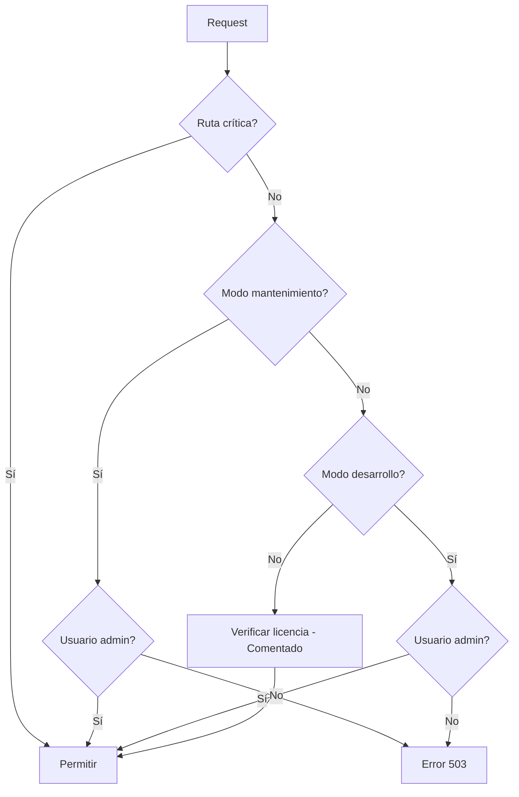

# System - Documentación Técnica

## Descripción General

El componente **System** es un middleware de Laravel que controla el acceso y disponibilidad de la aplicación. Gestiona el modo mantenimiento, modo desarrollo y verificaciones de licencia del sistema.

## Ubicación

- **Middleware**: `app/Http/Middleware/System.php`
- **Configuración**: Tabla `settings` (grupo 'System')
- **Vista mantenimiento**: `resources/views/errors/503.blade.php`

## Configuraciones de System

Las configuraciones se almacenan en la tabla `settings` con el grupo 'System':

| Key | Display Name | Tipo | Valor por defecto | Descripción |
|-----|--------------|------|-------------------|-------------|
| `system.development` | Sistema en Mantenimiento 503 | checkbox | '0' | Activa modo mantenimiento solo para no-admins |
| `system.payment-alert` | Alerta de Pago | checkbox | '1' | Muestra alertas de pago en el sistema |
| `system.code-system` | Código del Sistema | text | 'code-1' | Código de identificación del sistema |

**Archivo de seeder**: `database/seeders/SettingsTableSeeder.php`

## Middleware System

### Registro

**Archivo**: `app/Http/Kernel.php`

El middleware está registrado de dos formas:

1. **Como middleware de grupo web** (línea 39):
```php
'web' => [
    // ... otros middlewares
    \App\Http\Middleware\System::class,
],
```

2. **Como middleware de ruta** (línea 70):
```php
protected $routeMiddleware = [
    // ...
    'system' => \App\Http\Middleware\System::class,
];
```

### Flujo de Ejecución



### Código Fuente

**Archivo**: `app/Http/Middleware/System.php`

```php
<?php

namespace App\Http\Middleware;

use Closure;
use Illuminate\Http\Request;
use Illuminate\Support\Facades\Auth;
use App\Http\Controllers\SolucionDigitalController;
use App\Http\Controllers\Controller;
use Illuminate\Support\Facades\Log;

class System
{
    public function handle(Request $request, Closure $next)
    {
        /* 1. Log de entrada */
        Log::info('System MW', [
            'url'   => $request->fullUrl(),
            'user'  => optional(auth()->user())->only(['id', 'name', 'role_id']),
            'dev'   => setting('system.development'),
            'maint' => setting('configuracion.maintenance'),
        ]);

        // 1. Rutas críticas siempre abiertas
        $open = [
            'admin/login',
            'admin/logout',
            'admin/password/*',
            'admin/voyager-assets*',
            '/',
        ];
        
        if ($request->is($open)) {
            return $next($request);
        }

        // 2. Modo mantenimiento
        if (setting('configuracion.maintenance') === '1') {
            if (auth()->check() && auth()->user()->hasRole(['admin', 'administrador'])) {
                return $next($request);
            }
            return response()->view('errors.503', [], 503);
        }

        // 3. Desarrollo: admins o administradores
        if (Auth::user()) {
            if (setting('system.development') && !auth()->user()->hasRole(['admin', 'administrador'])) {
               return response()->view('errors.503', [], 503);
            }
        }

        // 4. Lógica de licencia (comentada)
        // $controller = new SolucionDigitalController();
        // $data = $controller->settings_code();

        // if ($data) {
        //     $payment = new Controller();
        //     if ($payment->payment_alert() === 'finalizado') {
        //         $blockedMethods = ['POST', 'PUT', 'PATCH', 'DELETE'];
        //         $allowedRoutes  = ['admin/login', 'admin/logout', 'admin/settings'];

        //         if (
        //             in_array($request->method(), $blockedMethods) &&
        //             !in_array($request->path(), $allowedRoutes)
        //         ) {
        //             return redirect()->back()
        //                 ->withInput()
        //                 ->with([
        //                     'message' => 'Para continuar con el servicio sin interrupciones, contacte al administrador.',
        //                     'alert-type' => 'error'
        //                 ]);
        //         }
        //     }
        // }

        /* último log antes de dejar pasar */
        Log::info('System MW → PERMITIDO', ['url' => $request->fullUrl()]);

        // 5. Si todo está bien, continuar
        return $next($request);
    }
}
```

### Lógica Detallada

#### 1. Rutas Críticas (Siempre abiertas)

Las siguientes rutas están excluidas de todas las verificaciones:

```php
$open = [
    'admin/login',        // Login
    'admin/logout',       // Logout
    'admin/password/*',   // Recuperación de contraseña
    'admin/voyager-assets*', // Assets de Voyager
    '/',                  // Home
];
```

Estas rutas siempre son accesibles sin importar el estado del sistema.

#### 2. Modo Mantenimiento

Verifica la configuración `configuracion.maintenance`:

- **Activo ('1')**: Solo admins y administradores pueden acceder
- **Inactivo**: Continúa con las siguientes verificaciones
- **Error**: Muestra vista `resources/views/errors/503.blade.php` con código 503

#### 3. Modo Desarrollo

Verifica la configuración `system.development`:

- **Activo**: Solo usuarios con roles 'admin' o 'administrador' pueden acceder
- **Inactivo**: Continúa con las siguientes verificaciones
- **Restricción**: Bloquea usuarios normales mostrando error 503

#### 4. Verificación de Licencia (Comentada)

Código actualmente comentado que bloquearía operaciones de escritura cuando el pago vence:

```php
if ($payment->payment_alert() === 'finalizado') {
    $blockedMethods = ['POST', 'PUT', 'PATCH', 'DELETE'];
    $allowedRoutes  = ['admin/login', 'admin/logout', 'admin/settings'];
    
    // Bloquea métodos de escritura excepto en rutas permitidas
}
```

#### 5. Logging

El middleware registra dos tipos de logs:

**Log de entrada** (línea 17):
```php
Log::info('System MW', [
    'url'   => $request->fullUrl(),
    'user'  => optional(auth()->user())->only(['id', 'name', 'role_id']),
    'dev'   => setting('system.development'),
    'maint' => setting('configuracion.maintenance'),
]);
```

**Log de aprobación** (línea 75):
```php
Log::info('System MW → PERMITIDO', ['url' => $request->fullUrl()]);
```

## Uso en Rutas

### Grupo Principal de Administración

**Archivo**: `routes/web.php` (línea 77)

```php
Route::prefix('admin')->middleware(['loggin', 'system'])->group(function () {
    // Todas las rutas de admin están protegidas por System
    Voyager::routes();
    Route::resource('people', PersonController::class);
    // ... más rutas
});
```

El middleware se aplica junto con `loggin` para verificar autenticación y permisos del sistema.

## Componentes Relacionados

### SolucionDigitalController

**Archivo**: `app/Http/Controllers/SolucionDigitalController.php`

```php
class SolucionDigitalController extends Controller
{
    public function settings_code()
    {
        // Devuelve null si la conexión o la tabla no existen
        // return rescue(function () {
        //     return DB::connection('solucionDigital')
        //              ->table('web_systems')
        //              ->where('code', setting('system.code-system'))
        //              ->first();
        // });
    }
}
```

Este controlador está diseñado para verificar licencias contra una base de datos externa (solucionDigital), pero actualmente está comentado.

### Controller

**Archivo**: `app/Http/Controllers/Controller.php`

El Controller base tiene un método relacionado:
```php
$controller = new SolucionDigitalController();
```

## Vista de Mantenimiento

**Archivo**: `resources/views/errors/503.blade.php`

Se muestra cuando el sistema está en modo mantenimiento o cuando el middleware bloquea el acceso. Esta vista debería contener información sobre el mantenimiento y, si corresponde, un mensaje de contacto.

## Alertas de Pago

En la vista `resources/views/vendor/voyager/master.blade.php` (línea 162):

```php
@if($solucionDigital->isNotEmpty() && is_numeric($aux->payment_alert()) && setting('system.payment-alert'))
    <div class="expiration-alert">
        <!-- Mensaje de alerta de pago -->
    </div>
@endif
```

La alerta de pago se muestra en el panel administrativo cuando:
1. Hay datos en la conexión 'solucionDigital'
2. El payment_alert() es numérico
3. La configuración `system.payment-alert` está activa

## Configuraciones Relacionadas

### Otras configuraciones que interactúan con System:

- **`configuracion.maintenance`**: Modo mantenimiento general (independiente de `system.development`)

## Ejemplos de Uso

### Activar Modo Desarrollo

```php
// Desde el panel de administración (Voyager Settings)
setting(['system.development' => '1']);
```

Resultado: Solo admins pueden acceder al sistema.

### Activar Modo Mantenimiento

```php
// Desde código
setting(['configuracion.maintenance' => '1']);
```

Resultado: Admins pueden trabajar, usuarios ven error 503.

### Verificar configuración en código

```php
$developmentMode = setting('system.development');
$paymentAlert = setting('system.payment-alert');
$systemCode = setting('system.code-system');
```

## Seguridad

### Roles que pueden pasar verificaciones:

- `admin`
- `administrador`

Estos roles pueden acceder al sistema incluso en modo mantenimiento o desarrollo.

### Consideraciones de seguridad:

1. Las rutas críticas están abiertas (login, logout, password reset)
2. Los logs registran todos los intentos de acceso
3. Las configuraciones de sistema están centralizadas
4. El middleware se ejecuta antes de cualquier lógica de negocio

## Troubleshooting

### Usuario bloqueado en modo desarrollo

**Problema**: Usuario normal no puede acceder aunque `system.development` está inactivo.

**Solución**: Verificar que `configuracion.maintenance` también esté inactivo y que el usuario tenga el rol correcto.

### Logs no aparecen

**Problema**: Los logs del middleware no se registran.

**Solución**: Verificar configuración de Laravel Log en `config/logging.php`.

### Alerta de pago no aparece

**Problema**: La alerta de pago configurada no se muestra.

**Solución**: Verificar:
1. `system.payment-alert` está activo
2. La conexión `solucionDigital` existe y tiene datos
3. El método `payment_alert()` retorna un valor numérico

## Dependencias

- Laravel 10+ (Middleware, Auth, Request, Log)
- Voyager (helper `setting()`)
- Database externa 'solucionDigital' (opcional, actualmente no usada)

## Archivos Relacionados

```
app/
├── Http/
│   ├── Middleware/
│   │   └── System.php              # Middleware principal
│   ├── Kernel.php                   # Registro de middlewares
│   └── Controllers/
│       ├── Controller.php           # Controller base
│       └── SolucionDigitalController.php  # Verificación de licencia

database/
└── seeders/
    └── SettingsTableSeeder.php     # Configuraciones por defecto

resources/
└── views/
    ├── errors/
    │   └── 503.blade.php           # Vista de mantenimiento
    └── vendor/voyager/
        └── master.blade.php         # Alertas de pago

routes/
└── web.php                          # Definición de rutas
```

## Notas Importantes

1. La funcionalidad de licencia está **comentada** pero el código está presente
2. Existen dos configuraciones de mantenimiento: `system.development` y `configuracion.maintenance`
3. Los logs ayudan a monitorear el estado del sistema y accesos
4. Las rutas críticas nunca son bloqueadas
5. El middleware se ejecuta en el grupo 'web', afectando a todas las rutas web por defecto

## Versiones

- **Creado**: Sistema inicial
- **Última modificación**: 2025-01-17
- **Estado**: Activo con funcionalidad de licencia deshabilitada (comentada)

---

# Bugs, Problemas, Mejoras y Optimizaciones

## 🐛 Bugs Críticos

### 1. Conflicto de Configuraciones de Mantenimiento
**Ubicación**: `app/Http/Middleware/System.php:20,36` y `database/seeders/SettingsTableSeeder.php:119`

**Problema**: Existen dos configuraciones para mantenimiento que causan confusión:
- `system.development` (línea 20, 45) - "Sistema en Mantenimiento 503"
- `configuracion.maintenance` (línea 21, 36) - "Modo mantenimiento general"

Ambos bloquean accesos pero con ligeras diferencias, creando confusión sobre cuál usar.

**Impacto**: 
- Administradores pueden activar ambos simultáneamente
- Comportamiento impredecible cuando ambos están activos
- Logs muestran valores diferentes para el mismo concepto

**Solución**: Unificar en una sola configuración o crear jerarquía clara.

---

### 2. Inconsistencia en Verificación de Usuario
**Ubicación**: `app/Http/Middleware/System.php:44-48`

**Problema**: Uso inconsistente de helpers de autenticación:
- Línea 90: `optional(auth()->user())`
- Línea 110: `auth()->check() && auth()->user()->hasRole()`
- Línea 44: `if (Auth::user())`
- Línea 45: `!auth()->user()->hasRole()`

Mezcla `Auth::user()` (facades) con `auth()->user()` (helper), lo cual no es ideal para consistencia.

**Solución**: 
```php
// Usar consistentemente auth()->check() o Auth::check()
if (auth()->check() && auth()->user()->hasRole(['admin', 'administrador'])) {
```

---

### 3. Riesgo de Error Fatal en Master Blade
**Ubicación**: `resources/views/vendor/voyager/master.blade.php:162, 225, 229, 235, 291, 355, 359, 365`

**Problema**: Uso de variables sin verificar si existen:
```php
@if($solucionDigital->isNotEmpty() && is_numeric($aux->payment_alert()) && setting('system.payment-alert'))
```

La variable `$aux` no está definida en el código visible de esta vista. Si `payment_alert()` falla, puede causar error.

Además, accesos directos a colecciones sin verificación:
```php
{{$solucionDigital->where('key','contact.phone')->first()->value ?? ''}}
```

Si la colección `solucionDigital` está vacía, `where()->first()` retorna null, pero el código asume que existe.

**Impacto**: Posibles errores 500 en producción si falla la conexión solucionDigital.

**Solución**: Verificar siempre antes de acceder:
```php
@php
    $phone = $solucionDigital->where('key','contact.phone')->first()?->value ?? '';
    $email = $solucionDigital->where('key','contact.email')->first()?->value ?? '';
@endphp
<p>{{$phone}}</p>
<p>{{$email}}</p>
```

---

### 4. Conexión `solucionDigital` Inexistente
**Ubicación**: `config/database.php` (comentado), `resources/views/vendor/voyager/master.blade.php:156-157`

**Problema**: 
- La conexión está comentada en `config/database.php`
- Pero el código sigue intentando usarla: `DB::connection('solucionDigital')->table('settings')->get()`
- Esto causará errores en producción

**Impacto**: 
- Errores de base de datos en producción
- La función `rescue()` capturará el error pero los datos no se cargarán
- Funcionalidad de alertas de pago no funcionará

**Solución**: 
1. Configurar correctamente la conexión o eliminar el código
2. Agregar validación explícita:
```php
$solucionDigital = rescue(
    fn () => config('database.connections.solucionDigital') 
        ? DB::connection('solucionDigital')->table('settings')->get()
        : collect(),
    fn () => collect()
);
```

---

### 5. Método `payment_alert()` con Lógica Obsoleta
**Ubicación**: `app/Http/Controllers/Controller.php:21-52`

**Problema**: 
- El método llama a `SolucionDigitalController::settings_code()` que retorna siempre `null`
- Toda la lógica de cálculo de días restantes es innecesaria
- El método siempre retorna `null`

**Código actual**:
```php
public function payment_alert()
{
    $controller = new SolucionDigitalController();
    $data = $controller->settings_code(); // SIEMPRE retorna null

    if (!$data || !isset($data->finish, $data->type)) {
        return null; // SIEMPRE retorna aquí
    }
    // ... código nunca ejecutado
}
```

**Solución**: 
- Eliminar el método si no se usará
- O implementar una fuente de datos real
- Actualizar master.blade.php para no depender de este método

---

### 6. Logs en Todos los Requests
**Ubicación**: `app/Http/Middleware/System.php:17-22, 75`

**Problema**: 
- Se registran logs en CADA request que pasa por el middleware
- El middleware está en el grupo 'web' que se ejecuta para todas las páginas
- Incluye recursos estáticos, AJAX, imágenes, etc.
- El archivo de log puede crecer exponencialmente

**Impacto**:
- `laravel.log` puede crecer cientos de MB por día
- Dificulta encontrar errores reales
- Puede llenar el disco
- Rendimiento reducido por I/O de escritura de logs

**Ejemplo de log innecesario**:
```
[2025-01-17 10:23:45] local.INFO: System MW {"url":"/admin/voyager-assets/css/style.css","user":null,"dev":"0","maint":"0"}
[2025-01-17 10:23:45] local.INFO: System MW → PERMITIDO {"url":"/admin/voyager-assets/css/style.css"}
```

**Solución**:
```php
// Agregar condiciones para no loggear requests estáticos
if (!$request->is(['admin/voyager-assets*', 'images/*', 'css/*', 'js/*'])) {
    Log::info('System MW', [...]);
}
```

O usar niveles de log más apropiados y rotación.

---

### 7. Duplicación de Ejecución de Middleware
**Ubicación**: `app/Http/Kernel.php:39,70` y `routes/web.php:77`

**Problema**: 
- El middleware está registrado en el grupo 'web' (línea 39)
- Y también como middleware individual (línea 70)
- En `routes/web.php:77` se usa explícitamente en rutas admin

Esto puede causar que el middleware se ejecute múltiples veces en el mismo request si no se maneja correctamente.

**Impacto**: Posible duplicación de logs y verificaciones.

**Solución**: Elegir una estrategia y usarla consistentemente:
- O mantenerlo solo en el grupo web
- O eliminar del grupo web y usarlo explícitamente donde se necesite

---

### 8. Auto-Reload en Página 503 Sin Control
**Ubicación**: `resources/views/errors/503.blade.php:90-93`

**Problema**: 
```javascript
setTimeout(function() {
    window.location.reload();
}, 300000); // 5 minutos
```

La página se recarga automáticamente cada 5 minutos sin interacción del usuario.

**Impacto**:
- El usuario puede estar en medio de leer un artículo o formulario
- Genera tráfico innecesario al servidor
- No hay botón de cancelar

**Solución**: 
```javascript
// Agregar contador visible y opción de cancelar
let countdown = 300;
const interval = setInterval(() => {
    document.getElementById('countdown').textContent = countdown + 's';
    if (countdown <= 0) {
        clearInterval(interval);
        window.location.reload();
    }
    countdown--;
}, 1000);

// Botón para cancelar
document.getElementById('cancelReload').addEventListener('click', () => {
    clearInterval(interval);
});
```

---

## 🔍 Problemas Menores

### 9. Rutas Críticas Incompletas
**Ubicación**: `app/Http/Middleware/System.php:96-102`

**Problema**: Falta considerar rutas importantes que deberían seguir funcionando:
- Rutas de validación pública (`/validar/{hash}`)
- Rutas de API públicas
- Webhooks de pago
- Rutas de health check

**Solución**: Agregar a la lista:
```php
$open = [
    'admin/login',
    'admin/logout',
    'admin/password/*',
    'admin/voyager-assets*',
    '/',
    'validar/*',
    'api/health',
    'webhooks/*',
];
```

---

### 10. Falta Validación de Datos en Settings
**Ubicación**: `database/seeders/SettingsTableSeeder.php`

**Problema**: 
- No hay validación de que los settings existan
- El código asume que `setting('system.development')` siempre existe
- Si se borra de la DB, puede causar errores

**Solución**: Usar valores por defecto:
```php
$devMode = setting('system.development', '0');
$maintenanceMode = setting('configuracion.maintenance', '0');
```

---

### 11. Nombre Confuso de Configuración
**Ubicación**: `database/seeders/SettingsTableSeeder.php:113`

**Problema**: 
```php
'key' => 'system.development',
'display_name' => 'Sistema en Mantenimiento 503',
```

El nombre dice "development" pero la descripción dice "Mantenimiento 503", lo cual es confuso para el administrador.

**Solución**: Renombrar a `system.maintenance` o actualizar la descripción.

---

## ⚡ Optimizaciones

### 1. Cachear Configuraciones de Settings
**Ubicación**: `app/Http/Middleware/System.php`

**Problema**: Las llamadas a `setting()` consultan la base de datos en cada request.

**Optimización**: Usar caché de Laravel:
```php
public function handle(Request $request, Closure $next)
{
    $devMode = Cache::remember('system.development', 300, fn() => setting('system.development'));
    $maintMode = Cache::remember('configuracion.maintenance', 300, fn() => setting('configuracion.maintenance'));
    
    Log::info('System MW', [
        'url'   => $request->fullUrl(),
        'user'  => optional(auth()->user())->only(['id', 'name', 'role_id']),
        'dev'   => $devMode,
        'maint' => $maintMode,
    ]);
    
    // ... resto del código
}
```

Invalidar caché cuando se actualicen los settings:
```php
// En el controlador que actualiza settings
Cache::forget('system.development');
Cache::forget('configuracion.maintenance');
```

**Impacto**: Reducción significativa de consultas a BD.

---

### 2. Separar Middleware System en Múltiples
**Ubicación**: `app/Http/Middleware/System.php`

**Problema**: El middleware hace demasiado: mantenimiento, desarrollo, licencia, logging.

**Optimización**: Crear middlewares especializados:

**`app/Http/Middleware/MaintenanceMode.php`**:
```php
public function handle(Request $request, Closure $next)
{
    if (setting('configuracion.maintenance') === '1') {
        if (auth()->check() && auth()->user()->hasRole(['admin', 'administrador'])) {
            return $next($request);
        }
        return response()->view('errors.503', [], 503);
    }
    return $next($request);
}
```

**`app/Http/Middleware/DevelopmentMode.php`**:
```php
public function handle(Request $request, Closure $next)
{
    if (auth()->check() && setting('system.development')) {
        if (!auth()->user()->hasRole(['admin', 'administrador'])) {
            return response()->view('errors.503', [], 503);
        }
    }
    return $next($request);
}
```

**Uso**:
```php
// Kernel.php
'web' => [
    // ...
    MaintenanceMode::class,
    DevelopmentMode::class,
],
```

**Beneficios**:
- Separación de responsabilidades
- Fácil desactivar uno sin el otro
- Código más limpio y testable
- Posibilidad de combinar de forma flexible

---

### 3. Usar Rate Limiting para Logs
**Ubicación**: `app/Http/Middleware/System.php`

**Problema**: El mismo error puede loggearse cientos de veces en segundos.

**Optimización**: Implementar rate limiting:
```php
use Illuminate\Support\Facades\RateLimiter;

public function handle(Request $request, Closure $next)
{
    $key = 'system-mw:' . $request->ip();
    
    if (!RateLimiter::attempt($key, 60, fn() => true, 60)) {
        // Solo loggear 60 veces por minuto por IP
        return $next($request);
    }
    
    Log::info('System MW', [...]);
    
    return $next($request);
}
```

---

### 4. Lazy Loading en Master Blade
**Ubicación**: `resources/views/vendor/voyager/master.blade.php:156-162`

**Problema**: La consulta a `solucionDigital` se ejecuta en todas las páginas.

**Optimización**: Usar eager loading y caché:
```blade
@php
$solucionDigital = Cache::remember('solucion-digital-settings', 60, function() {
    return rescue(
        fn () => \Illuminate\Support\Facades\DB::connection('solucionDigital')
            ->table('settings')->get(),
        fn () => collect()
    );
@endphp
```

---

### 5. Eliminar Imports No Usados
**Ubicación**: `app/Http/Middleware/System.php:8-9`

```php
use App\Http\Controllers\SolucionDigitalController;  // No usado (comentado)
use App\Http\Controllers\Controller;  // No usado
```

**Optimización**: Eliminar líneas 8-9 para reducir el tamaño del archivo y mejorar claridad.

---

## 🚀 Mejoras Sugeridas

### 1. Endpoint de Health Check
**Ubicación**: Nuevo en `routes/web.php`

**Problema**: No hay forma de monitorear el estado del sistema desde herramientas externas.

**Mejora**: 
```php
Route::get('/api/health', function () {
    return response()->json([
        'status' => setting('configuracion.maintenance') === '1' ? 'maintenance' : 'operational',
        'development_mode' => setting('system.development') === '1',
        'timestamp' => now()->toISOString(),
    ]);
})->withoutMiddleware([\App\Http\Middleware\System::class]);
```

Esto permite monitorear el sistema con herramientas como UptimeRobot, Pingdom, etc.

---

### 2. Modo Solo Lectura (Read-Only)
**Nueva Configuración**: `system.readonly`

**Mejora**: Implementar un modo donde los usuarios pueden ver pero no modificar datos:
```php
if (setting('system.readonly') === '1') {
    $blockedMethods = ['POST', 'PUT', 'PATCH', 'DELETE'];
    
    if (in_array($request->method(), $blockedMethods)) {
        if (!auth()->user()->hasRole(['admin', 'administrador'])) {
            return response()->json([
                'message' => 'El sistema está en modo solo lectura',
            ], 403);
        }
    }
}
```

**Beneficios**:
- Permite auditorías sin riesgo de modificaciones
- Útil durante migraciones o actualizaciones
- Más flexible que modo mantenimiento total

---

### 3. Mensaje Personalizable de Mantenimiento
**Nueva Configuración**: `system.maintenance_message`

**Problema**: El mensaje de mantenimiento es estático en la vista 503.

**Mejora**: 
```php
// En middleware
$maintenanceMessage = setting('system.maintenance_message', 
    'Estamos realizando tareas de mantenimiento para mejorar nuestro servicio.'
);

return response()->view('errors.503', [
    'message' => $maintenanceMessage,
], 503);
```

```blade
<!-- resources/views/errors/503.blade.php -->
<div class="maintenance-message">
    <p class="lead">{{ $message }}</p>
</div>
```

---

### 4. Notificación por Email al Activar Mantenimiento
**Nueva Funcionalidad**

**Mejora**: Notificar a administradores cuando se activa modo mantenimiento:
```php
if (setting('configuracion.maintenance') === '1') {
    // Solo notificar si cambió recientemente
    $lastNotification = Cache::get('maintenance-notified');
    
    if (!$lastNotification || now()->diffInMinutes($lastNotification) > 5) {
        $admins = \App\Models\User::role('admin')->get();
        
        foreach ($admins as $admin) {
            $admin->notify(new \App\Notifications\MaintenanceModeActivated());
        }
        
        Cache::put('maintenance-notified', now(), 10);
    }
    
    // ... resto de lógica
}
```

---

### 5. Bypass por Token de Emergencia
**Nueva Funcionalidad**

**Mejora**: Permitir acceso con un token temporal sin login:
```php
// En middleware
$emergencyToken = $request->query('emergency_token');

if ($emergencyToken && Cache::get('emergency-token') === $emergencyToken) {
    return $next($request); // Permitir acceso
}

// ... verificaciones normales
```

**Uso**: Generar token desde artisan:
```bash
php artisan system:emergency-token
# Output: Acceso de emergencia: /admin/dashboard?emergency_token=abc123
```

El token expira después de 1 hora automáticamente.

---

### 6. API Endpoints con Códigos de Estado Apropiados
**Nueva Funcionalidad**

**Mejora**: Para rutas API, usar códigos de estado más apropiados:
```php
if (setting('configuracion.maintenance') === '1') {
    if ($request->expectsJson()) {
        return response()->json([
            'message' => 'Sistema en mantenimiento',
            'retry_after' => 3600, // segundos
        ], 503);
    }
    
    return response()->view('errors.503', [], 503);
}
```

---

### 7. Auditoría de Cambios de Estado
**Nueva Funcionalidad**

**Mejora**: Registrar quién activó/desactivó el modo mantenimiento:
```php
// Crear tabla system_status_logs
Schema::create('system_status_logs', function (Blueprint $table) {
    $table->id();
    $table->foreignId('user_id')->nullable();
    $table->string('setting_key');
    $table->string('old_value');
    $table->string('new_value');
    $table->ipAddress('ip_address');
    $table->timestamps();
});

// En middleware al detectar cambios
$oldValue = Cache::get('system.development');
$newValue = setting('system.development');

if ($oldValue !== $newValue) {
    SystemStatusLog::create([
        'user_id' => auth()->id(),
        'setting_key' => 'system.development',
        'old_value' => $oldValue,
        'new_value' => $newValue,
        'ip_address' => request()->ip(),
    ]);
    
    Cache::put('system.development', $newValue);
}
```

---

### 8. Dashboard de Estado del Sistema
**Nueva Vista/Controller**

**Mejora**: Crear un panel que muestre el estado actual:
```php
// Admin/SystemStatusController.php
public function index()
{
    return view('admin.system-status', [
        'maintenance_mode' => setting('configuracion.maintenance') === '1',
        'development_mode' => setting('system.development') === '1',
        'readonly_mode' => setting('system.readonly') === '1',
        'system_code' => setting('system.code-system'),
        'payment_alert' => setting('system.payment-alert') === '1',
        'connection_status' => $this->checkSolucionDigitalConnection(),
    ]);
}
```

---

### 9. Comandos de Artisan
**Nuevos Comandos**

**Mejora**: Facilitar el control del sistema desde CLI:
```bash
# Activar modo mantenimiento
php artisan system:maintenance --on

# Desactivar modo mantenimiento  
php artisan system:maintenance --off

# Ver estado actual
php artisan system:status

# Activar modo desarrollo
php artisan system:development --on
```

---

### 10. Integración con Notifications
**Nueva Funcionalidad**

**Mejora**: Crear notificaciones push para admin:
```php
class MaintenanceModeActivated extends Notification implements ShouldBroadcast
{
    use Queueable;
    
    public function toBroadcast($notifiable)
    {
        return new BroadcastMessage([
            'message' => 'Modo mantenimiento activado',
            'type' => 'warning',
            'timestamp' => now()->toISOString(),
        ]);
    }
}
```

---

## 🗑️ Código Muerto y Limpieza Necesaria

### 1. Código Comentado en Middleware
**Ubicación**: `app/Http/Middleware/System.php:51-72`

**Problema**: 22 líneas de código comentado que no se usa pero ocupa espacio y confunde.

**Solución**: Eliminar o mover a un archivo de referencia por si se necesita en el futuro.

---

### 2. Imports No Usados
**Ubicación**: `app/Http/Middleware/System.php:8-9`

```php
use App\Http\Controllers\SolucionDigitalController;  // Eliminar
use App\Http\Controllers\Controller;  // Eliminar
```

---

### 3. SolucionDigitalController Vacío
**Ubicación**: `app/Http/Controllers/SolucionDigitalController.php`

**Problema**: Controlador con un método que retorna siempre null.

**Solución**: Eliminar el controlador o implementar funcionalidad real.

---

### 4. Configuración de SolucionDigital en database.php
**Ubicación**: `config/database.php` (líneas comentadas)

**Solución**: Eliminar si no se usará, o configurar correctamente.

---

## 📝 Cosas que Faltan

### 1. Tests para el Middleware
**Estado**: No existen

**Necesario**: Crear tests unitarios y de integración:
```php
// tests/Feature/SystemMiddlewareTest.php
public function test_maintenance_mode_blocks_users()
{
    setting(['configuracion.maintenance' => '1']);
    
    $response = $this->get('/admin/dashboard');
    $response->assertStatus(503);
}

public function test_admin_can_access_during_maintenance()
{
    $admin = User::factory()->create()->assignRole('admin');
    setting(['configuracion.maintenance' => '1']);
    
    $response = $this->actingAs($admin)->get('/admin/dashboard');
    $response->assertStatus(200);
}
```

---

### 2. Documentación de Uso
**Estado**: Parcial

**Falta**: 
- Guía para administradores sobre cómo usar los modos
- Explicación de diferencias entre maintenance y development
- Qué hacer cuando el sistema está en mantenimiento
- Cómo verificar logs de System MW

---

### 3. Manejo de Errores en Conexión Externa
**Estado**: Parcial (solo con `rescue`)

**Falta**: 
- Fallbacks más robustos
- Alertas al admin cuando falla la conexión
- Sistema de reintentos con backoff

---

### 4. Rate Limiting para Protección
**Estado**: No existe

**Falta**: Proteger contra ataques de fuerza bruta en modo mantenimiento.

---

### 5. Integración con Sistema de Auditoría
**Estado**: No existe

**Falta**: Registrar cambios de configuración de sistema en logs de auditoría.

---

### 6. Configuración de Tiempo de Expiración
**Estado**: No existe

**Falta**: Poder programar automáticamente el fin del modo mantenimiento:
```php
// setting('system.maintenance_end') = '2025-01-17 18:00:00'
if (setting('system.maintenance_end') && now() > setting('system.maintenance_end')) {
    setting(['configuracion.maintenance' => '0']);
}
```

---

## 🎯 Prioridad de Implementación

### Alta Prioridad (Corregir ASAP)
1. ✅ Eliminar imports no usados
2. ✅ Corregir conexión `solucionDigital` o eliminar código
3. ✅ Unificar configuraciones de mantenimiento
4. ✅ Agregar validaciones en master.blade.php
5. ✅ Implementar rate limiting para logs
6. ✅ Corregir inconsistencia de Auth

### Media Prioridad
1. Crear tests
2. Implementar caché de settings
3. Agregar endpoint de health check
4. Mejorar mensajes de mantenimiento
5. Separar middleware en componentes

### Baja Prioridad
1. Modo solo lectura
2. Notificaciones por email
3. Dashboard de estado
4. Comandos de Artisan
5. Integración con broadcast notifications

---

## 📊 Resumen de Archivos a Modificar

| Archivo | Tipo | Cambios Sugeridos | Prioridad |
|---------|------|-------------------|-----------|
| `app/Http/Middleware/System.php` | Bug, Optimización | Corregir Auth, eliminar imports, rate limiting logs | Alta |
| `config/database.php` | Bug | Configurar solucionDigital o eliminar código | Alta |
| `resources/views/vendor/voyager/master.blade.php` | Bug | Validar variables, usar caché | Alta |
| `app/Http/Controllers/Controller.php` | Código muerto | Eliminar o implementar `payment_alert()` | Media |
| `database/seeders/SettingsTableSeeder.php` | Mejora | Corregir nombres, unificar configs | Alta |
| `resources/views/errors/503.blade.php` | Mejora | Agregar contador visible, botón cancelar | Media |
| `routes/web.php` | Mejora | Agregar health check, bypass token | Media |
| `app/Http/Kernel.php` | Optimización | Revisar duplicación de middleware | Media |
| `config/logging.php` | Optimización | Configurar rotación de logs | Media |

---

## 🔧 Comandos Útiles

### Ver logs de System MW
```bash
tail -f storage/logs/laravel.log | grep "System MW"
```

### Contar requests por hora en logs
```bash
grep "System MW" storage/logs/laravel.log | awk '{print $1" "$2}' | sort | uniq -c
```

### Ver tamaño del archivo de logs
```bash
ls -lh storage/logs/laravel.log
```

### Limpiar logs antiguos
```bash
php artisan log:clear
```
