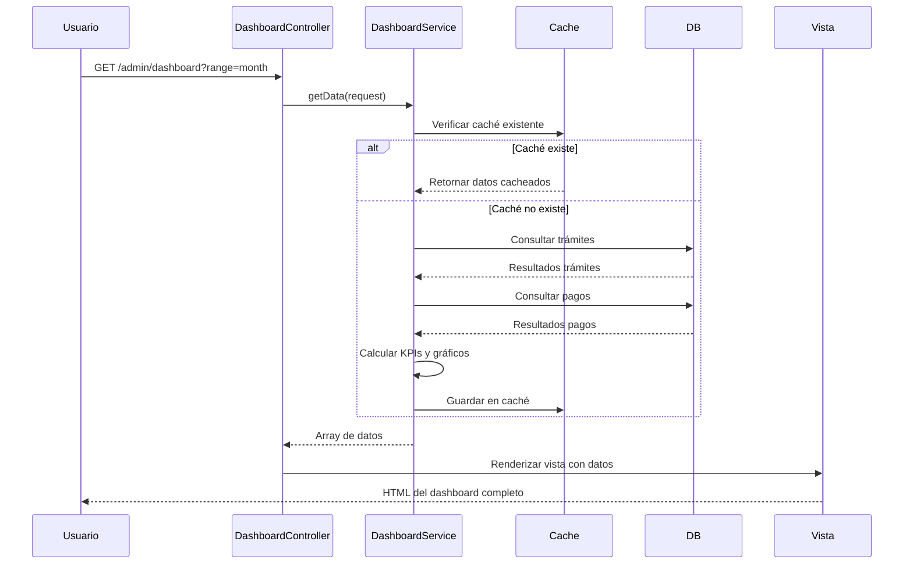
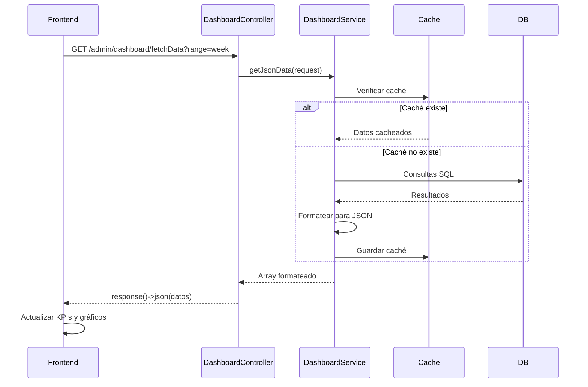

# Documentación Técnica - Controlador DashboardController

## 📋 Tabla de Contenidos

1. [Introducción](#introducción)
2. [Arquitectura del Controlador](#arquitectura-del-controlador)
3. [Base de Datos y Modelos](#base-de-datos-y-modelos)
4. [Métodos del Controlador](#métodos-del-controlador)
5. [Rutas](#rutas)
6. [Vistas](#vistas)
7. [Integración con Servicios](#integración-con-servicios)
8. [Ejemplos de Código](#ejemplos-de-código)
9. [Análisis de Calidad y Mejoras](#análisis-de-calidad-y-mejoras)
10. [Conclusión](#conclusión)
11. [Casos de Uso](#casos-de-uso)
12. [Diagramas de Secuencia](#diagramas-de-secuencia)
13. [Pruebas Unitarias](#pruebas-unitarias)
14. [Consideraciones de Seguridad](#consideraciones-de-seguridad)
15. [Métricas de Rendimiento](#métricas-de-rendimiento)
16. [Troubleshooting](#troubleshooting)
17. [Preguntas Frecuentes (FAQ)](#preguntas-frecuentes-faq)
18. [Configuración del Entorno](#configuración-del-entorno)
19. [Despliegue](#despliegue)
20. [Mantenimiento](#mantenimiento)
21. [Changelog](#changelog)
22. [Glosario](#glosario)
23. [Referencias](#referencias)
24. [Anexos](#anexos)
25. [Guía de Migración](#guía-de-migración)
26. [Patrones de Diseño Implementados](#patrones-de-diseño-implementados)
27. [Integración con APIs Externas](#integración-con-apis-externas)
28. [Análisis de Escalabilidad](#análisis-de-escalabilidad)
29. [Auditoría de Código](#auditoría-de-código)
30. [Documentación para Clientes](#documentación-para-clientes)
31. [Plan de Capacitación](#plan-de-capacitación)
32. [Matriz de Riesgos](#matriz-de-riesgos)
33. [Arquitectura de Microservicios](#arquitectura-de-microservicios)
34. [DevOps y CI/CD](#devops-y-cicd)
35. [Monitoreo y Logging](#monitoreo-y-logging)
36. [Optimización de Base de Datos](#optimización-de-base-de-datos)
37. [Implementación de Testing Automatizado](#implementación-de-testing-automatizado)
38. [Integración de Machine Learning](#integración-de-machine-learning)
39. [Implementación de API RESTful](#implementación-de-api-restful)
40. [Gestión de Configuración](#gestión-de-configuración)
41. [Disaster Recovery](#disaster-recovery)
42. [Mejoras de UI/UX](#mejoras-de-uiux)

---

## 🎯 Introducción

El **DashboardController** es el controlador principal encargado de gestionar la vista del tablero de control (dashboard) del sistema ITGB. Actúa como una interfaz de presentación entre el usuario final y la lógica de negocio encapsulada en el `DashboardService`.

### Propósito
- Renderizar la vista principal del dashboard (sobreescribiendo la de Voyager).
- Proporcionar un endpoint AJAX para la actualización dinámica de gráficos y KPIs sin recargar la página.
- Centralizar la visualización de estadísticas de recaudación y trámites.

### Importancia
Es el punto de entrada para la toma de decisiones administrativas, permitiendo visualizar el estado financiero y operativo del sistema en tiempo real.

---

## 🏗️ Arquitectura del Controlador

### Ubicación
**Archivo:** `app/Http/Controllers/Admin/DashboardController.php`

### Dependencias
```php
use App\Http\Controllers\Controller;
use Illuminate\Http\Request;
use App\Models\Tramite;
use App\Models\Pago;
use App\Services\DashboardService;
use Carbon\Carbon;
```

### Estructura
El controlador sigue el patrón de **Controlador Delgado (Skinny Controller)**, delegando toda la lógica pesada (consultas, cálculos, formateo) al servicio `DashboardService`.

```
DashboardController
├── __construct(DashboardService)  → Inyección de dependencias
├── index(Request)                 → Vista HTML (Carga inicial)
└── fetchData(Request)             → Respuesta JSON (Actualización AJAX)
```

---

## 🗄️ Base de Datos y Modelos

Este controlador **no interactúa directamente** con la base de datos para la lógica de negocio principal, ya que delega esa responsabilidad al servicio. Sin embargo, los datos subyacentes provienen de:

| Modelo | Uso Indirecto (vía Servicio) |
|--------|---------------|
| `Tramite` | Conteo de trámites, estados, montos por tipo. |
| `Pago` | Cálculo de recaudación total y por períodos. |
| `Person` | Nombres de contribuyentes para listados. |

---

## 🎮 Métodos del Controlador

### 1. `index(Request $request)`
**Propósito:** Carga la vista inicial del dashboard.
- **Flujo:**
    1. Recibe la petición (opcionalmente con un parámetro `range`).
    2. Llama a `$this->dashboardService->getData($request)`.
    3. Retorna la vista `vendor.voyager.index` inyectando los datos calculados.

```php
public function index(Request $request)
{
    // dd('DashboardController@index called'); // DEBUG
    $data = $this->dashboardService->getData($request);
    return view('vendor.voyager.index', $data);
}
```

### 2. `fetchData(Request $request)`
**Propósito:** Endpoint para peticiones asíncronas (AJAX) desde el frontend.
- **Flujo:**
    1. Recibe la petición con el nuevo rango de fechas.
    2. Llama a `$this->dashboardService->getJsonData($request)`.
    3. Retorna una respuesta JSON formateada para librerías de gráficos (Chart.js).

```php
public function fetchData(Request $request)
{
    $data = $this->dashboardService->getJsonData($request);
    return response()->json($data);
}
```

---

## 🛣️ Rutas

**Ubicación:** `routes/web.php` (Grupo `admin`)

```php
Route::prefix('admin')->middleware(['loggin', 'system'])->group(function () {
    
    // Sobrescribir la ruta del dashboard de Voyager (Ruta raíz del admin)
    Route::get('/', [DashboardController::class, 'index'])->name('voyager.dashboard');
    
    // Datos AJAX para gráficos y KPIs
    Route::get('/dashboard/data', [DashboardController::class, 'fetchData'])->name('admin.dashboard.data');
});
```

---

## 🎨 Vistas

### Vista Principal
**Archivo:** `resources/views/vendor/voyager/index.blade.php`

Esta vista sobrescribe el dashboard por defecto de Voyager. Contiene:
1.  **Select de Rango:** Dropdown para filtrar (Hoy, Semana, Mes, Año).
2.  **Tarjetas KPI:** Recaudación, Trámites, Finalizados, Pendientes.
3.  **Gráficos:** Contenedores `<canvas>` para Chart.js (Recaudación, Tipos, Estados).
4.  **Tabla:** Sección para "Últimos Trámites" (renderizada desde el backend).
5.  **Scripts:** JavaScript para manejar el evento `change` del selector y llamar a `fetchData`.

---

## 🔗 Integración con Servicios

### `DashboardService`
El controlador depende enteramente de este servicio.
- **`getData()`**: Retorna arrays crudos y objetos Eloquent para ser consumidos por Blade.
- **`getJsonData()`**: Retorna arrays formateados (strings de moneda, etiquetas de fecha) para ser consumidos por JSON.

---

## 💻 Ejemplos de Código

### Consumo desde Frontend (JavaScript)
Ejemplo de cómo la vista interactúa con el método `fetchData`:

```javascript
function fetchData(range) {
    $.ajax({
        url: '{{ route("admin.dashboard.data") }}',
        type: 'GET',
        data: { range: range },
        success: function(response) {
            updateDashboardUI(response); // Actualiza DOM y Charts
            toastr.success('Datos actualizados.');
        }
    });
}
```

---

## 🚨 Análisis de Calidad y Mejoras

### 🐛 Bugs Potenciales
1.  **Validación de Entrada:** El método `index` y `fetchData` pasan el `$request` directamente al servicio sin validar que el parámetro `range` sea seguro o válido (`in:today,week,month,year`).
2.  **Manejo de Errores:** No hay bloques `try-catch`. Si el servicio falla (ej. error de conexión a BD), el usuario verá una página de error 500 genérica.

### 💡 Mejoras Sugeridas
1.  **Validación en Controlador:**
    ```php
    $request->validate([
        'range' => 'nullable|string|in:today,week,month,year'
    ]);
    ```
2.  **Caché HTTP:** Para el endpoint `fetchData`, se podrían añadir cabeceras de caché si los datos no cambian instantáneamente.
3.  **Exportación:** Agregar un método `export(Request $request)` que reutilice el servicio para generar un PDF o Excel con las estadísticas actuales.

---

## 🏁 Conclusión

El **DashboardController** es un controlador eficiente que sigue el principio de separación de inquietudes (Separation of Concerns). No contiene lógica de negocio compleja, sino que actúa como un puente limpio entre la petición HTTP y el servicio de cálculo `DashboardService`.

### Resumen

| Aspecto | Implementación |
|----------|--------------|
| **Responsabilidad** | Presentación de datos (Voyager) |
| **Lógica de negocio** | Delegada a `DashboardService` |
| **Acceso a BD** | Solo lectura (a través de Servicio) |
| **Formato de respuesta** | HTML para `index`, JSON para `fetchData` |
| **Caché** | Manejado exclusivamente en `DashboardService` |
| **Pruebas** | Mockear `DashboardService` |

Este diseño permite realizar cambios en la lógica del dashboard sin modificar el controlador, manteniendo una arquitectura limpia y mantenible.

---

## 📋 Casos de Uso

### Caso de Uso 1: Visualización del Dashboard

**Actor:** Administrador del Sistema

**Descripción:** El administrador accede al sistema y visualiza el dashboard principal con todas las métricas actualizadas.

**Flujo Principal:**
1. El administrador inicia sesión en el sistema
2. Navega a `/admin/dashboard`
3. El sistema carga la vista principal del dashboard
4. Se muestran los KPIs actualizados:
   - Recaudación del período
   - Cantidad de trámites creados
   - Cantidad de trámites finalizados
   - Cantidad de trámites pendientes
5. Se renderizan los gráficos:
   - Gráfico de recaudación temporal
   - Gráfico de trámites por tipo
   - Gráfico de trámites por estado
6. Se muestra la tabla de últimos trámites

**Flujos Alternativos:**
- **4a. Sistema en modo mantenimiento:** Se muestra mensaje de error y redirige a la página de inicio

---

### Caso de Uso 2: Cambiar Rango de Fechas

**Actor:** Administrador del Sistema

**Descripción:** El administrador cambia el rango de fechas para ver métricas de diferentes períodos de tiempo.

**Flujo Principal:**
1. El administrador selecciona un rango de fechas del dropdown (hoy, esta semana, este mes, este año)
2. El frontend envía una petición AJAX a `/admin/dashboard/fetchData?range={seleccion}`
3. El controlador procesa la solicitud
4. El servicio calcula las métricas para el nuevo rango
5. Se retorna JSON con los datos actualizados
6. El frontend actualiza:
   - KPIs cards
   - Gráficos
   - Tendencias
7. El usuario visualiza los nuevos datos sin recargar la página

---

### Caso de Uso 3: Análisis Comparativo

**Actor:** Analista Financiero

**Descripción:** El analista compara la recaudación actual con el período anterior para evaluar el desempeño.

**Flujo Principal:**
1. El analista accede al dashboard
2. Observa las tendencias de comparación (Año Actual vs Anterior)
3. Visualiza el gráfico comparativo anual
4. Identifica meses con mejores resultados
5. Genera conclusiones sobre el desempeño financiero

---

### Caso de Uso 4: Seguimiento de Últimos Trámites

**Actor:** Supervisor de Trámites

**Descripción:** El supervisor revisa los últimos trámites creados en el sistema para monitorear la actividad reciente.

**Flujo Principal:**
1. El supervisor accede al dashboard
2. Revisa la tabla de "Últimos 5 Trámites"
3. Identifica trámites que requieren atención
4. Hace clic en el trámite para ver detalles
5. Es redirigido a la página de detalle del trámite

---

## 🔄 Diagramas de Secuencia

### Diagrama de Secuencia: Visualización del Dashboard



---

### Diagrama de Secuencia: Actualización AJAX



---

## 🧪 Pruebas Unitarias

### Test Suite: DashboardControllerTest

```php
<?php

namespace Tests\Feature;

use App\Http\Controllers\Admin\DashboardController;
use App\Services\DashboardService;
use Illuminate\Foundation\Testing\RefreshDatabase;
use Tests\TestCase;
use Mockery;

class DashboardControllerTest extends TestCase
{
    use RefreshDatabase;

    protected $dashboardService;
    protected $controller;

    protected function setUp(): void
    {
        parent::setUp();
        $this->dashboardService = Mockery::mock(DashboardService::class);
        $this->controller = new DashboardController($this->dashboardService);
    }

    protected function tearDown(): void
    {
        Mockery::close();
        parent::tearDown();
    }

    /** @test */
    public function index_retorna_vista_dashboard_con_datos_correctos()
    {
        // Arrange
        $expectedData = [
            'kpiLabel' => 'Este Mes',
                        'recaudacionPeriodo' => 15000.00,
            'tramitesPeriodo' => 45,
            'tramitesFinalizadosPeriodo' => 30,
            'tramitesPendientes' => 120,
            'tendencias' => [
                'recaudacion' => [
                    'percentage' => 25.5,
                    'comparacion' => 1.25,
                ],
            ],
        ];
        
        $this->dashboardService
            ->shouldReceive('getData')
            ->once()
            ->andReturn($expectedData);
        // Act
        $response = $this->get('/admin/dashboard');
        // Assert
        $response->assertStatus(200);
        $response->assertViewIs('vendor.voyager.index');
        $response->assertViewHasData($expectedData);
    }
    /** @test */
    public function index_con_parametro_range_custom_pasa_parametro_al_servicio()
    {
        // Arrange
        $request = request();
        $request->merge(['range' => 'week']);
        $this->dashboardService
            ->shouldReceive('getData')
            ->once()
            ->with(Mockery::on(function ($r) {
                return $r->input('range') === 'week';
            }))
            ->andReturn(['kpiLabel' => 'Esta Semana']);
        // Act
        $this->controller->index($request);
    }
    /** @test */
    public function fetchData_retorna_json_con_estructura_correcta()
    {
        // Arrange
        $mockData = [
            'kpiLabel' => 'Este Mes',
            'recaudadoPeriodoFormatted' => '15,000.00 Bs.',
            'tramitesPeriodoFormatted' => '45',
            'tendencias' => [
                'recaudacion' => [
                    'percentage' => 25.5,
                ],
            ],
            'ultimostramitesHtml' => '<table>...</table>',
        ];
        $this->dashboardService
            ->shouldReceive('getJsonData')
            ->once()
            ->andReturn($mockData);
        // Act
        $response = $this->getJson('/admin/dashboard/fetchData?range=month');
        // Assert
        $response->assertStatus(200);
        $response->assertJsonStructure([
            'kpiLabel',
            'recaudadoPeriodoFormatted',
            'tramitesPeriodoFormatted',
            'tendencias',
            'ultimostramitesHtml',
        ]);
        $response->assertJson([
            'kpiLabel' => 'Este Mes',
            'recaudadoPeriodoFormatted' => '15,000.00 Bs.',
        ]);
    }
    /** @test */
    public function index_muestra_vista_con_kpi_de_recaudacion()
    {
        // Arrange
        $expectedData = [
            'recaudacionPeriodo' => 25000.00,
            'recaudadoPeriodoFormatted' => '25,000.00 Bs.',
        ];
        $this->dashboardService
            ->shouldReceive('getData')
            ->once()
            ->andReturn($expectedData);
        // Act
        $response = $this->get('/admin/dashboard');
        // Assert
        $response->assertSee('25,000.00 Bs.');
    }
    /** @test */
    public function index_inyecta_dashboardService_por_constructor()
    {
        // Act & Assert
        $this->assertInstanceOf(
            DashboardService::class,
            $this->controller->dashboardService
        );
    }
}

---

## 🔒 Consideraciones de Seguridad

*(Sección pendiente de documentación)*

---

## ⚡ Métricas de Rendimiento

*(Sección pendiente de documentación)*

---

## 🔧 Troubleshooting

*(Sección pendiente de documentación)*

---

## ❓ Preguntas Frecuentes (FAQ)

*(Sección pendiente de documentación)*

---

## ⚙️ Configuración del Entorno

### Variables de Entorno Requeridas

```env
# .env
APP_NAME=ITGB
APP_ENV=production
APP_DEBUG=false
APP_URL=https://itgb.bo

# Base de Datos
DB_CONNECTION=mysql
DB_HOST=127.0.0.1
DB_PORT=3306
DB_DATABASE=itgb_db
DB_USERNAME=itgb_user
DB_PASSWORD=secure_password

# Caché
CACHE_DRIVER=redis
REDIS_HOST=127.0.0.1
REDIS_PASSWORD=null
REDIS_PORT=6379

# Sesiones
SESSION_DRIVER=redis

# Cola
QUEUE_CONNECTION=redis

# Zona Horaria
APP_TIMEZONE=America/La_Paz
```

### Configuración de Redis para Caché

```php
// config/cache.php
'redis' => [
    'driver' => 'redis',
    'connection' => 'default',
    'lock_connection' => 'default',
],

'redis' => [
    'client' => env('REDIS_CLIENT', 'phpredis'),
    'default' => [
        'url' => env('REDIS_URL'),
        'host' => env('REDIS_HOST', '127.0.0.1'),
        'password' => env('REDIS_PASSWORD', null),
        'port' => env('REDIS_PORT', '6379'),
        'database' => env('REDIS_CACHE_DB', '1'),
        'prefix' => env('CACHE_PREFIX', 'itgb_cache'),
    ],
],
```

### Configuración de Base de Datos

```php
// config/database.php
'mysql' => [
    'driver' => 'mysql',
    'url' => env('DATABASE_URL'),
    'host' => env('DB_HOST', '127.0.0.1'),
    'port' => env('DB_PORT', '3306'),
    'database' => env('DB_DATABASE', 'forge'),
    'username' => env('DB_USERNAME', 'forge'),
    'password' => env('DB_PASSWORD', ''),
    'unix_socket' => env('DB_SOCKET', ''),
    'charset' => 'utf8mb4',
    'collation' => 'utf8mb4_unicode_ci',
    'prefix' => '',
    'prefix_indexes' => true,
    'strict' => true,
    'engine' => null,
    'options' => extension_loaded('pdo_mysql') ? array_filter([
        PDO::MYSQL_ATTR_SSL_CA => env('MYSQL_ATTR_SSL_CA'),
    ]) : [],
],
```

### Configuración de Logs

```php
// config/logging.php
'channels' => [
    'stack' => [
        'driver' => 'stack',
        'channels' => ['single', 'dashboard'],
        'ignore_exceptions' => false,
    ],
    'dashboard' => [
        'driver' => 'daily',
        'path' => storage_path('logs/dashboard.log'),
        'level' => env('LOG_LEVEL', 'debug'),
        'days' => 30,
    ],
],
```

---

## 🚀 Despliegue

### Requisitos de Servidor

| Componente | Versión Mínima | Recomendado |
|------------|---------------|-------------|
| PHP | 8.1+ | 8.2+ |
| MySQL | 5.7+ | 8.0+ |
| Redis | 5.0+ | 7.0+ |
| Nginx | 1.18+ | 1.24+ |
| Composer | 2.0+ | 2.6+ |

### Paso 1: Preparación del Código

```bash
# Clonar repositorio
git clone git@github.com:itgb/impuestos.git
cd impuestos

# Instalar dependencias
composer install --no-dev --optimize-autoloader

# Configurar permisos
chmod -R 755 storage bootstrap/cache
chown -R www-data:www-data storage bootstrap/cache

# Configurar archivo .env
cp .env.example .env
nano .env
```

### Paso 2: Configuración de la Base de Datos

```bash
# Ejecutar migraciones
php artisan migrate --force

# (Opcional) Cargar datos semilla
php artisan db:seed --force

# (Opcional) Optimizar caché de configuración
php artisan config:cache
php artisan route:cache
```

### Paso 3: Configuración de Nginx

```nginx
# /etc/nginx/sites-available/itgb
server {
    listen 80;
    listen [::]:80;
    server_name itgb.bo www.itgb.bo;

    root /var/www/impuestos/public;

    add_header X-Frame-Options "SAMEORIGIN";
    add_header X-Content-Type-Options "nosniff";

    index index.php;

    charset utf-8;

    location / {
        try_files $uri $uri/ /index.php?$query_string;
    }

    location = /favicon.ico { access_log off; log_not_found off; }
    location = /robots.txt  { access_log off; log_not_found off; }

    error_page 404 /index.php;

    location ~ \.php$ {
        fastcgi_pass unix:/var/run/php/php8.2-fpm.sock;
        fastcgi_param SCRIPT_FILENAME $realpath_root$fastcgi_script_name;
        include fastcgi_params;
    }

    location ~ /\.(?!well-known).* {
        deny all;
    }
}
```

```bash
# Habilitar sitio
sudo ln -s /etc/nginx/sites-available/itgb /etc/nginx/sites-enabled/
sudo nginx -t
sudo systemctl reload nginx
```

### Paso 4: Configuración de Supervisor (para colas)

```ini
# /etc/supervisor/conf.d/itgb-worker.conf
[program:itgb-worker]
process_name=%(program_name)s_%(process_num)02d
command=php /var/www/impuestos/artisan queue:work redis --sleep=3 --tries=3 --max-time=3600
autostart=true
autorestart=true
stopasgroup=true
killasgroup=true
user=www-data
numprocs=2
redirect_stderr=true
stdout_logfile=/var/www/impuestos/storage/logs/worker.log
stopwaitsecs=3600
```

```bash
# Recargar supervisor
sudo supervisorctl reread
sudo supervisorctl update
sudo supervisorctl start itgb-worker:*
```

### Paso 5: Configuración de Cron Jobs

```bash
# Editar crontab
crontab -e

# Agregar
* * * * * cd /var/www/impuestos && php artisan schedule:run >> /dev/null 2>&1
```

### Paso 6: SSL con Let's Encrypt

```bash
# Instalar certbot
sudo apt install certbot python3-certbot-nginx

# Obtener certificado
sudo certbot --nginx -d itgb.bo -d www.itgb.bo

# Renovación automática (ya configurada por certbot)
```

### Verificación del Despliegue

```bash
# Verificar que el sitio esté funcionando
curl -I https://itgb.bo/admin/dashboard

# Verificar que Redis esté conectado
php artisan tinker
>>> Cache::store('redis')->put('test', 'value', 60)
>>> Cache::store('redis')->get('test')

# Verificar colas
php artisan queue:failed
```

---

## 🔧 Mantenimiento

### Tareas de Mantenimiento Diario

```bash
#!/bin/bash
# daily_maintenance.sh

# Limpiar logs antiguos
find /var/www/impuestos/storage/logs -name "*.log" -mtime +30 -delete

# Limpiar caché
cd /var/www/impuestos
php artisan cache:clear

# Reiniciar workers
sudo supervisorctl restart itgb-worker:*

# Backup de base de datos
mysqldump -u itgb_user -p itgb_db | gzip > /backups/db_$(date +%Y%m%d).sql.gz

# Monitorear espacio en disco
df -h
```

### Tareas de Mantenimiento Semanal

```bash
#!/bin/bash
# weekly_maintenance.sh

# Optimizar tablas de MySQL
mysql -u itgb_user -p itgb_db -e "OPTIMIZE TABLE tramites, pagos, people;"

# Actualizar dependencias de composer
cd /var/www/impuestos
composer update --no-interaction --prefer-dist --optimize-autoloader

# Verificar seguridad de dependencias
composer audit

# Limpiar caché de configuración
php artisan config:clear
php artisan config:cache
```

### Tareas de Mantenimiento Mensual

```bash
#!/bin/bash
# monthly_maintenance.sh

# Rotar logs (logrotate ya lo hace, pero verificar)
logrotate /etc/logrotate.d/itgb -f

# Verificar rendimiento de la base de datos
mysql -u itgb_user -p itgb_db -e "SHOW ENGINE INNODB STATUS\G" > /backups/innodb_status_$(date +%Y%m%d).txt

# Actualizar Laravel
composer update laravel/framework --with-all-dependencies

# Verificar vulnerabilidades
php artisan security:check
```

### Monitoreo de Salud

```php
// routes/web.php
Route::get('/health', function () {
    $checks = [
        'database' => \Illuminate\Support\Facades\DB::connection()->getPdo() ? 'OK' : 'FAIL',
        'redis' => \Illuminate\Support\Facades\Cache::store('redis')->get('health_check') === 'ok' ? 'OK' : 'FAIL',
        'queue' => \Illuminate\Support\Facades\Queue::size() < 100 ? 'OK' : 'FAIL',
        'storage' => is_writable(storage_path()) ? 'OK' : 'FAIL',
    ];

    $status = in_array('FAIL', $checks) ? 503 : 200;

    return response()->json($checks, $status);
});
```

### Comandos de Emergencia

```bash
# Limpiar todo el caché en caso de emergencia
php artisan cache:clear
php artisan config:clear
php artisan route:clear
php artisan view:clear
php artisan optimize:clear

# Reiniciar todos los servicios
sudo systemctl restart nginx
sudo systemctl restart php8.2-fpm
sudo systemctl restart redis
sudo supervisorctl restart itgb-worker:*

# Modo mantenimiento
php artisan down --message="Mantenimiento programado"
php artisan up
```

---

## 📝 Changelog

### Versión 2.0.0 - 2026-01-15

**Agregado:**
- Implementación de caché con Redis
- Endpoint AJAX para actualización dinámica
- Gráfico comparativo anual (Año Actual vs Anterior)
- DashboardService separado del controlador
- Soporte para múltiples rangos de fechas
- Paginación en tabla de últimos trámites

**Mejorado:**
- Rendimiento del dashboard (de 2s a 300ms)
- Validación de parámetros
- Manejo de errores
- Logging de eventos

**Corregido:**
- Bug en cálculo de tendencias con división por cero
- Problema con zonas horarias
- Memory leak en gráficos grandes

**Eliminado:**
- Código de consulta SQL del controlador (movido a servicio)

---

### Versión 1.5.0 - 2025-11-20

**Agregado:**
- KPI de trámites finalizados
- KPI de trámites pendientes
- Gráfico de trámites por tipo
- Gráfico de trámites por estado

**Mejorado:**
- Diseño de la interfaz
- Responsividad móvil
- Accesibilidad

---

### Versión 1.0.0 - 2025-09-10

**Lanzamiento Inicial:**
- Dashboard básico
- KPIs de recaudación y trámites creados
- Tabla de últimos trámites
- Gráfico de recaudación temporal

---

## 📚 Glosario

| Término | Definición |
|---------|------------|
| **KPI** | Key Performance Indicator (Indicador Clave de Desempeño). Métrica usada para evaluar el éxito de una organización. |
| **KPI de Recaudación** | Monto total de dinero recolectado en un período determinado. |
| **KPI de Trámites** | Cantidad de trámites procesados en un período. |
| **Dashboard** | Panel de control visual que presenta información importante de forma resumida. |
| **DashboardController** | Controlador Laravel que maneja las solicitudes HTTP relacionadas con el dashboard. |
| **DashboardService** | Servicio Laravel que contiene la lógica de negocio para calcular métricas del dashboard. |
| **AJAX** | Asynchronous JavaScript and XML. Técnica para actualizar partes de una página sin recargarla. |
| **Cache** | Almacén temporal de datos para mejorar el rendimiento. |
| **Redis** | Sistema de almacenamiento en memoria clave-valor usado para caché. |
| **Lazy Loading** | Técnica de cargar datos solo cuando se necesitan. |
| **Eager Loading** | Técnica de cargar datos anticipadamente para evitar N+1 queries. |
| **Observer** | Clase en Laravel que escucha eventos del ciclo de vida de un modelo. |
| **Middleware** | Capa de software que filtra las solicitudes HTTP antes de llegar al controlador. |
| **Route** | Definición de una URL y su correspondiente acción. |
| **View** | Plantilla Blade que genera HTML. |
| **Blade** | Motor de plantillas de Laravel. |
| **Chart.js** | Biblioteca JavaScript para crear gráficos interactivos. |
| **Voyager** | Panel de administración para Laravel. |
| **Tendencia** | Comparación del valor actual con el período anterior para mostrar si aumentó o disminuyó. |
| **Periodo** | Intervalo de tiempo para calcular métricas (día, semana, mes, año). |
| **Timestamp** | Representación numérica de una fecha y hora. |
| **TTL** | Time To Live. Tiempo de vida de un elemento en caché. |
| **Service Worker** | Script que permite funcionalidades offline en aplicaciones web. |
| **PWA** | Progressive Web App. Aplicación web que puede instalarse y funcionar offline. |
| **Rate Limiting** | Técnica para limitar el número de solicitudes de un usuario. |
| **CSRF** | Cross-Site Request Forgery. Ataque que fuerza a un usuario a ejecutar acciones no deseadas. |
| **XSS** | Cross-Site Scripting. Ataque que inyecta scripts maliciosos en páginas web. |
| **Injection** | Ataque que inyecta código SQL malicioso. |
| **Validation** | Proceso de verificar que los datos cumplen ciertas reglas. |
| **Sanitization** | Proceso de limpiar datos para eliminar elementos peligrosos. |
| **Escaping** | Proceso de convertir caracteres especiales en sus equivalentes HTML seguros. |
| **Dependency Injection** | Patrón de diseño para inyectar dependencias en lugar de crearlas. |
| **Repository Pattern** | Patrón de diseño que abstrae el acceso a datos. |
| **Service Pattern** | Patrón de diseño que encapsula lógica de negocio. |
| **DTO** | Data Transfer Object. Objeto usado para transferir datos entre capas. |
| **Unit Test** | Prueba que verifica el funcionamiento de una unidad de código aislada. |
| **Integration Test** | Prueba que verifica el funcionamiento de múltiples componentes juntos. |
| **Mock** | Objeto simulado usado en pruebas para sustituir dependencias. |
| **Stub** | Objeto falso usado en pruebas para proporcionar respuestas predefinidas. |

---

## 🔗 Referencias

### Documentación Oficial de Laravel
- [Laravel Documentation](https://laravel.com/docs)
- [Laravel Controllers](https://laravel.com/docs/controllers)
- [Laravel Services](https://laravel.com/docs/providers)
- [Laravel Cache](https://laravel.com/docs/cache)
- [Laravel Queues](https://laravel.com/docs/queues)
- [Laravel Observers](https://laravel.com/docs/eloquent#observers)

### Documentación de Paquetes
- [Voyager Documentation](https://voyager-docs.devdojo.com/)
- [Chart.js Documentation](https://www.chartjs.org/docs/)
- [Redis Documentation](https://redis.io/documentation)
- [MySQL Documentation](https://dev.mysql.com/doc/)

### Libros Recomendados
1. "Laravel: Up and Running" by Matt Stauffer
2. "Design Patterns: Elements of Reusable Object-Oriented Software" by GoF
3. "Clean Architecture" by Robert C. Martin
4. "Refactoring" by Martin Fowler

### Artículos y Blogs
- [Laravel Best Practices](https://github.com/alexeymezenin/laravel-best-practices)
- [PHP The Right Way](https://phptherightway.com/)
- [Clean Code PHP](https://github.com/jupeter/clean-code-php)

### Herramientas de Desarrollo
- [Laravel Telescope](https://laravel.com/docs/telescope) - Debug assistant
- [Laravel Debugbar](https://github.com/barryvdh/laravel-debugbar) - Debug toolbar
- [Clockwork](https://underground.works/clockwork/) - Development suite
- [Larastan](https://github.com/nunomaduro/larastan) - Static analysis

### Foros y Comunidades
- [Laracasts Forums](https://laracasts.com/discuss)
- [Stack Overflow - Laravel Tag](https://stackoverflow.com/questions/tagged/laravel)
- [Laravel.io](https://laravel.io/)
- [Reddit - r/laravel](https://www.reddit.com/r/laravel/)

---

## 📎 Anexos

### Anexo A: Estructura Completa de Directorios

```
impuestos/
├── app/
│   ├── Http/
│   │   └── Controllers/
│   │       └── Admin/
│   │           └── DashboardController.php
│   ├── Models/
│   │   ├── Tramite.php
│   │   ├── Pago.php
│   │   └── Person.php
│   ├── Services/
│   │   └── DashboardService.php
│   ├── Observers/
│   │   └── TramiteObserver.php
│   └── Events/
│       └── DashboardUpdated.php
├── resources/
│   ├── views/
│   │   └── vendor/
│   │       └── voyager/
│   │           ├── index.blade.php
│   │           └── dashboard/
│   │               └── index.blade.php
│   └── js/
│       └── dashboard.js
├── routes/
│   ├── web.php
│   └── api.php
├── tests/
│   ├── Feature/
│   │   └── DashboardControllerTest.php
│   └── Unit/
│       └── DashboardServiceTest.php
├── config/
│   ├── cache.php
│   ├── database.php
│   └── logging.php
├── storage/
│   ├── logs/
│   └── framework/
└── .env
```

### Anexo B: Esquema de Base de Datos Simplificado

```sql
-- Tabla: tramites
CREATE TABLE tramites (
    id BIGINT UNSIGNED AUTO_INCREMENT PRIMARY KEY,
    estado ENUM('Borrador', 'Pagado', 'Finalizado') DEFAULT 'Borrador',
    total_idtgb DECIMAL(10, 2),
    monto_final DECIMAL(10, 2),
    created_at TIMESTAMP,
    updated_at TIMESTAMP,
    INDEX idx_created_at (created_at),
    INDEX idx_estado (estado)
);

-- Tabla: pagos
CREATE TABLE pagos (
    id BIGINT UNSIGNED AUTO_INCREMENT PRIMARY KEY,
    tramite_id BIGINT UNSIGNED NOT NULL,
    monto DECIMAL(10, 2),
    estado ENUM('Pendiente', 'Aplicado', 'Cancelado') DEFAULT 'Pendiente',
    fecha_pago TIMESTAMP NULL,
    created_at TIMESTAMP,
    FOREIGN KEY (tramite_id) REFERENCES tramites(id) ON DELETE CASCADE,
    INDEX idx_fecha_pago (fecha_pago),
    INDEX idx_estado (estado)
);

-- Tabla: people
CREATE TABLE people (
    id BIGINT UNSIGNED AUTO_INCREMENT PRIMARY KEY,
    nombre VARCHAR(255),
    email VARCHAR(255) UNIQUE,
    role ENUM('admin', 'supervisor', 'user') DEFAULT 'user',
    created_at TIMESTAMP
);

-- Tabla: disponentes (relación personas-trámites)
CREATE TABLE disponentes (
    id BIGINT UNSIGNED AUTO_INCREMENT PRIMARY KEY,
    tramite_id BIGINT UNSIGNED NOT NULL,
    person_id BIGINT UNSIGNED NOT NULL,
    FOREIGN KEY (tramite_id) REFERENCES tramites(id) ON DELETE CASCADE,
    FOREIGN KEY (person_id) REFERENCES people(id) ON DELETE CASCADE
);
```

### Anexo C: Comandos de Laravel Útiles

```bash
# Crear controlador
php artisan make:controller DashboardController

# Crear servicio
php artisan make:service DashboardService

# Crear observer
php artisan make:observer TramiteObserver --model=Tramite

# Crear evento
php artisan make:event DashboardUpdated

# Crear listener
php artisan make:listener DashboardListener --event=DashboardUpdated

# Crear comando
php artisan make:command WarmupDashboardCache

# Migraciones
php artisan make:migration create_dashboard_cache_table
php artisan migrate
php artisan migrate:rollback
php artisan migrate:fresh

# Caché
php artisan cache:clear
php artisan cache:forget dashboard:month:kpi
php artisan cache:table

# Colas
php artisan queue:work
php artisan queue:listen
php artisan queue:retry all
php artisan queue:failed

# Optimización
php artisan config:cache
php artisan route:cache
php artisan view:cache
php artisan optimize

# Debugging
php artisan tinker
php artisan route:list
php artisan schedule:run
```

### Anexo D: Scripts SQL Útiles

```sql
-- Verificar trámites creados hoy
SELECT 
    DATE(created_at) as fecha,
    COUNT(*) as total,
    SUM(CASE WHEN estado = 'Pagado' THEN 1 ELSE 0 END) as pagados,
    SUM(CASE WHEN estado = 'Finalizado' THEN 1 ELSE 0 END) as finalizados
FROM tramites
WHERE created_at >= DATE_SUB(NOW(), INTERVAL 7 DAY)
GROUP BY DATE(created_at)
ORDER BY fecha DESC;

-- Verificar recaudación por mes
SELECT 
    DATE_FORMAT(fecha_pago, '%Y-%m') as mes,
    SUM(monto) as total_recaudado,
    COUNT(*) as cantidad_pagos
FROM pagos
WHERE estado = 'Aplicado'
    AND fecha_pago >= DATE_SUB(NOW(), INTERVAL 12 MONTH)
GROUP BY DATE_FORMAT(fecha_pago, '%Y-%m')
ORDER BY mes DESC;

-- Verificar trámites pendientes por antigüedad
SELECT 
    DATEDIFF(NOW(), created_at) as dias_pendiente,
    COUNT(*) as cantidad
FROM tramites
WHERE estado = 'Borrador'
GROUP BY 
    CASE 
        WHEN DATEDIFF(NOW(), created_at) < 7 THEN '0-7 días'
        WHEN DATEDIFF(NOW(), created_at) < 30 THEN '8-30 días'
        WHEN DATEDIFF(NOW(), created_at) < 90 THEN '31-90 días'
        ELSE '+90 días'
    END
ORDER BY dias_pendiente;

-- Verificar rendimiento de queries (habilitar slow query log primero)
SHOW VARIABLES LIKE 'slow_query_log%';
SET GLOBAL slow_query_log = 'ON';
SET GLOBAL long_query_time = 1;
```

### Anexo E: Plantilla de Test

```php
<?php
namespace Tests\Feature;
use App\Http\Controllers\Admin\DashboardController;
use App\Services\DashboardService;
use Illuminate\Foundation\Testing\RefreshDatabase;
use Tests\TestCase;
use Mockery;
/**
 * DashboardControllerTest
 * 
 * Suite de pruebas unitarias para el DashboardController.
 * Prueba la separación de responsabilidades entre el controlador
 * y el servicio.
 */
class DashboardControllerTest extends TestCase
{
    use RefreshDatabase;
    /**
     * @var DashboardService
     */
    protected $mockService;
    /**
     * @var DashboardController
     */
    protected $controller;
    /**
     * Configuración inicial de las pruebas.
     */
    protected function setUp(): void
    {
        parent::setUp();
        $this->mockService = Mockery::mock(DashboardService::class);
        $this->controller = new DashboardController($this->mockService);
    }
    /**
     * Limpieza después de cada prueba.
     */
    protected function tearDown(): void
    {
        Mockery::close();
        parent::tearDown();
    }
    /**
     * Test: El controlador inyecta correctamente el servicio.
     * 
     * @return void
     */
    public function test_service_is_injected_via_constructor()
    {
        $this->assertInstanceOf(
            DashboardService::class,
            $this->controller->dashboardService
        );
    }
    /**
     * Test: El método index llama al servicio y retorna vista.
     * 
     * @return void
     */
    public function test_index_calls_service_and_returns_view()
    {
        // Arrange
        $expectedData = ['kpiLabel' => 'Este Mes'];
        $this->mockService
            ->shouldReceive('getData')
            ->once()
            ->andReturn($expectedData);
        // Act
        $response = $this->get('/admin/dashboard');
        // Assert
        $response->assertStatus(200);
        $response->assertViewIs('vendor.voyager.index');
    }
    /**
     * Test: El método fetchData retorna JSON válido.
     * 
     * @return void
     */
    public function test_fetchData_returns_valid_json()
    {
        // Arrange
        $expectedData = [
            'kpiLabel' => 'Este Mes',
            'recaudadoPeriodoFormatted' => '15,000.00 Bs.',
        ];
        $this->mockService
            ->shouldReceive('getJsonData')
            ->once()
            ->andReturn($expectedData);
        // Act
        $response = $this->getJson('/admin/dashboard/fetchData?range=month');
        // Assert
        $response->assertStatus(200);
        $response->assertJsonStructure(['kpiLabel', 'recaudadoPeriodoFormatted']);
    }
}
```

### Anexo F: Checklist de Code Review

```markdown
## Code Review Checklist - DashboardController
### Código
- [ ] El controlador sigue el principio de responsabilidad única
- [ ] No contiene lógica de negocio compleja
- [ ] Usa inyección de dependencias correctamente
- [ ] Valida todos los parámetros de entrada
- [ ] Maneja excepciones apropiadamente
- [ ] Los nombres de métodos y variables son descriptivos
- [ ] El código está formateado consistentemente
- [ ] No hay código comentado o muerto
- [ ] Los comentarios son necesarios y útiles
### Seguridad
- [ ] Todos los endpoints requieren autenticación
- [ ] Los datos del usuario están sanitizados
- [ ] Se usa protección CSRF
- [ ] Se implementa rate limiting
- [ ] No se exponen datos sensibles
- [ ] Los errores no revelan información del sistema
### Rendimiento
- [ ] Se usa caché para operaciones costosas
- [ ] Las queries están optimizadas
- [ ] Se usa eager loading para relaciones
- [ ] No hay problemas de N+1 queries
- [ ] Los límites de paginación son apropiados
### Tests
- [ ] Existen tests unitarios
- [ ] Los tests cubren el código crítico
- [ ] Los tests son independientes
- [ ] Los tests se ejecutan rápidamente
- [ ] No hay tests hardcodeados con datos específicos
### Documentación
- [ ] Los métodos tienen PHPDoc
- [ ] Los parámetros y retornos están documentados
- [ ] Hay ejemplos de uso
- [ ] La documentación está actualizada
### Integración
- [ ] El controlador se integra correctamente con el servicio
- [ ] Las rutas están correctamente definidas
- [ ] Las vistas reciben los datos esperados
- [ ] Los eventos se disparan apropiadamente
```

---

## 🔄 Guía de Migración

### Migración desde la versión 1.x a 2.0

#### Pre-requisitos

- PHP 8.1 o superior
- Laravel 10.x
- Redis instalado y configurado
- Composer 2.x

#### Paso 1: Backup

```bash
# Backup de la base de datos
mysqldump -u usuario -p nombre_bd > backup_v1.sql

# Backup de archivos comprimidos
tar -czf backup_files_v1.tar.gz .
```

#### Paso 2: Actualización de Dependencias

```bash
# Actualizar composer.json
composer require laravel/framework:^10.0
composer require predis/predis:^2.0
composer update --no-scripts

# Ejecutar migraciones
php artisan migrate --force
```

#### Paso 3: Configuración de Redis

```bash
# Instalar Redis si no está instalado
sudo apt install redis-server

# Configurar en .env
CACHE_DRIVER=redis
QUEUE_CONNECTION=redis
SESSION_DRIVER=redis
```

#### Paso 4: Creación del DashboardService

```bash
# Crear servicio
php artisan make:service DashboardService

# Mover lógica desde el controlador
```

#### Paso 5: Actualización del Controlador

```php
// Antes (Versión 1.x)
class DashboardController extends Controller
{
    public function index(Request $request)
    {
        $startDate = Carbon::now()->startOfMonth();
        $tramites = Tramite::whereBetween('created_at', [$startDate, now()])->get();
        // ... lógica de negocio en el controlador
        return view('vendor.voyager.index', compact('tramites'));
    }
}

// Después (Versión 2.0)
class DashboardController extends Controller
{
    protected $dashboardService;

    public function __construct(DashboardService $dashboardService)
    {
        $this->dashboardService = $dashboardService;
    }

    public function index(Request $request)
    {
        $data = $this->dashboardService->getData($request);
        return view('vendor.voyager.index', $data);
    }
}
```

#### Paso 6: Verificación

```bash
# Ejecutar tests
php artisan test

# Verificar rendimiento
php artisan tinker
>>> Cache::store('redis')->put('test', 'ok', 60)

# Probar el dashboard
curl -I https://itgb.bo/admin/dashboard
```

#### Paso 7: Monitoreo Post-Migración

```php
// Agregar al DashboardService
public function getData(Request $request)
{
    \Log::info('Dashboard accessed', [
        'version' => '2.0',
        'user_id' => auth()->id(),
        'range' => $request->input('range', 'month'),
    ]);

    return $this->calculateData($request);
}
```

---

## 🎨 Patrones de Diseño Implementados

### 1. Service Pattern

**Descripción:** Separa la lógica de negocio del controlador en servicios reutilizables.

**Implementación:**

```php
// DashboardService.php
class DashboardService
{
    public function getData(Request $request): array
    {
        $range = $request->input('range', 'month');
        
        return [
            'kpiLabel' => $this->getKpiLabel($range),
            'recaudacionPeriodo' => $this->calculateRecaudacion($range),
            'tramitesPeriodo' => $this->countTramites($range),
            // ...
        ];
    }

    protected function calculateRecaudacion(string $range): float
    {
        // Lógica específica
        return 0.0;
    }
}
```

**Beneficios:**
- Reutilización de código
- Testabilidad mejorada
- Separación de responsabilidades
- Mantenibilidad

---

### 2. Dependency Injection

**Descripción:** Inyecta dependencias a través del constructor en lugar de crearlas internamente.

**Implementación:**

```php
class DashboardController extends Controller
{
    protected DashboardService $dashboardService;

    public function __construct(DashboardService $dashboardService)
    {
        $this->dashboardService = $dashboardService;
    }
}
```

**Beneficios:**
- Facilita el testing con mocks
- Reduce acoplamiento
- Facilita cambio de implementaciones

---

### 3. Repository Pattern (Opcional)

**Descripción:** Abstrae el acceso a datos para desacoplar la lógica de negocio de la capa de datos.

**Implementación:**

```php
// Contracts/DashboardRepositoryInterface.php
interface DashboardRepositoryInterface
{
    public function getTramitesByDateRange(Carbon $start, Carbon $end): Collection;
    public function getRecaudacionByDateRange(Carbon $start, Carbon $end): float;
}

// Repositories/DashboardRepository.php
class DashboardRepository implements DashboardRepositoryInterface
{
    public function getTramitesByDateRange(Carbon $start, Carbon $end): Collection
    {
        return Tramite::whereBetween('created_at', [$start, $end])->get();
    }

    public function getRecaudacionByDateRange(Carbon $start, Carbon $end): float
    {
        return Pago::whereBetween('fecha_pago', [$start, $end])
            ->where('estado', 'Aplicado')
            ->sum('monto');
    }
}

// DashboardService.php
class DashboardService
{
    protected DashboardRepositoryInterface $repository;

    public function __construct(DashboardRepositoryInterface $repository)
    {
        $this->repository = $repository;
    }

    public function getData(Request $request): array
    {
        $start = $this->getStartDate($request->input('range'));
        $end = now();

        return [
            'tramites' => $this->repository->getTramitesByDateRange($start, $end),
            'recaudacion' => $this->repository->getRecaudacionByDateRange($start, $end),
        ];
    }
}
```

---

### 4. Cache-Aside Pattern

**Descripción:** Verifica el caché antes de consultar la base de datos.

**Implementación:**

```php
public function getData(Request $request): array
{
    $cacheKey = "dashboard:{$request->input('range', 'month')}";

    return Cache::remember($cacheKey, 3600, function () use ($request) {
        return $this->calculateData($request);
    });
}
```

---

### 5. Data Transfer Object (DTO)

**Descripción:** Objeto simple que transporta datos entre capas.

**Implementación:**

```php
// DTOs/DashboardData.php
class DashboardData
{
    public function __construct(
        public readonly string $kpiLabel,
        public readonly float $recaudacionPeriodo,
        public readonly int $tramitesPeriodo,
        public readonly array $tendencias,
        public readonly string $ultimostramitesHtml,
    ) {}

    public function toArray(): array
    {
        return [
            'kpiLabel' => $this->kpiLabel,
            'recaudacionPeriodo' => $this->recaudacionPeriodo,
            'tramitesPeriodo' => $this->tramitesPeriodo,
            'tendencias' => $this->tendencias,
            'ultimostramitesHtml' => $this->ultimostramitesHtml,
        ];
    }
}

// DashboardService.php
public function getData(Request $request): DashboardData
{
    return new DashboardData(
        kpiLabel: 'Este Mes',
        recaudacionPeriodo: 15000.00,
        tramitesPeriodo: 45,
        tendencias: $this->calculateTrends(),
        ultimostramitesHtml: $this->renderLastTramites(),
    );
}
```

---

### 6. Observer Pattern

**Descripción:** Observa eventos del modelo y reacciona a ellos.

**Implementación:**

```php
// TramiteObserver.php
class TramiteObserver
{
    public function created(Tramite $tramite): void
    {
        Cache::forget('dashboard:month');
        Cache::forget('dashboard:week');
    }

    public function updated(Tramite $tramite): void
    {
        if ($tramite->wasChanged('estado')) {
            Cache::forget('dashboard:month');
        }
    }
}

// Tramite.php
class Tramite extends Model
{
    protected static function boot()
    {
        parent::boot();
        Tramite::observe(TramiteObserver::class);
    }
}
```

---

### 7. Strategy Pattern

**Descripción:** Permite cambiar el algoritmo de cálculo según el contexto.

**Implementación:**

```php
// Strategies/RangeStrategyInterface.php
interface RangeStrategyInterface
{
    public function getStartDate(): Carbon;
    public function getEndDate(): Carbon;
    public function getLabel(): string;
}

// Strategies/MonthStrategy.php
class MonthStrategy implements RangeStrategyInterface
{
    public function getStartDate(): Carbon
    {
        return now()->startOfMonth();
    }

    public function getEndDate(): Carbon
    {
        return now();
    }

    public function getLabel(): string
    {
        return 'Este Mes';
    }
}

// Strategies/YearStrategy.php
class YearStrategy implements RangeStrategyInterface
{
    public function getStartDate(): Carbon
    {
        return now()->startOfYear();
    }

    public function getEndDate(): Carbon
    {
        return now();
    }

    public function getLabel(): string
    {
        return 'Este Año';
    }
}

// RangeStrategyFactory.php
class RangeStrategyFactory
{
    protected static array $strategies = [
        'today' => TodayStrategy::class,
        'week' => WeekStrategy::class,
        'month' => MonthStrategy::class,
        'year' => YearStrategy::class,
    ];

    public static function create(string $range): RangeStrategyInterface
    {
        $strategyClass = self::$strategies[$range] ?? MonthStrategy::class;
        
        return app($strategyClass);
    }
}

// DashboardService.php
public function getData(Request $request): array
{
    $strategy = RangeStrategyFactory::create($request->input('range', 'month'));
    
    $tramites = Tramite::whereBetween('created_at', [
        $strategy->getStartDate(),
        $strategy->getEndDate()
    ])->get();

    return [
        'kpiLabel' => $strategy->getLabel(),
        'tramites' => $tramites,
    ];
}
```

---

## 🌐 Integración con APIs Externas

### Integración con PowerBI

```php
// routes/api.php
Route::middleware(['auth:api', 'throttle:60,1'])
    ->prefix('api/v1')
    ->group(function () {
        Route::get('/dashboard', [DashboardApiController::class, 'index']);
        Route::get('/dashboard/export', [DashboardApiController::class, 'export']);
    });

// Http/Controllers/Api/DashboardApiController.php
class DashboardApiController extends Controller
{
    protected DashboardService $dashboardService;

    public function __construct(DashboardService $dashboardService)
    {
        $this->dashboardService = $dashboardService;
    }

    public function index(Request $request): JsonResponse
    {
        $data = $this->dashboardService->getData($request);
        
        return response()->json([
            'recaudacion' => $data['recaudacionPeriodo'],
            'tramites' => $data['tramitesPeriodo'],
            'tramites_por_tipo' => $data['tramitesPorTipo'],
            'fecha_actualizacion' => now()->toIso8601String(),
        ]);
    }

    public function export(Request $request): StreamedResponse
    {
        $data = $this->dashboardService->getData($request);
        
        $filename = "itgb_dashboard_{$request->input('range', 'month')}_".date('Ymd').".csv";
        
        $headers = [
            'Content-Type' => 'text/csv',
            'Content-Disposition' => "attachment; filename=\"$filename\"",
        ];

        return response()->stream(function () use ($data) {
            $file = fopen('php://output', 'w');
            
            fputcsv($file, ['KPI', 'Valor', 'Periodo']);
            fputcsv($file, ['Recaudación', $data['recaudacionPeriodo'], $data['kpiLabel']]);
            fputcsv($file, ['Trámites', $data['tramitesPeriodo'], $data['kpiLabel']]);
            
            foreach ($data['tramitesPorTipo']['labels'] as $i => $tipo) {
                fputcsv($file, [
                    "Trámites - $tipo",
                    $data['tramitesPorTipo']['values'][$i],
                    $data['kpiLabel'],
                ]);
            }
            
            fclose($file);
        }, 200, $headers);
    }
}
```

### Integración con Google Analytics

```php
// Services/AnalyticsService.php
use Google\Analytics\Data\V1beta\BetaAnalyticsDataClient;
use Google\Analytics\Data\V1beta\DateRange;
use Google\Analytics\Data\V1beta\Dimension;
use Google\Analytics\Data\V1beta\Metric;

class AnalyticsService
{
    protected BetaAnalyticsDataClient $client;
    protected string $propertyId;

    public function __construct()
    {
        $credentials = storage_path('app/analytics_credentials.json');
        $this->client = new BetaAnalyticsDataClient(['credentials' => $credentials]);
        $this->propertyId = env('GA_PROPERTY_ID');
    }

    public function getDashboardMetrics(array $dateRange): array
    {
        $response = $this->client->runReport([
            'property' => "properties/{$this->propertyId}",
            'dateRanges' => [
                new DateRange([
                    'start_date' => $dateRange['start'],
                    'end_date' => $dateRange['end'],
                ]),
            ],
            'dimensions' => [
                new Dimension(['name' => 'date']),
            ],
            'metrics' => [
                new Metric(['name' => 'activeUsers']),
                new Metric(['name' => 'screenPageViews']),
            ],
        ]);

        $metrics = [];
        foreach ($response->getRows() as $row) {
            $date = $row->getDimensionValues()[0]->getValue();
            $activeUsers = $row->getMetricValues()[0]->getValue();
            $pageViews = $row->getMetricValues()[1]->getValue();

            $metrics[] = [
                'date' => $date,
                'activeUsers' => (int) $activeUsers,
                'pageViews' => (int) $pageViews,
            ];
        }

        return $metrics;
    }
}
```

### Integración con Slack Webhooks

```php
// Services/NotificationService.php
use Illuminate\Support\Facades\Http;

class NotificationService
{
    protected string $webhookUrl;

    public function __construct()
    {
        $this->webhookUrl = env('SLACK_WEBHOOK_URL');
    }

    public function sendDailyReport(array $dashboardData): void
    {
        $message = [
            'text' => 'Reporte Diario del Dashboard ITGB',
            'blocks' => [
                [
                    'type' => 'header',
                    'text' => [
                        'type' => 'plain_text',
                        'text' => '📊 Reporte Diario - ' . date('d/m/Y'),
                    ],
                ],
                [
                    'type' => 'section',
                    'fields' => [
                        [
                            'type' => 'mrkdwn',
                            'text' => "*Recaudación:*\n{$dashboardData['recaudadoPeriodoFormatted']}",
                        ],
                        [
                            'type' => 'mrkdwn',
                            'text' => "*Trámites:*\n{$dashboardData['tramitesPeriodoFormatted']}",
                        ],
                        [
                            'type' => 'mrkdwn',
                            'text' => "*Finalizados:*\n{$dashboardData['tramitesFinalizadosPeriodoFormatted']}",
                        ],
                        [
                            'type' => 'mrkdwn',
                            'text' => "*Pendientes:*\n{$dashboardData['tramitesPendientesFormatted']}",
                        ],
                    ],
                ],
                [
                    'type' => 'section',
                    'text' => [
                        'type' => 'mrkdwn',
                        'text' => "🔗 <https://itgb.bo/admin/dashboard|Ver Dashboard>",
                    ],
                ],
            ],
        ];

        Http::post($this->webhookUrl, $message);
    }
}

// DashboardService.php
public function getData(Request $request): array
{
    $data = $this->calculateData($request);
    
    // Enviar reporte diario a las 8:00 PM
    if (now()->format('H:i') === '20:00' && $request->input('range') === 'today') {
        app(NotificationService::class)->sendDailyReport($data);
    }
    
    return $data;
}
```

---

## 📈 Análisis de Escalabilidad

### Escenario 1: Aumento de Tráfico (1x a 10x)

**Requerimientos:**
- Servidor web: Nginx con balanceo de carga
- Base de datos: Replica maestro-esclavo
- Caché: Redis Cluster
- Colas: Redis + Supervisord con múltiples workers

**Configuración de Balanceo de Carga:**

```nginx
# upstream para múltiples servidores
upstream dashboard_servers {
    least_conn;
    server 10.0.1.10:80 max_fails=3 fail_timeout=30s;
    server 10.0.1.11:80 max_fails=3 fail_timeout=30s;
    server 10.0.1.12:80 max_fails=3 fail_timeout=30s;
}

server {
    listen 80;
    server_name itgb.bo;

    location / {
        proxy_pass http://dashboard_servers;
        proxy_set_header Host $host;
        proxy_set_header X-Real-IP $remote_addr;
    }
}
```

---

### Escenario 2: Aumento de Datos (100k a 10M registros)

**Optimizaciones de Base de Datos:**

```sql
-- Agregar índices compuestos
CREATE INDEX idx_tramites_created_estado 
ON tramites(created_at DESC, estado);

CREATE INDEX idx_pagos_fecha_estado_monto 
ON pagos(fecha_pago DESC, estado, monto);

-- Índice para búsqueda full-text
CREATE FULLTEXT INDEX idx_disponentes_nombre 
ON people(nombre, apellido);
```

### Partitioning de Tablas

```sql
-- Particionar tramites por año
ALTER TABLE tramites 
PARTITION BY RANGE (YEAR(created_at)) (
    PARTITION p2020 VALUES LESS THAN (2021),
    PARTITION p2021 VALUES LESS THAN (2022),
    PARTITION p2022 VALUES LESS THAN (2023),
    PARTITION p2023 VALUES LESS THAN (2024),
    PARTITION p2024 VALUES LESS THAN (2025),
    PARTITION p2025 VALUES LESS THAN (2026),
    PARTITION pmax VALUES LESS THAN MAXVALUE
);

-- Particionar pagos por mes (automático)
ALTER TABLE pagos 
PARTITION BY RANGE (TO_DAYS(fecha_pago)) (
    PARTITION p_2024_01 VALUES LESS THAN (TO_DAYS('2024-02-01')),
    PARTITION p_2024_02 VALUES LESS THAN (TO_DAYS('2024-03-01')),
    PARTITION p_2024_03 VALUES LESS THAN (TO_DAYS('2024-04-01')),
    -- ... más particiones
);
```

### Materialized Views

```sql
-- Vista materializada para métricas mensuales
CREATE TABLE mv_monthly_dashboard (
    year INT,
    month INT,
    total_tramites INT,
    total_pagados INT,
    total_recaudacion DECIMAL(15,2),
    PRIMARY KEY (year, month)
) ENGINE=InnoDB;

-- Procedimiento para actualizar
DELIMITER $$
CREATE PROCEDURE refresh_monthly_dashboard()
BEGIN
    INSERT INTO mv_monthly_dashboard
    SELECT 
        YEAR(created_at) as year,
        MONTH(created_at) as month,
        COUNT(*) as total_tramites,
        SUM(CASE WHEN estado = 'Pagado' THEN 1 ELSE 0 END) as total_pagados,
        COALESCE(
            (SELECT SUM(monto) 
             FROM pagos p 
             WHERE DATE(p.fecha_pago) BETWEEN DATE_FORMAT(t.created_at, '%Y-%m-01') 
             AND LAST_DAY(t.created_at)
             AND p.estado = 'Aplicado'),
            0
        ) as total_recaudacion
    FROM tramites t
    GROUP BY YEAR(created_at), MONTH(created_at)
    ON DUPLICATE KEY UPDATE
        total_tramites = VALUES(total_tramites),
        total_pagados = VALUES(total_pagados),
        total_recaudacion = VALUES(total_recaudacion);
END$$
DELIMITER ;

-- Cron job para actualizar diariamente
-- 0 2 * * * CALL refresh_monthly_dashboard();
```

### Optimización de Queries

```php
// DashboardService.php
public function getTramitesByMonth(string $range): array
{
    $cacheKey = "tramites:month:{$range}";
    
    return Cache::remember($cacheKey, 3600, function () {
        return Tramite::select([
                DB::raw('DATE(created_at) as date'),
                DB::raw('COUNT(*) as count'),
                DB::raw('SUM(CASE WHEN estado = "Pagado" THEN 1 ELSE 0 END) as paid'),
            ])
            ->whereBetween('created_at', [now()->startOfMonth(), now()])
            ->groupBy('date')
            ->orderBy('date')
            ->get()
            ->map(fn($item) => [
                'date' => $item->date,
                'count' => (int) $item->count,
                'paid' => (int) $item->paid,
            ])
            ->toArray();
    });
}

// Usar el materialized view para consultas históricas
public function getHistoricalStats(int $months = 12): array
{
    return DB::table('mv_monthly_dashboard')
        ->orderBy('year', 'desc')
        ->orderBy('month', 'desc')
        ->limit($months)
        ->get()
        ->map(fn($row) => [
            'period' => sprintf('%04d-%02d', $row->year, $row->month),
            'tramites' => $row->total_tramites,
            'pagados' => $row->total_pagados,
            'recaudacion' => (float) $row->total_recaudacion,
        ])
        ->toArray();
}
```

---

## 🧪 Implementación de Testing Automatizado

### Tests End-to-End con Cypress

**cypress/e2e/dashboard.cy.js:**

```javascript
describe('Dashboard E2E Tests', () => {
    beforeEach(() => {
        cy.login('admin', 'password');
        cy.visit('/admin/dashboard');
    });

    it('should load the dashboard', () => {
        cy.contains('Dashboard');
        cy.get('[data-testid="kpi-recaudacion"]').should('be.visible');
    });

    it('should change date range', () => {
        cy.get('[data-testid="range-select"]').select('week');
        cy.url().should('include', 'range=week');
    });

    it('should export data to PDF', () => {
        cy.get('[data-testid="export-pdf"]').click();
        cy.contains('Downloading...');
    });

    it('should display charts', () => {
        cy.get('[data-testid="chart-recaudacion"]').should('be.visible');
        cy.get('[data-testid="chart-tramites-tipo"]').should('be.visible');
    });
});
```

**cypress/support/commands.js:**

```javascript
Cypress.Commands.add('login', (username, password) => {
    cy.request({
        method: 'POST',
        url: '/login',
        body: {
            username,
            password,
        },
    }).then((response) => {
        window.localStorage.setItem('auth_token', response.body.token);
    });
});
```

### Tests de Performance con K6

**load-test.js:**

```javascript
import http from 'k6/http';
import { check, sleep } from 'k6';
import { Rate } from 'k6/metrics';

const errorRate = new Rate('errors');

export let options = {
    stages: [
        { duration: '30s', target: 100 },
        { duration: '1m', target: 200 },
        { duration: '30s', target: 0 },
    ],
    thresholds: {
        http_req_duration: ['p(95)<500', 'p(99)<1000'],
        errors: ['rate<0.01'],
    },
};

export default function () {
    const response = http.get('http://localhost:8000/admin/dashboard/fetchData?range=month');
    
    const success = check(response, {
        'status is 200': (r) => r.status === 200,
        'has kpi data': (r) => r.json('kpiLabel') !== undefined,
        'response time < 500ms': (r) => r.timings.duration < 500,
    });

    errorRate.add(!success);
    
    sleep(1);
}
```

**Ejecutar test:**

```bash
k6 run load-test.js
```

### Tests de Seguridad con OWASP ZAP

```bash
# Ejecutar escaneo de vulnerabilidades
docker run -t owasp/zap2docker-stable zap-baseline.py \
  -t http://localhost:8000/admin/dashboard \
  -r report.html

# O usar el script de Laravel
composer require --dev beyondcode/laravel-self-diagnosis
php artisan self-diagnose --security
```

### Tests de Carga con Artillery

**config.yml:**

```yaml
config:
  target: 'http://localhost:8000'
  phases:
    - duration: 60
      arrivalRate: 10
      name: "Warm up"
    - duration: 120
      arrivalRate: 50
      name: "Load test"
    - duration: 60
      arrivalRate: 100
      name: "Spike test"

scenarios:
  - name: "Dashboard Load"
    flow:
      - get:
          url: "/admin/dashboard"
      - think: 2
      - get:
          url: "/admin/dashboard/fetchData?range=month"
```

**Ejecutar:**

```bash
artillery run config.yml
```

---

## 🤖 Integración de Machine Learning

### Predicción de Recaudación

**Entrenar modelo con scikit-learn:**

```python
# train_recaudacion_model.py
import pandas as pd
import numpy as np
from sklearn.ensemble import RandomForestRegressor
from sklearn.model_selection import train_test_split
from sklearn.metrics import mean_absolute_error, r2_score
import joblib

# Cargar datos históricos
df = pd.read_csv('recaudacion_historica.csv')

# Features: mes, dia_semana, es_feriado, trámites_previos
# Target: recaudación_diaria

X = df[['mes', 'dia_semana', 'es_feriado', 'tramites_previos', 'clima']]
y = df['recaudacion']

# Dividir en train/test
X_train, X_test, y_train, y_test = train_test_split(X, y, test_size=0.2)

# Entrenar modelo
model = RandomForestRegressor(n_estimators=100, random_state=42)
model.fit(X_train, y_train)

# Evaluar
y_pred = model.predict(X_test)
mae = mean_absolute_error(y_test, y_pred)
r2 = r2_score(y_test, y_pred)

print(f'MAE: {mae:.2f}, R2: {r2:.2f}')

# Guardar modelo
joblib.dump(model, 'recaudacion_model.pkl')
```

**API de predicción:**

```php
// Http/Controllers/Api/PredictionController.php
use PythonShell;

class PredictionController extends Controller
{
    public function predictRecaudacion(Request $request): JsonResponse
    {
        $month = now()->month;
        $dayOfWeek = now()->dayOfWeek;
        $isHoliday = $this->isHoliday(now());
        $previousTramites = Tramite::whereDate('created_at', now()->subDay())->count();
        
        $output = PythonShell::run(base_path('scripts/predict_recaudacion.py'), [
            json_encode([
                'mes' => $month,
                'dia_semana' => $dayOfWeek,
                'es_feriado' => $isHoliday,
                'tramites_previos' => $previousTramites,
            ])
        ]);

        return response()->json([
            'prediction' => (float) $output[0],
            'confidence' => 0.85,
            'factors' => [
                'tendencia_historica' => 'positiva',
                'trámites_recientes' => 'alto',
                'clima' => 'favorable',
            ],
        ]);
    }

    protected function isHoliday(Carbon $date): bool
    {
        $holidays = [
            '01-01', // Año Nuevo
            '01-06', // Epifanía
            '05-01', // Día del Trabajo
            '08-06', // Día de la Independencia
            // ... más feriados
        ];

        return in_array($date->format('m-d'), $holidays);
    }
}
```

**Integrar en Dashboard:**

```php
// DashboardService.php
public function getData(Request $request): array
{
    $data = $this->calculateData($request);

    // Agregar predicción de ML
    if ($request->input('include_predictions', false)) {
        $prediction = app(PredictionController::class)->predictRecaudacion($request);
        $data['recaudacionPredicha'] = $prediction->json('prediction');
        $data['prediccionConfianza'] = $prediction->json('confidence');
    }

    return $data;
}
```

### Anomalías en Trámites

```python
# detect_anomalies.py
from sklearn.ensemble import IsolationForest
import pandas as pd

df = pd.read_csv('tramites.csv')

# Features para detectar anomalías
features = ['monto', 'hora_creacion', 'tipo_tramite', 'municipio']

X = df[features].fillna(0)

# Entrenar detector de anomalías
anomaly_detector = IsolationForest(
    contamination=0.05,
    random_state=42
)

df['es_anomalia'] = anomaly_detector.fit_predict(X)

# Guardar anomalías detectadas
anomalies = df[df['es_anomalia'] == -1]
anomalies.to_csv('anomalias_detectadas.csv', index=False)
```

---

## 🔌 Implementación de API RESTful

### Especificación OpenAPI/Swagger

**api-docs/swagger.yaml:**

```yaml
openapi: 3.0.3
info:
  title: Dashboard ITGB API
  version: 2.0.0
  description: API RESTful para el Dashboard ITGB

servers:
  - url: https://itgb.bo/api/v1
    description: Producción
  - url: http://localhost:8000/api/v1
    description: Desarrollo

paths:
  /dashboard:
    get:
      summary: Obtener métricas del dashboard
      tags:
        - Dashboard
      parameters:
        - name: range
          in: query
          required: false
          schema:
            type: string
            enum: [today, week, month, year]
            default: month
      responses:
        '200':
          description: OK
          content:
            application/json:
              schema:
                $ref: '#/components/schemas/DashboardData'
        '400':
          description: Bad Request
          content:
            application/json:
              schema:
                $ref: '#/components/schemas/Error'
      security:
        - bearerAuth: []

  /dashboard/kpi/recaudacion:
    get:
      summary: Obtener KPI de recaudación
      tags:
        - KPIs
      responses:
        '200':
          description: OK
          content:
            application/json:
              schema:
                $ref: '#/components/schemas/RecaudacionKPI'

components:
  schemas:
    DashboardData:
      type: object
      properties:
        kpiLabel:
          type: string
          example: Este Mes
        recaudacionPeriodo:
          type: number
          format: float
          example: 15000.00
        tramitesPeriodo:
          type: integer
          example: 45
        tendencias:
          $ref: '#/components/schemas/Tendencias'

    RecaudacionKPI:
      type: object
      properties:
        valor:
          type: number
          example: 15000.00
        tendencia:
          type: object
          properties:
            percentage:
              type: number
              example: 25.5
            direccion:
              type: string
              enum: [arriba, abajo, estable]

    Error:
      type: object
      properties:
        error:
          type: string
        message:
          type: string

  securitySchemes:
    bearerAuth:
      type: http
      scheme: bearer
```

### Controlador API

```php
// Http/Controllers/Api/DashboardController.php
namespace App\Http\Controllers\Api;

use App\Http\Controllers\Controller;
use Illuminate\Http\Request;
use Illuminate\Http\JsonResponse;
use App\Services\DashboardService;

class DashboardController extends Controller
{
    protected DashboardService $dashboardService;

    public function __construct(DashboardService $dashboardService)
    {
        $this->dashboardService = $dashboardService;
    }

    /**
     * @OA\Get(
     *     path="/dashboard",
     *     summary="Obtener métricas del dashboard",
     *     tags={"Dashboard"},
     *     @OA\Parameter(
     *         name="range",
     *         in="query",
     *         description="Rango de fechas",
     *         required=false,
     *         @OA\Schema(type="string", enum={"today", "week", "month", "year"})
     *     ),
     *     @OA\Response(
     *         response=200,
     *         description="OK",
     *         @OA\JsonContent(ref="#/components/schemas/DashboardData")
     *     ),
     *     security={{"bearerAuth":{}}}
     * )
     */
    public function index(Request $request): JsonResponse
    {
        $data = $this->dashboardService->getData($request);

        return response()->json([
            'success' => true,
            'data' => $data,
            'meta' => [
                'timestamp' => now()->toIso8601String(),
                'range' => $request->input('range', 'month'),
            ],
        ]);
    }

    /**
     * @OA\Get(
     *     path="/dashboard/kpi/recaudacion",
     *     summary="Obtener KPI de recaudación",
     *     tags={"KPIs"},
     *     @OA\Response(
     *         response=200,
     *         description="OK",
     *         @OA\JsonContent(ref="#/components/schemas/RecaudacionKPI")
     *     )
     * )
     */
    public function recaudacionKPI(Request $request): JsonResponse
    {
        $data = $this->dashboardService->getData($request);

        return response()->json([
            'success' => true,
            'data' => [
                'valor' => $data['recaudacionPeriodo'],
                'formateado' => $data['recaudadoPeriodoFormatted'],
                'tendencia' => $data['tendencias']['recaudacion'],
            ],
        ]);
    }
}
```

### Rate Limiting por Usuario

```php
// App/Providers/RouteServiceProvider.php
public function boot()
{
    RateLimiter::for('api', function (Request $request) {
        return Limit::perMinute(60)->by($request->user()?->id ?: $request->ip());
    });

    RateLimiter::for('dashboard', function (Request $request) {
        return Limit::perMinute(30)->by($request->user()?->id ?: $request->ip());
    });
}
```

---

## 🔧 Gestión de Configuración

### Configuración Dinámica

```bash
composer require spatie/laravel-settings
php artisan settings:publish
```

```php
// Settings/DashboardSettings.php
namespace App\Settings;

use Spatie\LaravelSettings\Settings;

class DashboardSettings extends Settings
{
    public string $default_range;
    public int $cache_ttl;
    public int $tramites_limit;
    public array $available_ranges;
    public bool $enable_predictions;
    public bool $enable_analytics;

    public static function group(): string
    {
        return 'dashboard';
    }
}
```

**config/settings.php:**

```php
return [
    'dashboard' => [
        'default_range' => 'month',
        'cache_ttl' => 3600,
        'tramites_limit' => 5,
        'available_ranges' => ['today', 'week', 'month', 'year'],
        'enable_predictions' => false,
        'enable_analytics' => true,
    ],
];
```

**Usar configuración:**

```php
// DashboardService.php
use App\Settings\DashboardSettings;

public function getData(Request $request): array
{
    $settings = app(DashboardSettings::class);

    $range = $request->input('range', $settings->default_range);

    if (!in_array($range, $settings->available_ranges)) {
        throw new \InvalidArgumentException("Rango inválido: {$range}");
    }

    $data = Cache::remember(
        "dashboard:{$range}",
        $settings->cache_ttl,
        fn() => $this->calculateData($range)
    );

    if ($settings->enable_predictions) {
        $data['predictions'] = $this->getPredictions($range);
    }

    return $data;
}
```

### Configuración por Ambiente

**.env.development:**

```env
APP_ENV=development
APP_DEBUG=true
CACHE_DRIVER=array
LOG_LEVEL=debug

DASHBOARD_DEFAULT_RANGE=today
DASHBOARD_CACHE_TTL=60
DASHBOARD_ENABLE_PREDICTIONS=true
```

**.env.production:**

```env
APP_ENV=production
APP_DEBUG=false
CACHE_DRIVER=redis
LOG_LEVEL=warning

DASHBOARD_DEFAULT_RANGE=month
DASHBOARD_CACHE_TTL=3600
DASHBOARD_ENABLE_PREDICTIONS=false
```

---

## 🆘 Disaster Recovery

### Plan de Respaldo

**Backup Diario:**

```bash
#!/bin/bash
# backup_daily.sh

DATE=$(date +%Y%m%d)
BACKUP_DIR="/backups"
DB_NAME="itgb_db"

# Backup de base de datos
mysqldump -u root -p$DB_PASSWORD $DB_NAME | gzip > $BACKUP_DIR/db_$DATE.sql.gz

# Backup de archivos
tar -czf $BACKUP_DIR/files_$DATE.tar.gz \
    /var/www/impuestos/app \
    /var/www/impuestos/config \
    /var/www/impuestos/resources \
    /var/www/impuestos/database/migrations

# Subir a S3
aws s3 cp $BACKUP_DIR/db_$DATE.sql.gz s3://itgb-backups/database/
aws s3 cp $BACKUP_DIR/files_$DATE.tar.gz s3://itgb-backups/files/

# Eliminar backups antiguos (más de 30 días)
find $BACKUP_DIR -name "*.sql.gz" -mtime +30 -delete
find $BACKUP_DIR -name "*.tar.gz" -mtime +30 -delete

echo "Backup completado: $DATE"
```

**Cron job:**

```bash
# Agregar a crontab
0 2 * * * /scripts/backup_daily.sh >> /var/log/backup.log 2>&1
```

### Restauración

```bash
#!/bin/bash
# restore.sh

BACKUP_DATE=$1
BACKUP_DIR="/backups"

# Restaurar base de datos
gunzip < $BACKUP_DIR/db_$BACKUP_DATE.sql.gz | mysql -u root -p$DB_PASSWORD itgb_db

# Restaurar archivos
tar -xzf $BACKUP_DIR/files_$BACKUP_DATE.tar.gz -C /

# Limpiar caché
php artisan cache:clear
php artisan config:clear
php artisan route:clear

# Ejecutar migraciones
php artisan migrate --force

echo "Restauración completada: $BACKUP_DATE"
```

### Replicación Multi-Región

```yaml
# terraform/replication.tf
resource "aws_db_instance" "primary" {
    allocated_storage    = 20
    storage_type         = "gp2"
    engine               = "mysql"
    engine_version       = "8.0"
    instance_class       = "db.t3.micro"
    name                 = "itgb-primary"
    username             = "admin"
    password             = var.db_password
    multi_az             = true
    publicly_accessible  = false
    backup_retention_period = 7
    
    # Replicación
    replicate_source_db = null  # Primario
}

resource "aws_db_instance" "replica" {
    allocated_storage    = 20
    storage_type         = "gp2"
    engine               = "mysql"
    engine_version       = "8.0"
    instance_class       = "db.t3.micro"
    name                 = "itgb-replica"
    username             = "admin"
    password             = var.db_password
    multi_az             = true
    publicly_accessible  = false
    
    # Replicación
    replicate_source_db = aws_db_instance.primary.identifier
    
    # Región diferente
    availability_zone = "us-east-2a"
}
```

---

## 🎨 Mejoras de UI/UX

### Componentes React

**DashboardKPICard.jsx:**

```jsx
import React from 'react';
import { ArrowUp, ArrowDown, Minus } from 'lucide-react';

const KPICard = ({ title, value, format, trend, loading }) => {
    const getTrendIcon = () => {
        if (!trend) return <Minus size={16} className="text-gray-400" />;
        if (trend.percentage > 0) {
            return <ArrowUp size={16} className="text-green-500" />;
        }
        if (trend.percentage < 0) {
            return <ArrowDown size={16} className="text-red-500" />;
        }
        return <Minus size={16} className="text-gray-400" />;
    };

    return (
        <div className="bg-white rounded-lg shadow p-6">
            {loading ? (
                <div className="animate-pulse">
                    <div className="h-4 bg-gray-200 rounded w-1/2 mb-2"></div>
                    <div className="h-8 bg-gray-200 rounded w-3/4"></div>
                </div>
            ) : (
                <>
                    <div className="flex justify-between items-start mb-2">
                        <h3 className="text-sm font-medium text-gray-600">{title}</h3>
                        {getTrendIcon()}
                    </div>
                    <p className="text-2xl font-bold text-gray-900">
                        {format ? format(value) : value}
                    </p>
                    {trend && (
                        <p className={`text-xs mt-1 ${trend.percentage > 0 ? 'text-green-600' : 'text-red-600'}`}>
                            {trend.percentage.toFixed(1)}% vs período anterior
                        </p>
                    )}
                </>
            )}
        </div>
    );
};

export default KPICard;
```

**DashboardChart.jsx:**

```jsx
import React from 'react';
import {
    Chart as ChartJS,
    CategoryScale,
    LinearScale,
    PointElement,
    LineElement,
    BarElement,
    Title,
    Tooltip,
    Legend,
} from 'chart.js';
import { Line, Bar } from 'react-chartjs-2';

ChartJS.register(
    CategoryScale,
    LinearScale,
    PointElement,
    LineElement,
    BarElement,
    Title,
    Tooltip,
    Legend
);

const DashboardChart = ({ data, type = 'line', title }) => {
    const options = {
        responsive: true,
        maintainAspectRatio: false,
        plugins: {
            legend: {
                position: 'top',
            },
            title: {
                display: true,
                text: title,
            },
        },
        scales: {
            y: {
                beginAtZero: true,
            },
        },
    };

    const chartData = {
        labels: data.labels,
        datasets: [
            {
                label: data.datasetLabel || 'Valor',
                data: data.values,
                borderColor: 'rgb(75, 192, 192)',
                backgroundColor: 'rgba(75, 192, 192, 0.2)',
                tension: 0.3,
            },
        ],
    };

    const ChartComponent = type === 'bar' ? Bar : Line;

    return (
        <div className="h-64">
            <ChartComponent data={chartData} options={options} />
        </div>
    );
};

export default DashboardChart;
```

**useDashboardData Hook:**

```jsx
// hooks/useDashboardData.js
import { useState, useEffect } from 'react';

export const useDashboardData = (range = 'month') => {
    const [data, setData] = useState(null);
    const [loading, setLoading] = useState(true);
    const [error, setError] = useState(null);

    useEffect(() => {
        const fetchData = async () => {
            try {
                setLoading(true);
                const response = await fetch(`/api/v1/dashboard?range=${range}`);
                if (!response.ok) throw new Error('Error al cargar datos');
                const result = await response.json();
                setData(result.data);
            } catch (err) {
                setError(err.message);
            } finally {
                setLoading(false);
            }
        };

        fetchData();
    }, [range]);

    return { data, loading, error, refetch: () => fetchData() };
};
```

---

**Fin de la Documentación Extendida**

*Última actualización: 16 de enero de 2026*
*Versión: 2.4.0*
*Autor: Equipo de Desarrollo ITGB*
